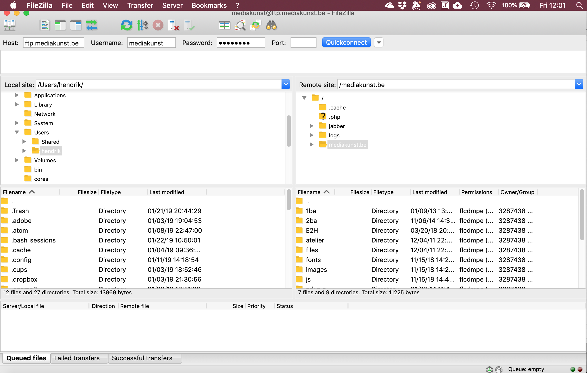

*A :collision: crashcourse in Code, prt1*
# Markdown, HTML, CSS
### Huiswerk (vooraf)
#### Installeer deze programma's op je laptop:
1. [Google Chrome](http://www.google.com/chrome)
2. [Atom](https://atom.io/) code editor
3. [FireZilla](https://filezilla-project.org/) of [CyberDuck](https://cyberduck.io/) als FTP client  
Wij voorzien [webhosting](https://nl.wikipedia.org/wiki/Webhosting) op [kaskprojecten.be](http://www.kaskprojecten.be/) of [mediakunst.be](https://mediakunst.be/)

#### Lees je in in de geschiedenis van het internet & internetkunst of net.art.
* https://www.internethalloffame.org/internet-history/timeline
* https://www.webfx.com/blog/web-design/the-history-of-the-internet-in-a-nutshell/
* https://anthology.rhizome.org/
* https://www.artspace.com/magazine/art_101/art-tech/90s-net-art-52704

### Huiswerk (achteraf)
Bedenk een project dat je [op 4à8u](http://fffff.at/speed-project/) kan uitwerken binnen het thema en met de aangeleerde tools.
Stuur je idee(ën) hiervoor door naar Jerry en Hendrik vóór het weekend. Zo kunnen we dit bekijken en eventueel voorbereiden zodat we jullie gerichter kunnen begeleiden.

## MARKDOWN

### Markdown. Wat & Waarom!
[Markdown](https://en.wikipedia.org/wiki/Markdown)[1](#myfootnote1) is een eenvoudige manier om opmaak toe te voegen aan tekst, zoals titels, nadruk in vet of cursief, lijsten maken, etc. Het is ontworpen als een eenvoudig alternatief voor HTML met leesbaarheid indachtig. Markdown wordt vaak gebruikt om readme-bestanden te formatteren, om berichten op online discussiefora te schrijven en om rich-text te maken met behulp van een eenvoudige teksteditor maar je kan er ook een eenvoudige blog of site[2](#myfootnote2) mee maken.

Voor de opmaak gebruikt Markdown interpunctie en tekens waarmee je al vertrouwd bent. Enkele voorbeelden.  
Voor titels of koppen, gebruikt je hashtags. Dus, `# KOP 1` is een grote kop. `## KOP 1.1` zou wat kleiner zijn, `### KOP 1.1.a` zou nog kleiner zijn.

Wil je een lijst maken? Typ gewoon een `-`, `+`of `*`voor een item en de lijst wordt automatisch aangemaakt.    
Om de nadruk te leggen, kan je een sterretje of asterisk (*echt?*) gebruiken voor cursief, of twee sterretjes voor vet (**echt!**).

Alle andere syntax in Markdown is vergelijkbaar. Het lijkt in eerste instantie een beetje ingewikkeld, maar met een korte introductie en cheatcheet bij de hand ben je er zo mee weg.

<a name="myfootnote1">1</a>: [Aaron Swartz](https://www.youtube.com/watch?v=2M0GQww1GoY) & [Lawrence Lessig](https://en.wikipedia.org/wiki/Lawrence_Lessig)    
<a name="myfootnote1">2</a>: bijv. [blot.im](https://blot.im/) maar ook [md-page
](https://github.com/oscarmorrison/md-page)

### Markdown. In de Praktijk
#### introducing Atom *A hackable text editor for the 21st Century*
kennis maken met de UI, preferences, commands, packages (core & community), markdown preview, git/github integration, ...

#### 3 tutorials
- [ ] kiezen met welke je wilt werken
1. https://github.com/tchapi/markdown-cheatsheet
2. https://github.com/adam-p/markdown-here/wiki/Markdown-Cheatsheet
3. https://guides.github.com/features/mastering-markdown/  

## HTML
https://github.com/CoderDojoSV/beginner-web

## CSS
https://github.com/CoderDojoSV/beginner-web

## FTP / SFTP
(S)FTP staat voor (Secure) File Transfer Protocol en is een verbindingsmethode die is ontworpen voor het overbrengen van bestanden van een externe server naar een lokale computer en omgekeerd.    
Wij maken gemakshalve gebruik van een FTP-client met een UI (User Interface) waardoor je drag&drop-gewijs bestanden kan kopieren. Je kan ook FTP-en vanuit commandline (in de terminal), in een browservenster, maar elk OS (Operating System) heeft ook FTP-software ingebouwd.     
FTP-adressen hebben een vergelijkbare opbouw als een webadres met een paar uitzonderingen: bijvoorbeeld `ftp.fakesite.org:21`. Het adres is `ftp.fakesite.org` en `21` is de gebruikte poort. Beiden zijn nodig bij het verbinden met de FTP-server. Vaak is er ook een gebruikersnaam en paswoord vereist. Dat schrijf je dan zo `username@ftp.fakesite.org/` en `username:password@ftp.fakesite.org/`.    
filezilla voorbeeld.
 

Zie ook https://www.wired.com/2010/02/ftp_for_beginners/

*-----fin-----*
