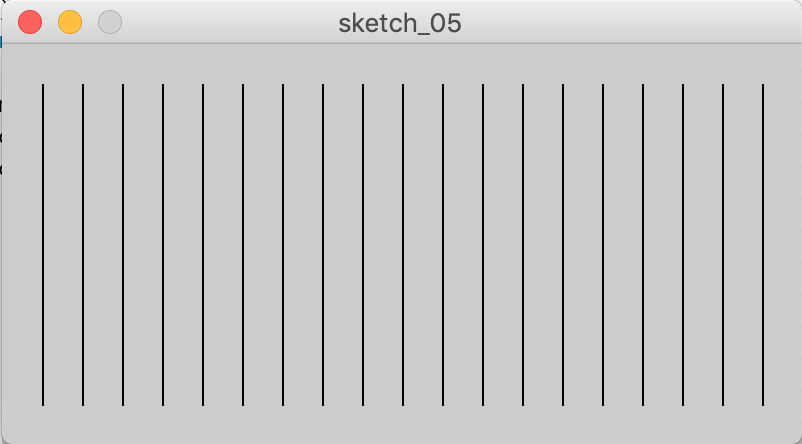
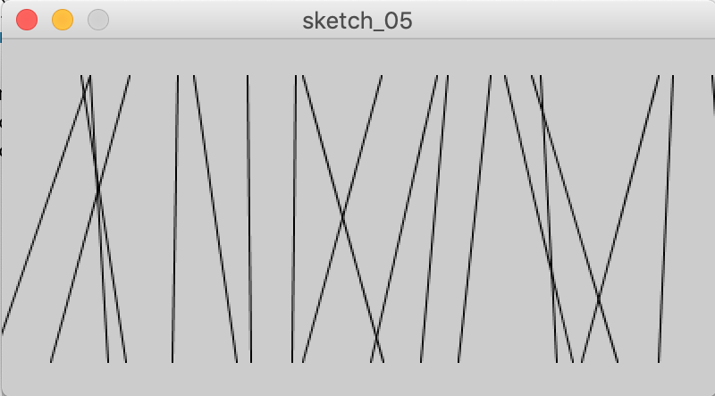
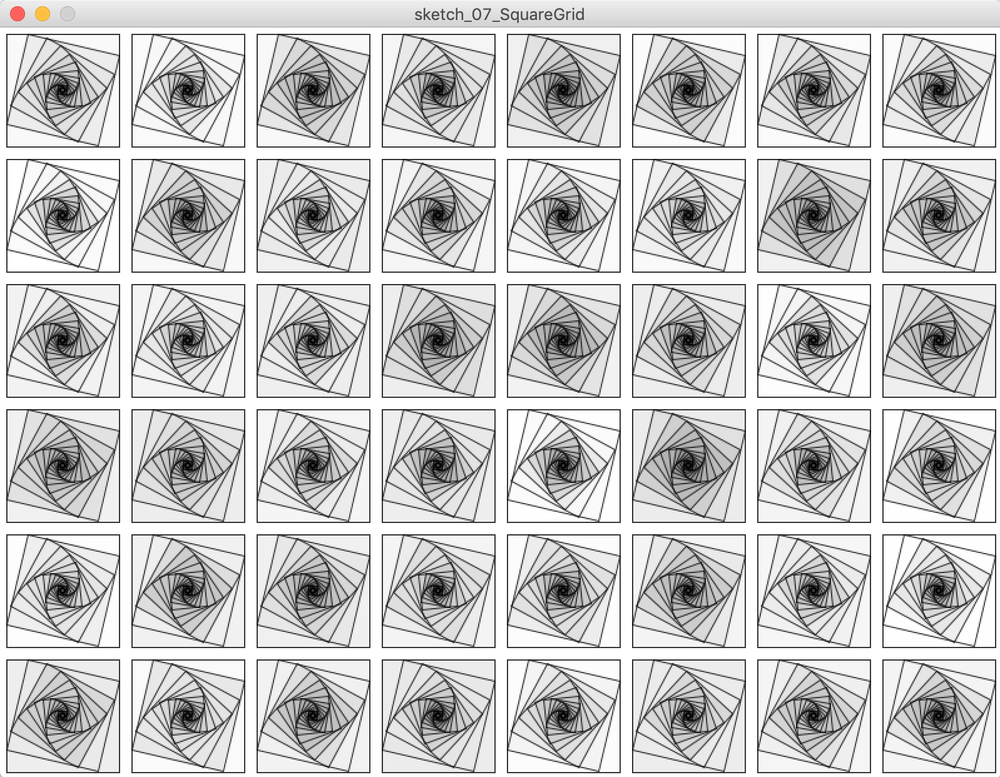
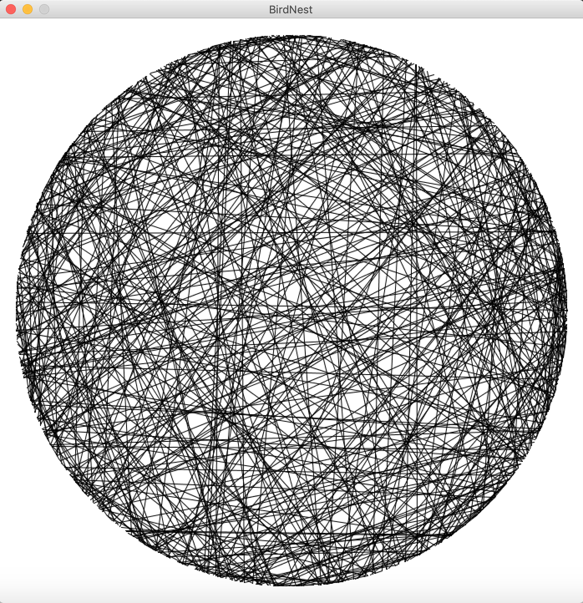
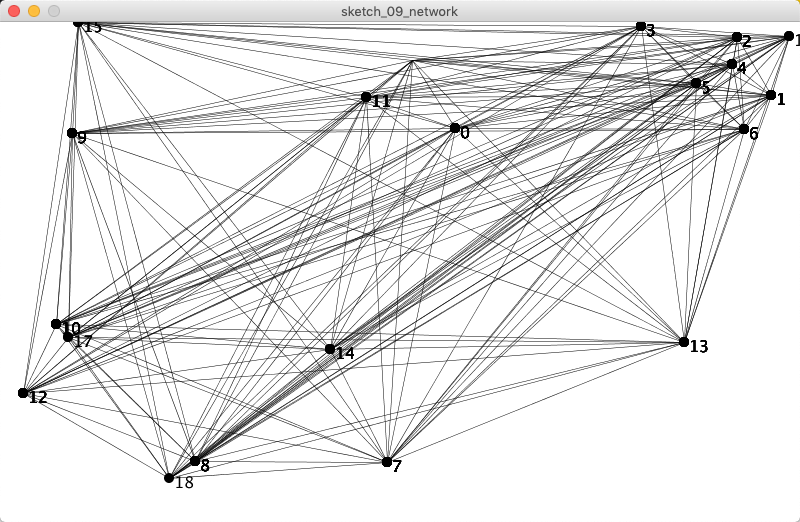
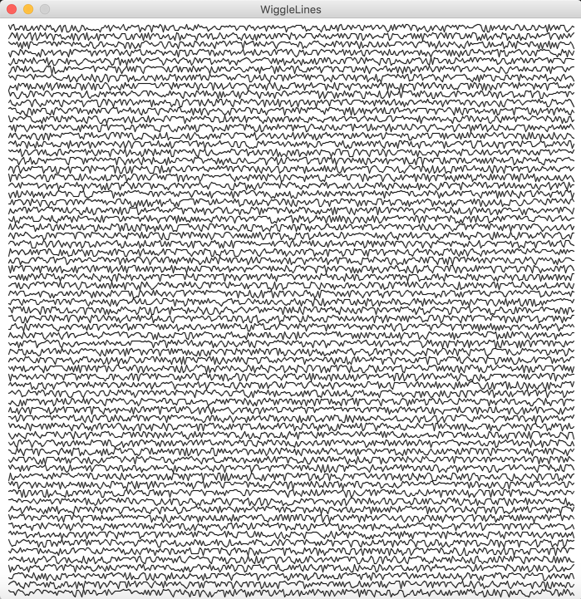
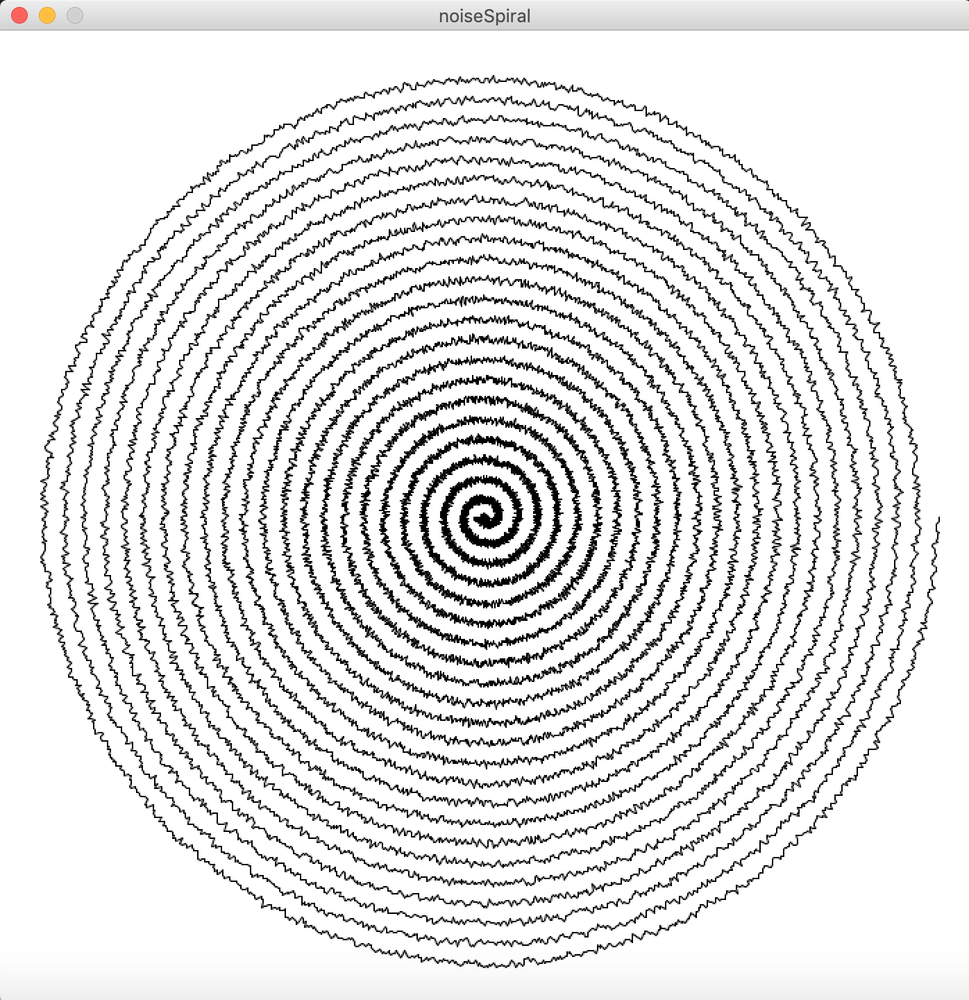
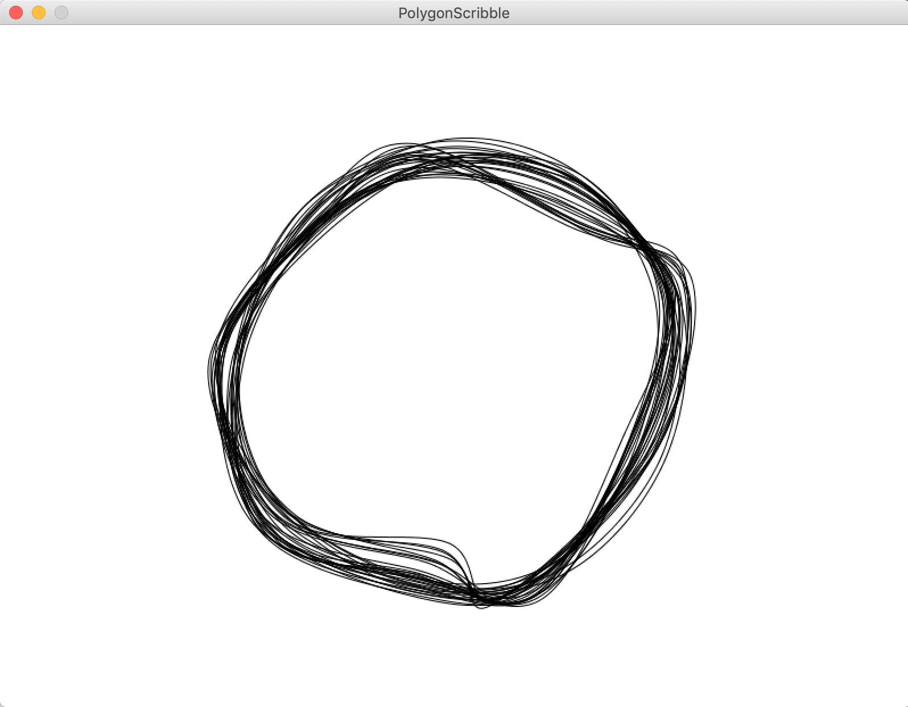

# Processing - Generative Art / Design Tutorial
_-- :satisfied: level 2 --_

## 16. Random

Unlike the smooth, linear motion common to computer graphics, motion in the physical world is usually idiosyncratic.
We can simulate the unpredictable qualities of the world by generating random numbers. The `random()` function calculates these values; we can set a range to tune the amount of disarray in a program. The following short example prints random values to the console, with the range limited by the position of the mouse. The ‘random()’ function always returns a floating-point value, so be sure the variable on the left side of the assignment operator (=) is a float as it is here (sketch_04):

```java
void draw() {
  float r = random(0, mouseX);
  println(r);
}
```
The following example uses the values from `random()` to change the position of lines on screen. When the mouse is at the left of the screen, the change is small; as it moves to the right, the values from random() increase and the movement becomes more exaggerated. Because the random() function is inside the for loop, a new random value is calculated for each point of every line (sketch_05):

```java
void setup() {
  size(400, 200);
}

void draw() {
  background(204);
  for (int x = 20; x < width; x += 20) {
    float mx = mouseX / 10;
    float offsetA = random(-mx, mx);
    float offsetB = random(-mx, mx);
    line(x + offsetA, 20, x - offsetB, height-20);
  }
}
```


_random shaking lines_

## 17. Examples

The following are a number of short examples during which the creation of random values plays a critical role.

## 17.1 Circle Grid 
(sketch_06)

```java
int tileSize = 50;   // define the size of each tile in the grid

void setup() {
  size(800, 800);   
  background(255);
  noStroke();
  noLoop();
}

void draw () {
  for (int x = tileSize; x < width; x += tileSize) {     // first loop in x-direction
    for (int y = tileSize; y < height; y += tileSize) {  // second loop in y-direction
      float circleSize = random(tileSize*0.2, tileSize); // set random circle size
      fill(random(255),150);                       // set random gray value
      ellipse(x, y, circleSize, circleSize);   // draw circle at each x,y position
    }
  }
}
```
This script draws a grid of circles in varying sizes and gray-scale values. The number of circles can be controlled by adjusting the ‘tileSize’ variable. The bigger a tile the less circles there are.    
`noLoop()` will prevent the draw function from running over and over again. Of course in this case the draw function could also be neglected completely. Turning ‘noLoop’ off will result in a flickering screen. Within the draw function two nested loops iterate in steps defined by ‘tileSize’ through the screen and draw circles at the respective locations.


_Circle Grid_ 

## 17.2 Square Grid 
(sketch_07)

```java
int tileSize = 100;
int iterations = 20; // number of times loop runs
int rotation = 14; // rotation in degree

void setup() {
  size(800, 600);
  background(255);
  stroke(0, 200); // set stroke transparency to ±80%
  rectMode(CENTER); // set rect drawmode to center
  noLoop();
}

void draw() {
  for (int x = tileSize/2; x < width; x+=tileSize) {
    for (int y = tileSize/2; y < height; y+=tileSize) {
      float rectSize = tileSize-10; // set rect size 10px smaller than grid

      pushMatrix();
      translate(x, y);
      for (int i = 0; i < iterations; i++) {
        fill (0, random(20));
        rect(0, 0, rectSize, rectSize);
        rectSize = rectSize / (sin(radians(rotation)) + cos(radians(rotation)));
        rotate(radians(rotation));
      }
      popMatrix();
    }
  }
}
```
Similar to the previous script ‘Circle Grid’ this program draws a grid of shapes on the screen, this time a set of nested squares. The sketch uses the [`pushMatrix()`](https://processing.org/reference/pushMatrix_.html) function to move the origin to the respective grid locations. It then draws a number of squares which are rotated and scaled inside each other according to the formula s = L / (sin α + cos α), for an enclosing square’s side length of L and an angle of rotation α (alpha) between 0 and π/2 radians.


_Square Grid_


## 17.3 Birds Nest 
(sketch_08)

```java
int num = 500; // amount of lines to be drawn

void setup() {
  size(700, 700);
  background(255);
  strokeWeight(1);
  noLoop();
}

void draw() {
  float radius = width/2-20; // set radius of circle
  translate(width/2, height/2); // move the origin to the center

  for (int i = 0; i < num; i++) {
    float angle1 = random(0, TWO_PI); // set random number between 0 and 360
    float x1 = sin(angle1) * radius; // first point on circle
    float y1 = cos(angle1) * radius;
    float angle2 = random(0, TWO_PI);
    float x2 = sin(angle2) * radius; // second point on circle
    float y2 = cos(angle2) * radius;
    line(x1, y1, x2, y2); // line between first and second point
  }
}
```
This script draws lines between random locations on a circle. The amount of lines are defined in the global variable ‘num’. The start and end position of each line are generated randomly within the ‘for loop’.


_Birds Nest Network_


## 17.4 Network 
(sketch_09)

```java
int num = 20; // amount of nodes in the network

void setup() {
  size (700, 700);
  background(255);
  stroke(0, 255); // setting transparency to 10
  noLoop();
}

void draw() {
  translate(width/2, height/2); // move origin to screen center

  float[] angle1 = new float[num]; // these are arrays of numbers.
  float[] angle2 = new float[num]; // the amount is defined by num
  float[] x1 = new float[num]; // more info: https://processing.org/reference/Array.html
  float[] x2 = new float[num];
  float[] y1 = new float[num];
  float[] y2 = new float[num];

  for (int i = 0; i < num; i++) {
    float radius = random(88, width/2-10);
    angle1[i] = random(0, TWO_PI);
    x1[i] = sin(angle1[i]) * radius;
    y1[i] = cos(angle1[i]) * radius;
    angle2[i] = random(0, TWO_PI);
    x2[i] = sin(angle2[i]) * radius;
    y2[i] = cos(angle2[i]) * radius;
  }
  for (int i = 0; i < num; i++) {
    for (int a = 1; a < num; a++) {
      strokeWeight(random(0.5, 1.5));
      line(x1[i], y1[i], x2[a], y2[a]);
    }
  }
}
```

_Network_

This sketch is similar to the previous one, ‘Birds Nest’. However instead of drawing single lines between two points at random locations on a circle it draws lines between all points within a range of circles, hence creating a network structure. To achieve this we need to create arrays of positions to be able to connect each point with all the others.

## 18. Arrays

**An array is a list of variables** that share a common name. Arrays are useful because they make it possible to work with more variables without creating a new name for each. Each item in an array is called an element, and each has an index value to mark its position within the array, starting from 0. To make an array, start with the name of the data type, followed by the brackets. The name you select for the array is next, followed by the equal symbol, followed by the ‘new’ keyword, followed by the name of the data type again, with the number of elements to create within the brackets. This pattern works for arrays of all data types. A list of five items, all of type int would look like this:

```java
int[] numberArray = new int[5];
```
You can specify what those five items are when you define the array using the braces syntax:

```java
int[] numberArray = {1, 2, 3, 4, 5};
```
However you define it, you can add items to each position. The following places a 3 as the third item, not the second. The first position is index 0, so the third item is index 2:

```java
numberArray[2] = 3;
```

## 19. Examples Part

## 19.1 Wiggle Lines 
(sketch_10)

```java
int border = 10; // frame around image
int xstep = 2; // stepsize (resolution) in x direction
int ystep = border; // rows
float lastx;
float lasty;

void setup() {
  size(800, 800);
  background(255);
  strokeWeight(1);
  stroke(0); // stroke color black
  noLoop();
  noFill();
}

void draw() {
  for (int i = ystep/2; i <= height-(border+ystep/2); i+=ystep) {
    for (int x = border; x <= width-border; x +=xstep) {
      float y = noise(random(border, border+ystep))*15; // random noise
      if (x == border) {
        lastx= 0;
      }
      if (lastx > 0) {
        line(x, y+i, lastx, lasty+i);
      }
      lastx = x;
      lasty = y;
    }
  }
}
```

_Wiggle Lines_

## 19.2 Noise Spiral 
(sketch_11)

```java
int border = 20; // image frame
int rotations = 23; // amount of spiral rotations

void setup() {
  size(700, 700);
  background(255);
  strokeWeight(1);
  stroke(0);
  noLoop();
}

void draw() {
  float radius = width/2 - border;
  int centX = width/2; // center of canvas
  int centY = height/2;
  float x, y;
  float lastx = 0;
  float lasty = 0;
  float radiusNoise = random(10);

  for (float ang = 0; ang <= 360*rotations; ang += 0.2) {
    radiusNoise += 0.5;
    radius -= 0.008;
    float thisRadius = radius - (noise(radiusNoise) * 10);
    float rad = radians(ang);
    x = centX + (thisRadius * cos(rad));
    y = centY + (thisRadius * sin(rad));
    if (lastx > 0) {
      line(x, y, lastx, lasty);
    }
    lastx = x;
    lasty = y;
  }
}
```
‘Wiggle Lines’ draws lines between coordinates which randomly vary in their y values. The resolution of the zigzag lines is defined by the ‘xstep’ variable. The spacing of lines is defined by the ‘ystep’ variable. Instead of using the random function this script introduces Perlin noise, which is a random sequence generator producing a more natural, harmonic succession of numbers than that of the standard random() function. In contrast to the random() function, Perlin noise is defined in an infinite n-dimensional space, in which each pair of coordinates corresponds to a fixed semi-random value (fixed only for the lifespan of the program). The resulting value will always be between 0.0 and 1.0. The actual noise structure is similar to that of an audio signal, which is why the resulting zigzag lines remind of frequency or heartbeat diagrams.

‘Noise Spiral’ is similar to ‘Wiggle Lines’ but draws the graph in a circular way, spiraling towards the center of the canvas.


_Noise Spiral_

## 19.3 Polygon Scribble 
(sketch_12)

```java
int sides = 4; // number of polygon sides
float[] x = new float[sides];
float[] y = new float[sides];

float variance = 10; // strength of polygon variation
int iterations = 100; // amount of times program runs
int radius = 150; // initial radius

void setup() {
  size(800, 800);
  float angle = radians(360/float(sides));

  for (int i=0; i < sides; i++) { // coordinates of polygon
    x[i] = cos(angle*i+50) * radius;
    y[i] = sin(angle*i+50) * radius;
  }

  stroke(0, 15);
  strokeWeight(1);
  background(255);
  noFill();
  noLoop();
}

void draw() {
  for (int a=0; a < iterations; a++) { // array of polygon coordinates
    for (int i=0; i < sides; i++) {
      x[i] += random(-variance, variance);
      y[i] += random(-variance, variance);
    }

    beginShape(); // draw polygon shape
    curveVertex(x[sides-1]+width/2, y[sides-1]+height/2);
    for (int i=0; i < sides; i++) {
      curveVertex(x[i]+width/2, y[i]+height/2);
    }
    curveVertex(x[0]+width/2, y[0]+height/2);
    curveVertex(x[1]+width/2, y[1]+height/2);
    endShape();
  }
}

```

_Polygon Scribble_

‘Polygon Scribble’ draws random polygon shapes on the screen. For each iteration the position of the polygon
coordinates vary slightly, which results in dynamic scribbles. The polygons are drawn using [`beginShape()`](https://
processing.org/reference/beginShape_.html) and [`endShape()`](https://processing.org/reference/endShape_.html).
Embedded are [`curveVertex()`](https://processing.org/reference/curveVertex_.html) functions, which draw spline curves
between the assigned coordinates. The splines are closed by adding the first two coordinates [0] and [1] to the loop.

## 20. Export

Processing includes a number of ways on exporting the created content.

**Bitmap images** can be saved using the [`saveFrame()`](https://processing.org/reference/saveFrame_.html) function. If
saveFrame() is used without parameters, it will save files as screen-0000.tif, screen-0001.tif, and so on. You can
specify the name of the sequence with the filename parameter, including hash marks (####), which will be replaced by the current frameCount value. The number of hash marks is used to determine how many digits to include in the file names. Append a file extension, to indicate the file format to be used: either TIFF (.tif), TARGA (.tga), JPEG (.jpg), or PNG (.png). Image files are saved to the sketch’s folder, which may be opened by selecting “Show Sketch Folder” from the “Sketch” menu.

Since our scripts due to the noLoop() function often only run once the default way of using saveFrame() would overwrite existing images each time the function is called. We therefore add the current time to the image name. This is done by adding

```java
import java.util.Calendar;
```
at the beginning of the script and creating two functions at the end:

```java
void keyPressed() {
  if (key == 's' || key == 'S') saveFrame(timestamp()+".png");
}

String timestamp() {
  Calendar now = Calendar.getInstance();
  return String.format("%1$ty%1$tm%1$td_%1$tH%1$tM%1$tS", now);
}

```
Now, whenever the key ‘s’ is pressed an image named with the current date and time is created.

**PDF or SVG vector files** can be saved using [`beginRecord()`](https://processing.org/reference/beginRecord_.html) and [`endRecord()`](https://processing.org/reference/endRecord_.html). The beginRecord() function requires two parameters, the first is the renderer and the second
is the file name. This function is always used with endRecord() to stop the recording process and close the file.
Note that beginRecord() will only pick up any settings that happen after it has been called. For instance, if you call
textFont() before beginRecord(), then that font will not be set for the file that you’re recording to.

In our case this requires to first add

```java
import processing.pdf.*;
```
or 
```java
import processing.svg.*;
``` 

at the top of the script and then include

```java
beginRecord(PDF, timestamp()+”.pdf”);
```
or 
```java
beginRecord(SVG, timestamp()+”.svg”);
```
within the setup() function and

```java
endRecord();
```
at the end of the draw() function.


The complete ‘Polygon Scribble’ program would then look like this. Note that beginRecord() is in comments since
otherwise a PDF would be created each time the script is run.

```java
import processing.pdf.*;
import java.util.Calendar;

int sides = 4;
float[] x = new float[sides];
float[] y = new float[sides];

float variance = 10;
int iterations = 3000;
int radius = 150;

void setup() {
  size(800, 800);
  // beginRecord(PDF, timestamp()+”.pdf”);
  smooth();
  float angle = radians(360/float(sides));
  for (int i=0; i<sides; i++) {
    x[i] = cos(angle*i+50) * radius;
    y[i] = sin(angle*i+50) * radius;
  }
  stroke(0, 5);
  strokeWeight(1);
  background(255);
  noFill();
  noLoop();
}

void draw() {
  background(255);
  for (int i=0; i< iterations; i++) {
    for (int a=0; a < sides; a++) {
      x[a] += random(-variance, variance);
      y[a] += random(-variance, variance);
    }
    beginShape();
    curveVertex(x[sides-1]+width/2, y[sides-1]+height/2);
    for (int a=0; a < sides; a++) {
      curveVertex(x[a]+width/2, y[a]+height/2);
    }
    curveVertex(x[0]+width/2, y[0]+height/2);
    curveVertex(x[1]+width/2, y[1]+height/2);

    endShape();
  }
  endRecord();
}

void keyReleased() {
  if (key == 's' || key == 'S') saveFrame(timestamp()+"_##.png");
}

// timestamp
String timestamp() {
  Calendar now = Calendar.getInstance();
  return String.format("%1$ty%1$tm%1$td_%1$tH%1$tM%1$tS", now);
}

```

## Sources:

- “Learning Processing, Second Edition: A Beginner’s Guide to Programming
Images, Animation, and Interaction” by Daniel Shiffman (2015)
- “Generative Art” by Matt Pearson (2011)
- “Make: Getting Started with Processing” by Casey Reas and Ben Fry (2010)
- Processing documentation (https://processing.org/tutorials/)

## Further Links:

* https://processing.org/tutorials/
* [http://www.generative-gestaltung.de/](http://www.generative-gestaltung.de/)
* [http://www.openprocessing.org/](http://www.openprocessing.org/)
* [Learning Processing youtube playlist by Dan Shiffman](https://www.youtube.com/user/shiffman/playlists?shelf_id=2&view=50&sort=dd)
