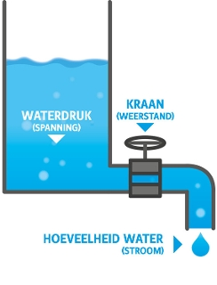
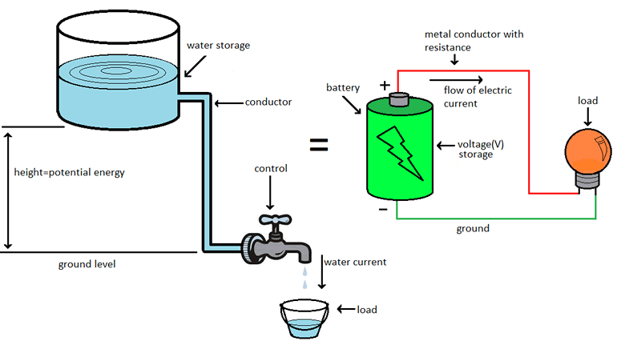

*---[ A crashcourse in Code, prt 3 ]---*

# ARDUINO

### Huiswerk (vooraf)
#### Installeer
Installeer [Arduino IDE](https://www.arduino.cc/en/Main/Software) 

#### Bekijk
voor de filosofie achter Arduino [deze 
video van de TED talk van Arduino ontwikkelaar Massimo Banzi](https://www.ted.com/talks/massimo_banzi_how_arduino_is_open_sourcing_imagination)

#### Lees
Bekijk deze lijst met interessante makers: https://github.com/theBlackBoxSociety/interestingPeople

### Huiswerk (achteraf)
Bedenk een project dat je [op 4à8u](http://fffff.at/speed-project/) kan uitwerken binnen het thema en met de aangeleerde tools.
Stuur je idee(ën) hiervoor door naar Jerry en Hendrik vóór het weekend. Zo kunnen we dit bekijken en eventueel voorbereiden zodat we jullie gerichter kunnen begeleiden.

## ARDUINO
[Arduino](https://www.arduino.cc/) is één van de meest populaire opensource elektronicaplatform (naast Raspberry Pi). Het is gebaseerd op eenvoudig te gebruiken hard- en software. Het is ontwikkeld met als doel de gebruikers het zo gemakkelijk mogelijk te maken met elektronische componenten te *'tinkeren'*[1](#myfootnote1). 

Door de jaren heen zijn Arduino's het brein geweest van duizenden projecten, van alledaagse objecten tot de meest complexe wetenschappelijke instrumenten. Een wereldwijde gemeenschap van makers - studenten, hobbyisten, kunstenaars, programmeurs en professionals - heeft zich rond dit open-sourceplatform verzameld, hun bijdragen hebben een ongelooflijke hoeveelheid kennis toegevoegd die zowel voor beginners als gevorderden een grote hulp kan zijn.

De basis van elk Arduino-project is een Arduino-board waar een aantal standaard componenten op vast zijn gesoldeerd. Het hart van een Arduino-board is een microcontroller, veelal een Atmel ATmega. Sommige Arduino-boards hebben echter microcontrollers van bijvoorbeeld Intel of STM. Wat je verder op een Arduino-board vindt, is afhankelijk van het model. De meeste boards hebben een usb-aansluiting om met je computer te kunnen communiceren, maar er zijn ook boards beschikbaar met alleen een wifi-module. 

Aan de zijkanten van elk board vind je in- en uitgangen die je via draadjes met sensoren en actuatoren kan verbinden. Op deze manier kan je met een Arduino de omgeving *voelen* door de gegevens van verschillende knoppen en sensoren te uit te lezen (input) en kan die omgeving beïnvloeden door het aansturen van LED's, motoren, relais en nog veel meer (output).

Om je Arduino-project te programmeren, heb je een computer nodig, maar dit betekent niet dat je project uiteindelijk een computer nodig heeft om te functioneren. Het Arduino board en de verbonden electronica kan gevoed worden door een netspanningsadapter of accu. 

<!--Arduino-boards kunnen ingangen uitlezen - licht op een sensor, een vinger op een knop of een Twitter-bericht, ... - en veranderen in een uitgang - een motor activeren, een LED aanzetten, iets online publiceren. Het programmeren van een Arduino-bord doe je door er een reeks instructies - een grogramma - naar de microcontroller op het bord te sturen. Hiervoor gebruik je de Arduino-programmeertaal (C++) en de Arduino IDE (gebaseerd op Processing). De Arduino-software is eenvoudig te gebruiken voor beginners, maar toch flexibel genoeg voor gevorderde gebruikers. Het werkt op Mac, Windows en Linux. -->

Aan de slag met Arduino! Raadpleeg [de beknopte handleiding](https://www.arduino.cc/en/Guide/HomePage). Als je op zoek bent naar inspiratie, kun je een grote verscheidenheid aan handleidingen vinden op [Arduino Project Hub](https://create.arduino.cc/projecthub). Meer uitleg over het volledige scala van officiële Arduino-producten, waaronder Boards, Modules (een kleinere formfactor van de klassieke borden), Shields (elementen die gemakkelelijk op het board aangesloten kunnen worden om extra functies toe te voegen) en Kits vindt je op de [products-page](https://www.arduino.cc/en/Main/Products).

## ELEKTRICITEIT

### Wat is elektriciteit?
Voor we echt aan de slag gaan lijkt het me noodzakelijk om heel beknopt enkele basis principes van elektriciteit en elektrische circuits uit te leggen. We doen dit a.d.h.v. [de befaamde water-analogie](https://www.google.com/search?q=water+analogy+electricity&rlz=1C5CHFA_enBE830BE830&tbm=isch&source=iu&ictx=1&fir=dbS3D2uaZhjOOM%253A%252CK4Myskr2OVtrnM%252C_&vet=1&usg=AI4_-kQxWQPlProSZBU7MdNqTABPfzF32Q&sa=X&ved=2ahUKEwjEpdu29_rgAhVEbFAKHZAUCI8Q9QEwC3oECAIQGg&cshid=1552336599334250#imgdii=M9M0PrqjM8GPjM:&imgrc=3SVFvWMRRCq-oM:&vet=1) waarbij **het stromen van water te vergelijken is met het stromen van elektronen**.     
Alhoewel deze vergelijking onvolkomen is is ze nuttig omdat er genoeg overeenkomsten zijn en onze zintuigen de verschijnselen van water onmiddellijk kunnen waarnemen en we bij elektriciteit enkel de effecten kunnen zien. Deze analogie gaat enkel op voor gelijkspanning en dus niet voor wisselspanning. 

### Wisselspanning vs Gelijkspanning    
Er bestaan twee soorten spanning, namelijk **wisselspanning** (AC – Alternating Current) en **gelijkspanning** (DC – Direct Current). Beide soorten bestaan naast elkaar en hebben hun eigen kenmerken.    
Bij wisselspanning lopen elektronen van de pluspool naar de minpool en van de minpool terug naar de pluspool. **De stroom wisselt dus continu van richting**. In Europa wisselt de stroom 50 keer per seconde van richting en is de frequentie dus 50 Hertz. De stroomspanning van ons energienet is gebaseerd op een  wisselspanning met een spanning van 230V.   
Bij gelijkspanning lopen elektronen alleen van de pluspool naar de minpool. De stroom loopt dus altijd in dezelfde richting. Er is dus sprake van een vaste plus en een vaste min. **De stroom zal dus altijd in dezelfde richting stromen** (van plus naar min - [of toch niet?](https://electronics.stackexchange.com/questions/181615/does-electrical-current-flow-from-positive-to-negative-or-negative-to-positive)).    
Hoewel het elektriciteitsnetwerk is ingericht op wisselspanning, werkt de meeste apparatuur juist op gelijkspanning. Het omzetten van AC naar DC gebeurt vaak met een netvoeding of adapter. Gelijkspanning werkt goed bij lagere spanningen.

### 3 basisprincipes: Spanning, Stroom en Weerstand
**Dus elektriciteit is de beweging van elektronen**. Deze elektronen creëren een spanning die we kunnen gebruiken om abreid te verrichten, bijv. een lamp laten branden, water te warmen, enz. 

Dit is gebaseerd op **3 basisprincipes:
Spanning, Stroom en Weerstand**    
Terug naar onze analogie van de watertank waaruit water stroomt. De hoeveelheid water die er uit onze kraan komt is de stroom, de waterdruk is de spanning. En de kraan en de diameter van de buis is de weerstand. 

    
**Spanning** (of voltage) is het verschil in lading tussen twee punten.   
**Stroom** is de snelheid waarmee de lading stroomt.  
**Weerstand** is de neiging van een materiaal om de stroom van lading te weerstaan.

 water | elektriciteit| eenheid | symbool |
 :--- | :--- | :---:  | :---:
 Waterdruk | Spanning (charge / voltage) | 	 volt |	 U
 Debiet van het water die uit de kraan stroomt | Stroom (current)	| ampère 	|  I
 Dikte van de buis of opening van de kraan | Weerstand (resistance) | ohm | R

De vergelijking water-elektriciteit in de tekening hieronder laat duidelijk zien hoe deze elementen zich tot elkaar verhouden.

De druk aan het einde van de buis kan spanning weergeven. Het water in de tank staat voor stroom. Hoe meer water in de tank, hoe hoger de spanning, des te meer druk wordt gemeten aan het einde van de buis.

We kunnen deze tank zien als een batterij, een plaats waar we een bepaalde hoeveelheid energie opslaan om later vrij te geven. Als we onze tank een bepaalde hoeveelheid leegmaken, daalt de druk aan het einde van de buis. We kunnen dit zien als een afnemende spanning, zoals wanneer een zaklamp minder hard gaat schijnen als de batterijen leeg raken. De hoeveelheid water die door de slang zal stromen vermindert ook.

Minder druk betekent dat er minder water door de buis stroomt. Dit brengt ons bij de stroom. Het (water)debiet meten we door het volume van het water te meten dat door de buis stroomt gedurende een bepaalde periode. Met elektriciteit meten we de hoeveelheid spanning (volt) die door het circuit stroomt gedurende een bepaalde periode. Stroom wordt gemeten in Ampère.

Stel dat onze kraan een kwartslag wordt dichtgedraaid maar dat we nog steeds hetzelfde debiet verwachten. Dat is alleen mogelijk als we de druk (spanning) verhogen. Er stroomt nu meer water door de buis uit de tank. De toename van de spanning zal een toename van de stroom veroorzaken.

Nu beginnen we de relatie tussen spanning en stroom te zien. Maar er is een derde factor die hier moet worden beschouwd: de breedte van de buis of de kraan die we kunnen dichtdraaien. In onze analogie is dit de weerstand.

Er is pas sprake van stroom (de hoeveelheid water die door het systeem loopt) als er spanning is opgebouwd in het systeem (de waterdruk). Deze waterdruk komt pas tot stand wanneer er een bepaalde weerstand is (een open- of dichtgedraaide kraan).

De verhouding tussen spanning, stroom en weerstand laat zich berekenen via de zogenaamde
Wet van Ohm. Dit is de formule:

**U (spanning) = I (stroom) x R (weerstand)**

Wanneer er twee elementen bekend zijn kan het derde element hiermee worden berekend.

**V = R * I**    
**I = V / R**

Dit is de enige regel die je echt moet onthouden en leren gebruiken.

Zie ook https://learn.sparkfun.com/tutorials/voltage-current-resistance-and-ohms-law/all

<a name="myfootnote1">1</a>: to tinker (verb) volgens de [Cambridge Dictionary](https://dictionary.cambridge.org/dictionary/english/tinker): to make small changes to something, especially in an attempt to repair or improve it.
