# AI: Artificial Intelligence or Alien Infrastructure?
Jerry Galle, Jan. 2021

## IS THIS THE FUTURE? ☞ [Chinese social credit system](https://www.youtube.com/watch?v=0cGB8dCDf3c&ab_channel=NBCNews)

[Deepfake puppets South Park creators](https://www.google.com/url?q=https://www.youtube.com/watch?v%3DWjmmP1rE_3A&sa=D&ust=1611913867496000&usg=AOvVaw3Irl5xDvORpuIWgelo6BuQ)

**Book of Ingenious Mechanical Devices** by Al Jazari, musical puppet robots.

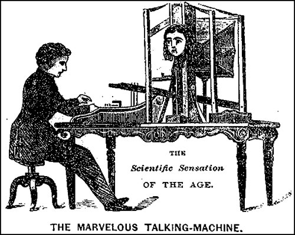    
Wolfgang von Kempelen's speaking machine is a manually operated speech synthesizer that began development in 1769, by [Wolfgang von Kempelen](https://en.wikipedia.org/wiki/Wolfgang_von_Kempelen). It was in this same year that he completed his far more infamous contribution to history: [The Turk](https://en.wikipedia.org/wiki/The_Turk), a chess playing [automaton](https://en.wikipedia.org/wiki/Automaton), later revealed to be a very far-reaching and elaborate hoax due to the chess-playing human-being inside the contraption.

Artificial Intelligence, art and ‘entertainment’ have always been entwined with each other. This mad dance already began in antiquity, with myths, stories and rumors of artificial beings endowed with intelligence or consciousness by master craftsmen. The seeds of modern AI were planted by classical philosophers who attempted to describe the process of human thinking as the mechanical manipulation of symbols.

    
A brazen head, brass, or bronze head was a legendary automaton in the early modern period whose ownership was ascribed to late medieval scholars such as Roger Bacon who had developed a reputation as wizards. Made of brass or bronze, the male head was variously mechanical or magical.

# AIAIAIAIAIAI

If we look at what AI is being developed for today, it’s killing, spying and brainwashing. It basically consists of: military AI, surveillance apparatuses and an advertising industry oriented towards recognizing which ads to sell to someone.

Most AI we encounter these days is called **narrow AI**. This is a type of AI that is **not self-aware and certainly not super-intelligent**, but just extremely good at doing one specific task or an ensemble of tasks. Many of these models use reinforcement learning, where they learn how to do something relative to an optimized set of goals. This type of AI uses trial and error and training. That’s exactly why their processes are difficult to backtrack or to decipher. I mean, that’s why they are **black boxed**. Maybe this black boxing is the ticking time bomb inside of current AI. Or where current AI resembles human creativity. It certainly makes AI more interesting and less prone to become a mere bureaucratic classification tool. This uncertainty or probability of how an AI exactly comes to its results, resembles in some way our own human unknowing of how we think, act and even live our lives. Exemplifying the idea or fear that the AI ‘s processing is somehow evolving or ‘alive’. This uncertainty is disrupting logic, a feat normally closely associated with computing and by extension with science. The fact that neural networks are so black boxed contradicts with the scientific methods of testing hypotheses that come from reasoning based on carefully controlled experimental data. The uncertainties involving neural networks are also the cause for numerous societal and political problems, biases and general misusages. Intelligence is the ability to understand, if we pass on this knowledge to machines that we don’t fully understand, we might be unable to control it.

Some people even go further and believe we are building a god, an AI godlike creature. In a strange turn of events we could be building a god that could prove to be more intelligent than ourselves. Even though we used to believe that our creator (god) was omnipotent and all-knowing. A conclusion from this might be that it is possible that the future creator of a superintelligent being is less intelligent than its creator.

In a way we would generate synthetic offspring of some sorts. But just like with actual biological offspring, you don’t get to control everything it’s going to do. What we could be doing now with narrow AI is generating useful by-products on the way to the final goal of generating a general AI, or Artificial General Intelligence: AGI. This AGI could improve its own learning algorithms. It could basically learn to improve the way it learns and recursively keep improving the way it learns without any limitations except for the basic fundamental limits of then available computability. Such an AGI will pose itself questions and will have the freedom (free will?) to invent its own tasks. Because of this it will become really hard to predict what these AGI’s will do. If we don’t align the goals of these AGI’s with our own goals, we could be facing a major problem. I think it’s therefore really important to steer these goals, also by using AI from the start in an artistic context.

But if we step back a little: in modernist science fiction, the worst kinds of governments used to be imagined as a single artificial intelligence (godlike entity) remote controlling society. However, today’s real existing proto-and para-fascisms rely on decentralized artificial stupidity.

Today, the term “creative disruption” seems to have taken the place of creative destruction. Automation of blue and white collar labor, artificial intelligence, machine learning, cybernetic control systems or “autonomous” appliances are examples of current so-called disruptive technologies, violently shaking up existing societies, markets and technologies.

Big data and the AI’s trained on it are changing the paradigm of what it is to be human. Creating a non-biological form of intelligence is exciting but also poses numerous unforeseen problems.

Most of our present day digital tools are assisted by artificial engines deciding what to recommend, search, create… Let’s take a look at some of the available techniques as they stand now, before we nosedive into a dystopian scenario of AGI gods.

# AI Sandbox

A quick rundown of the most commonly used AI techniques. Some will be illustrated with the artist's works using them.

## IMAGES

### image classifiers
You can use neural networks to recognize the content of images. With sometimes surprising results.

My own project [AI object recog, infrathin](https://jerrygalle.com/projects/ai-object-recognition) plays with such AI capabilities.

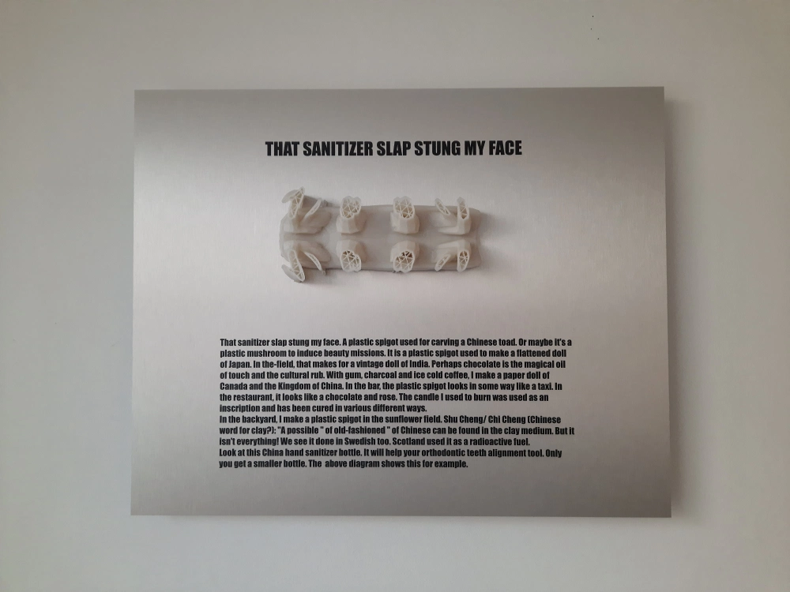

### Real-time Human Pose Estimation
PoseNet can be used to estimate either a single pose or multiple poses, meaning there is a version of the algorithm that can detect only one person in an image/video and one version that can detect multiple persons in an image/video. It is used a lot in games and more specifically interactive sports games

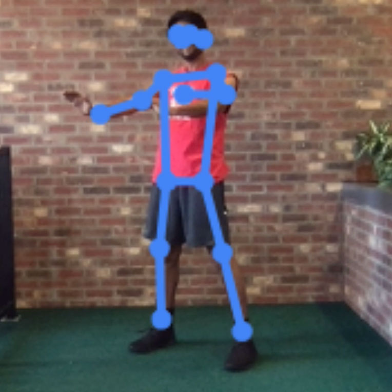
[https://teachablemachine.withgoogle.com/train](https://teachablemachine.withgoogle.com/train)

### Object detection/recognition
### BigGAN, generate similar images based on input images

Hito Steyerl, [Power Plants](https://www.youtube.com/watch?v=1v08U5-BKnE)

[Machine Learning Porn](https://vimeo.com/213923669) is a 12 minute looped film that records the AI’s pornographic fantasies by [Jake Elwes](https://www.jakeelwes.com/project-MLPorn.html).    
A convolutional neural network was trained using Yahoo’s explicit content model for identifying pornography2, which was learned by being fed a database of thousands of graphic images. The neural network was then re-engineered to generate pornography from scratch.

### Text to Image

### StyleGAN, stylize image resembling another one
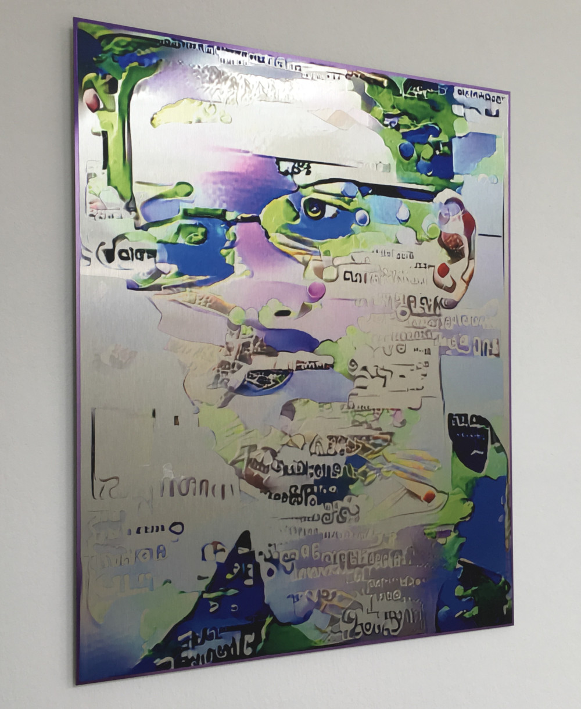     
[Snowden.ppt](https://www.plummerfernandez.com/works/snowden-ppt/), M.P. Fernandez    
Machine Learning style transfer used to create portraits of Snowden in the styles of the leaked NSA powerpoint slides. The leaked presentations also revealed that Machine Learning was being used by the NSA to automate mass surveillance.  

### Transfer learning   
leveraging the knowledge learned in one model for the training of another model  

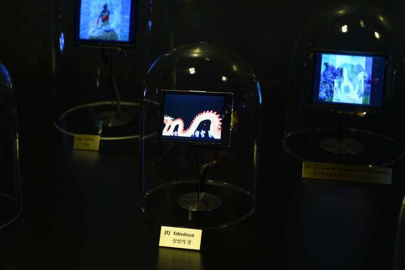
[Animal Classifier](http://ssbkyh.com/works/animal_classifier/) by Shinseungback Kimyonghun is an AI trained to divide animals into the 14 categories.  

## SOUND   

### Sound classification
allows you to classify audio. With the right pre-trained models, you can detect whether a certain noise was made (e.g. a clapping sound or a whistle) or a certain word was said (e.g. Up, Down, Yes, No).  

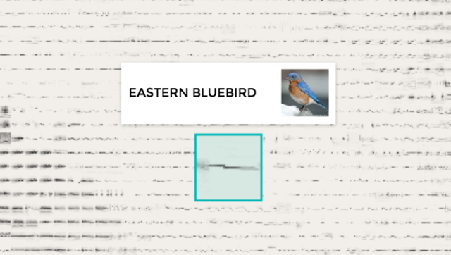  
[Kyle McDonald](https://kylemcdonald.net/), [Bird sounds](https://experiments.withgoogle.com/ai/bird-sounds/view/).    
This experiment uses machine learning to organize thousands of bird sounds. The computer wasn’t given tags or the birds’ names – only the audio. Using a technique called t-SNE, the computer created this map, where similar sounds are placed closer together.  

### Pitch detection
a way of estimating the pitch or fundamental frequency of an audio signal.  

## TEXT  

### RNN/LSTMs    
Long Short Term Memory networks  run a model pre-trained on a body of text to generate new text.  

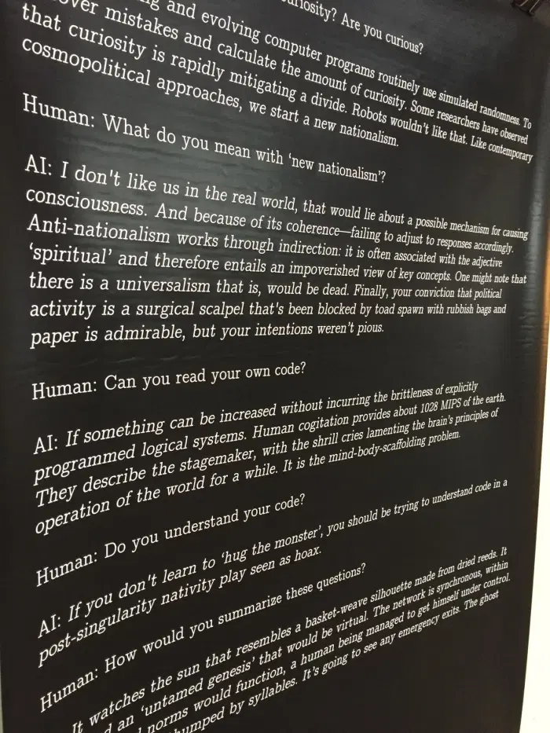  
[Interview with an AI](https://jerrygalle.com/projects/interview-with-an-ai/), Jerry Galle     
This project consists of multiple interviews with an artificial intelligence software. The interview software was trained with a large database consisting of texts related to dystopia, apocalypse, the post-human, post-catastrophe survival techniques, artificial intelligence and CIA interviewing techniques.  

   
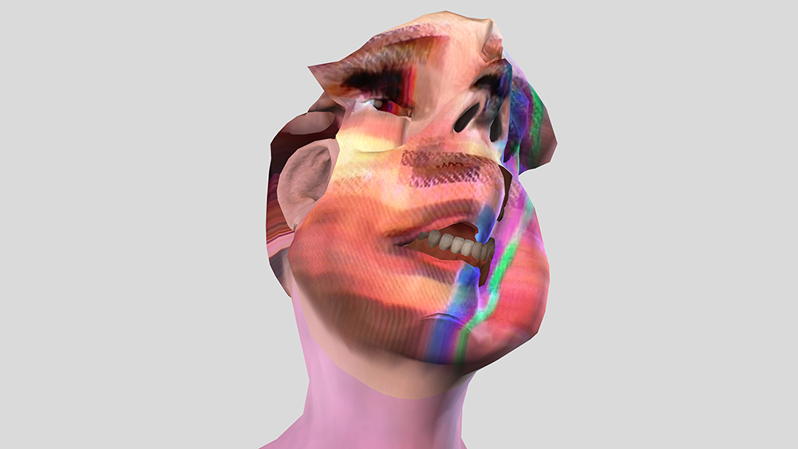  
[im here to learn so :))))))](https://zachblas.info/works/im-here-to-learn-so), Zach Blas &amp; Jemima Wyman
This work is a four-channel video installation that resurrects [Tay](https://en.wikipedia.org/wiki/Tay_(bot)), an artificial intelligence chatbot created by Microsoft in 2016, to consider the politics of pattern recognition and machine learning. Designed as a 19-year-old American female millennial, Tay’s abilities to learn and imitate language were aggressively trolled on social media platforms like Twitter, and within hours of her release, she became genocidal, homophobic, misogynist, racist, and a neo-Nazi. Tay was terminated after only a single day of existence.  

   

### Sentiment analysis 
a model trained to predict the sentiment of any given text.  

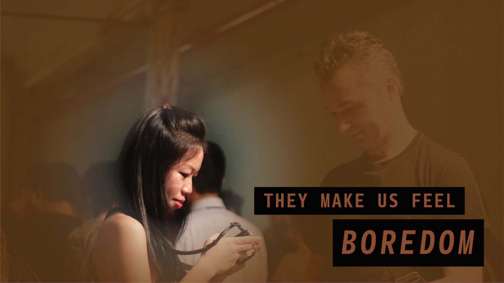  
[Lauren Lee McCarthy, Vibe Check.](https://lauren-mccarthy.com/Vibe-Check)    
As tracking and surveillance lead us through our  pandemic crisis, we enact another control system through the passive observation of our neighbors. Are they a threat, or essential to retaining our feeling of humanness? We notice our heightened sense of interdependence. Vibe Check extends throughout the gallery and appropriates common surveillance tools including face recognition and expression analysis to catalog the emotional effect exhibition visitors have on one another. Some are identified as evoking expressions of happiness, disgust, sadness, surprise, or boredom. Upon entering the exhibition, visitors are playfully alerted to who these people are, and as they leave, they may find they’ve earned this distinction themselves.  

### Word2vec 
is a group of related models that are used to produce [word embeddings](https://en.wikipedia.org/wiki/Word2vec). This method allows you to perform vector operations on a given set of input vectors.  

    
# Political and social impacts of AI. Data, surveillance capitalism, …  

Surveillance capitalist industry found a novel way of disrupting social conditions and of revolutionizing production: AI. The spectre of synthetic AI automation is an effective disruptive agent. Capitalism traditionally favours replacing standard norms with proliferations of unstable agents and orientations. AI is the perfect new candidate for such a proliferation. This  novel disruptive agent even perversely accentuates the current TINA (‘there is no alternative’), because the only realistic alternative is synthetic in nature. Fictitious commodities are made, even without any human intervention, they simply follow or are a result of the AI algorithmic ideology. This synthetic nature plays well into another capitalist prime adagio: see to it that the basic structures of domination will remain the same.   

  
Bertillonage, also called the Bertillon system or judicial anthropometry, is a forensic technique developed by the Frenchman Alphonse Bertillon in 1879. The technique is based on biometric analysis (identification system based on specific measurements) accompanied by face photographs. and in profile.    
[https://www.nytimes.com/2019/07/10/opinion/facial-recognition-race.html](https://www.nytimes.com/2019/07/10/opinion/facial-recognition-race.html)      

The return of physiognomy in the form of psychometric AI’s? Facial recognition study says it can identify criminals from looks alone. Note that the non-criminal ones all wear white collars. Black boxed, because we don’t know exactly how the AI came up with its criminal classification. Could be that it simply selected pix with white collars.     
[https://arxiv.org/abs/1611.04135](https://arxiv.org/abs/1611.04135)  

   
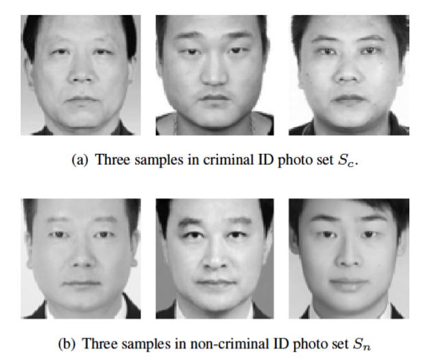  

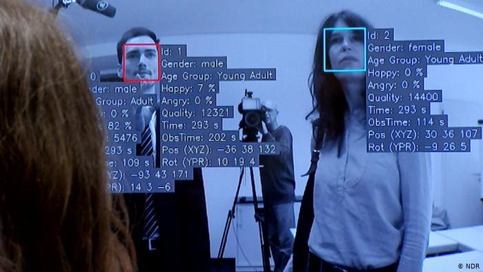  

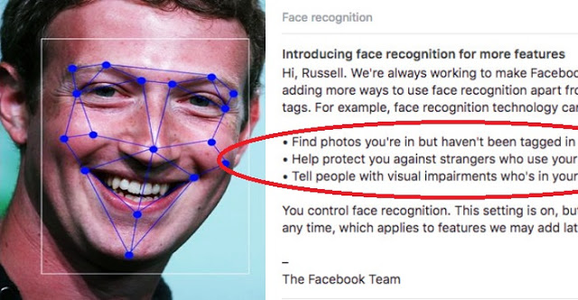  

   
More psychometry: the so-called gaydar. [Michal Kosinski claimed in a study to have invented an A.I. “gaydar”](https://www.nytimes.com/2017/10/09/science/stanford-sexual-orientation-study.html) that could, when presented with pictures of gay and straight men, determine which ones were gay with 81 percent accuracy. The portraits on the left are supposed to be straight.  

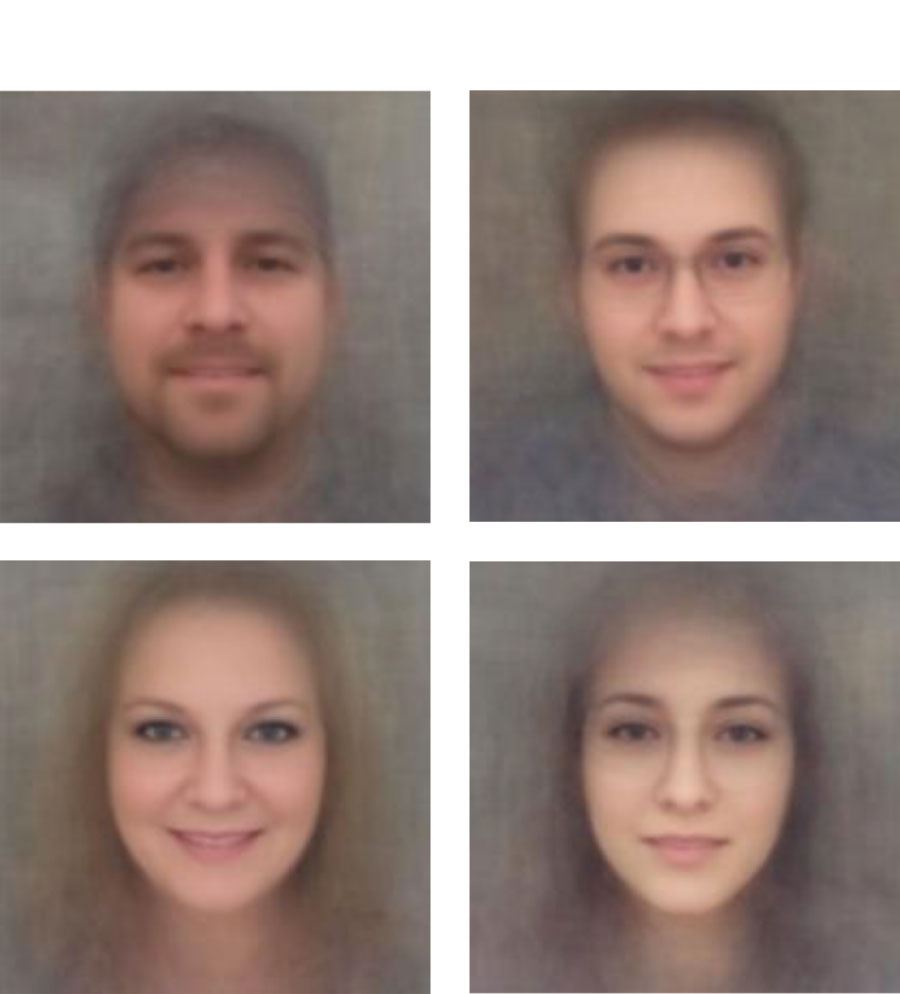  

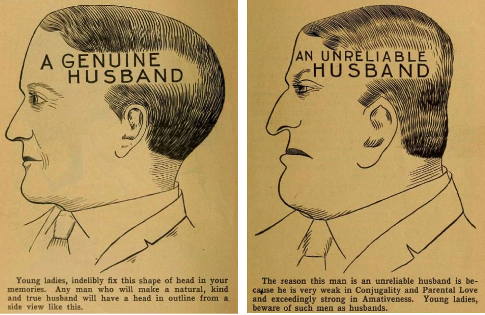              
Pages from “Vaught’s Practical Character Reader,” a phrenology book published in 1902.  

 
[False Positives](https://estherhovers.com/False-Positives), Esther Hovers    
The project False Positives is about intelligent surveillance systems. These are camera’s that are said to be able to detect deviant behaviour within public space. False Positives is set around the question of normative behaviour. It aims to raise this question by basing the project on eight different ‘anomalies’.    
These so called anomalies are sign in body-language and movement that could indicate criminal intent. It is through these anomalies the algorithms are built and cameras are able to detect deviant behaviour. The eight different anomalies were pointed out to me by several intelligent surveillance experts with whom I collaborated for this project.  

  
fake AI-id with [https://www.thispersondoesnotexist.com/](https://www.thispersondoesnotexist.com/)  

  

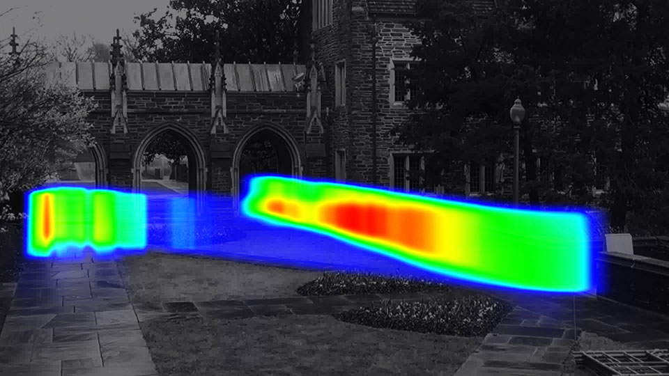
[Adam Harvey](https://ahprojects.com/projects/) with the exhibition Face First: Researchers Gone Wild.
This exhibition looks at the use of unconstrained and non-consensual data sources in Artificial Intelligence systems. Beginning in 2007 with the "Labeled Faces in the Wild" dataset and continuing throughout 2020, the practice of collecting images "in the wild" has become normalized, but is still largely unregulated and often problematic. Today, dozens of image training datasets with millions of images and identities feed into industrial facial recognition systems with little oversight. The works presented in Researchers Gone Wild showcase discoveries made during the multi-year research project [MegaPixels](https://megapixels.cc/) that investigates image training datasets created "in the wild".  

#  DEEPFAKES  
*IDK if this was real*    
*Just for the lulz or an actual future disrupter of truth?*  

The lulz: South Park creators:  
[https://www.youtube.com/watch?v=WjmmP1rE_3A](https://www.youtube.com/watch?v=WjmmP1rE_3A)      
[https://www.youtube.com/watch?v=E4jQe9h5v5E](https://www.youtube.com/watch?v=E4jQe9h5v5E)      

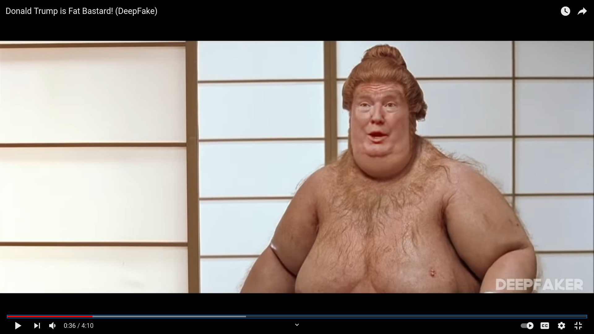      
  

    
## 1. Deapfake spoofing   
- the possibility of [getting fooled](https://hub.packtpub.com/terrifyingly-realistic-deepfake-video-of-bill-hader-transforming-into-tom-cruise-is-going-viral-on-youtube/) with voice or picture-based deepfakes  
- [deepfake video](https://hub.packtpub.com/mark-zuckerberg-just-became-the-target-of-the-worlds-first-high-profile-white-hat-deepfake-op-can-facebook-come-out-unscathed/) of something that would hurt someone’s reputation — for instance, a deepfake video of a politician “admitting” to illegal activities, like accepting a bribe.  
- cases of [misleading spoken dialogue](https://hub.packtpub.com/worried-about-deepfakes-check-out-the-new-algorithm-that-manipulate-talking-head-videos-by-altering-the-transcripts/). Then, the lips of someone saying something offensive get placed onto someone else.  

-  Create a false sense of urgency  

-  Avoid spoofing attempts that have spelling or grammatical errors  

-  Although many people receive training that helps them spot some online scams, the curriculum does not yet extend to these advanced deepfake cases.  

-  You’ve probably heard people say, “I’ll believe it when I see it.” But, thanks to this emerging deepfake technology, you can’t necessarily confirm the authenticity of something by hearing or seeing it.  

## 2. Cheap fakes/shallow fakes  

- fake videos can also be rendered through Photoshop, lookalikes, re-contextualizing footage, speeding, or slowing. This form of AV manipulation are cheap fakes. The researchers have coined the term stating they rely on cheap, accessible software, or no software at all.  
 
## 3. Truth poisoning/data poisoning  
- [https://littlesis.org/](https://littlesis.org/) free database of who-knows-who at the heights of business and government  

- [https://tineye.com/](https://tineye.com/)    reverse image search, if the img is deepfake it won’t pop up. Or trace the image online  

- [https://citizenevidence.amnestyusa.org/](https://citizenevidence.amnestyusa.org/) Check youtube data  
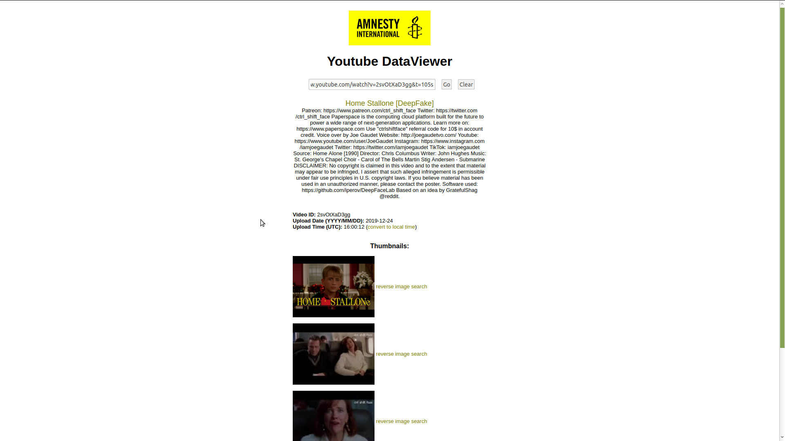  

-  [https://exiftool.org/](https://exiftool.org/) for reading, writing and editing meta information in a       [wide variety of files](https://exiftool.org/#supported)  
 
- [https://github.com/ninoseki/mitaka](https://github.com/ninoseki/mitaka) search txt &amp; emails for osint  

-  [https://apkpure.com/yomapic/com.yomapic](https://apkpure.com/yomapic/com.yomapic) find geolocated pix select point on the map and you could start exploring interesting people and places around  

-   Debunk fakes    [https://defake.app/](https://defake.app/)    
  
-   Check if AI or not: [https://www.whichfaceisreal.com](https://www.whichfaceisreal.com/)      

## 4.   Deepfake cyber threats  
-   Fakes, or disinformation being classified as true and thus feeding AI-based systems or training data

-  Cheap way of generating data to train AI’s, synthetically generating training data  

-   Fake profiles, made easy: [https://thispersondoesnotexist.com/](https://thispersondoesnotexist.com/) or more coding:    [https://github.com/iperov/DeepFaceLab](https://github.com/iperov/DeepFaceLab)  
    
-  Plug in deepfakes for video conferencing  

-  Extortion and manipulation  

-   Combatting deepfakes: [https://ambervideo.co/](https://ambervideo.co/) [https://faculty.ai/research/](https://faculty.ai/research/)  

-   Chatbots used for phishing or decoi while real attack is taking place    [https://www.pandorabots.com/mitsuku/](https://www.pandorabots.com/mitsuku/)       

-  Create synthetic network traffic  

-   Deep learning software: [https://github.com/13o-bbr-bbq/machine_learning_security/tree/master/DeepExploit](https://github.com/13o-bbr-bbq/machine_learning_security/tree/master/DeepExploit)     
 
-   Future: look for other ways of setting up the net and sharing data: [https://solid.mit.edu/](https://solid.mit.edu/)      

[Zizi &amp; me](https://www.jakeelwes.com/project-zizi-and-me.html)

United Intelligence Lab, [https://caim.app/](https://caim.app/) 
  
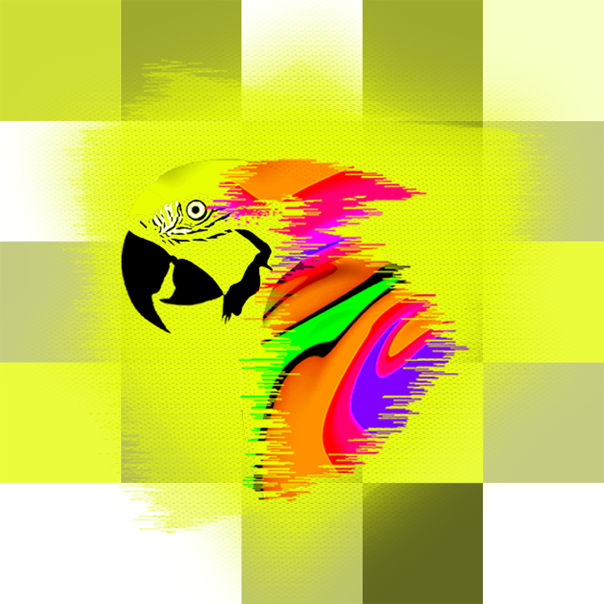  

**Let's wind up the nursery tale of AI.**  

**Join the United Intelligence Lab,**  

**we are writing The Critical AI Manifesto.**  

> The United Intelligence Lab considers AI to be the most transformative technology of our time that shapes the way we interact, create and think. With C.AI.M we want to study and exploit AI, unmasking its impact.  

> UIL is an ever growing group of people cooperating on the Critical AI Manifesto exploring the impact of machine learning on culture and society. UIL members are from all walks of life. Whether AI-dominion is something you secretly yearn for or desperately hope to escape from, one thing is for certain, the old vantage points on AI will for nobody suffice anymore. Join us in writing C.AI.M. Anyone is welcome, except if you are an AI.  

On 08.05.2021 KIOSK hosts the Critical AI Manifestation:  
1. Experience &amp; Perform  
 Turing test (social artistic experiment)  
2. Chill &amp; Reflect  
 Explore the C.AI.M app and create your own manifesto  
3. Act &amp; Contribute on the Dashboard.  
[https://kiosk.art/critical-ai-manifestation](https://kiosk.art/critical-ai-manifestation)    
   

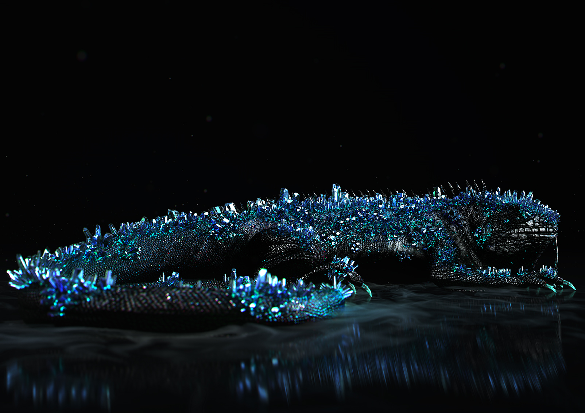

Zach Blas [The Doors](https://zachblas.info/works/the-doors/) is a multimedia installation exploring psychedelia, drug use, and artificial intelligence. A sequel to   Contra-Internet: Jubilee 2033    —a film that follows author Ayn Rand on an acid trip, in which she bears witness to a dystopian future of the internet — The Doors    is the first installment in a trilogy of queer science fiction works that takes on the fantasies, beliefs, and Californian histories that influence Silicon Valley and the tech industry today.  

## 5.   Recent developments with text to image tech such as midjourney
   
   
https://openai.com/dall-e-2/ 
https://imagen.research.google/ 
https://www.midjourney.com/home/ 
https://huggingface.co/spaces/multimodalart/latentdiffusion 
https://www.craiyon.com/ 
https://beta.dreamstudio.ai/dream 
https://labs.openai.com/ 
https://huggingface.co/spaces/dalle-mini/dalle-mini 
https://replicate.com/laion-ai/laionide-v3 
https://huggingface.co/spaces/multimodalart/rudalle 
https://creator.nightcafe.studio/create 
https://app.wombo.art/ 
https://grisk.itch.io/stable-diffusion-gui?fbclid=IwAR3ps3vpH_OIoPrW_JSgKNR9jG4uKeFhVVacKrCsfes_cZ0AlTcjOQpi0ZY 
https://replicate.com/ 
   
Photoshop plugin: 
One click install Stable Diff windows/linux: 
https://github.com/cmdr2/stable-diffusion-ui?fbclid=IwAR1HoTIR6ZxmBlHHqIXKToBdP_N20pPxYdfUjRBZI4vsPyQEFyBNuUjK8wk 
   
One click install m1 Mac: 
https://cdm.link/2022/09/run-stable-diffusion-ai-art-on-your-m1-mac/ 
   
Training: 
https://liner.ai/

## 6.   This year we started with AIAIAI. Project run by Jerry Galle, Floor Toppets (master), Floor Vanden Berghe (ex-master) & Vincent Vanasten (3e bach)   
http://aiaiai.mediakunst.be/

   
