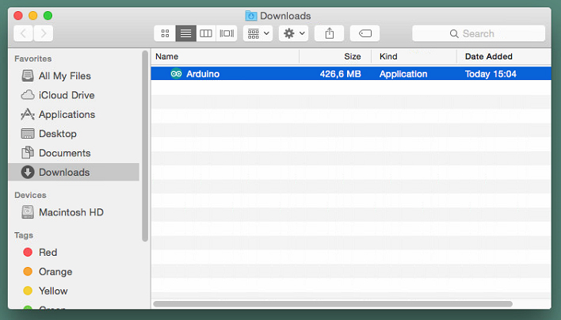
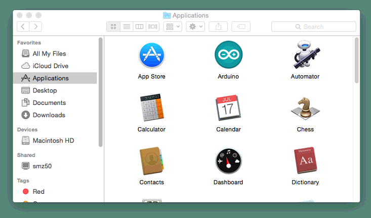
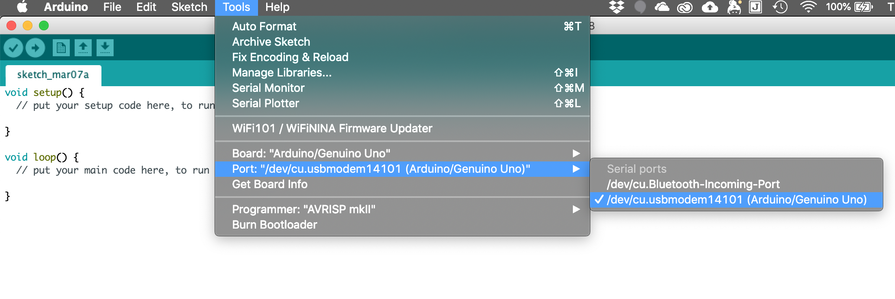
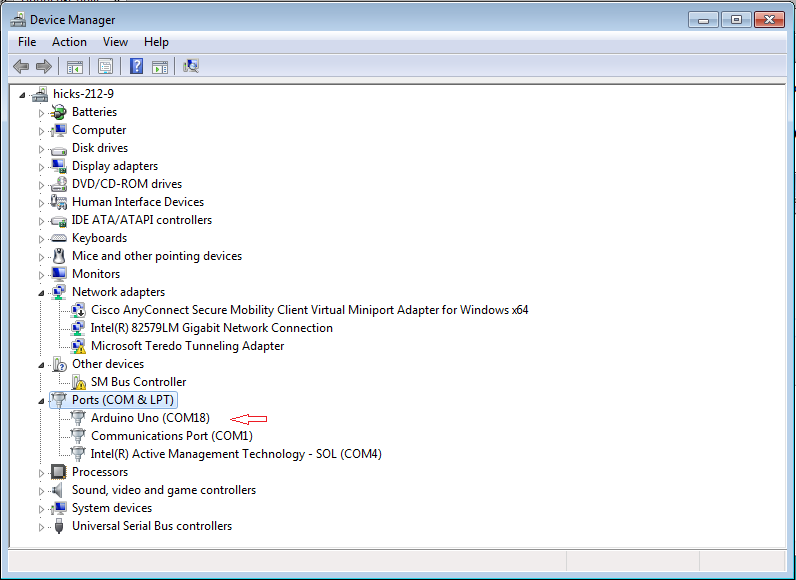
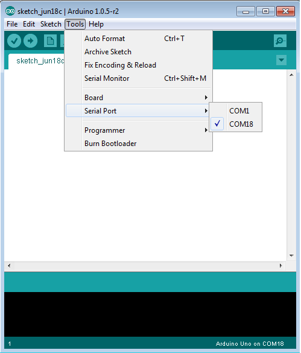
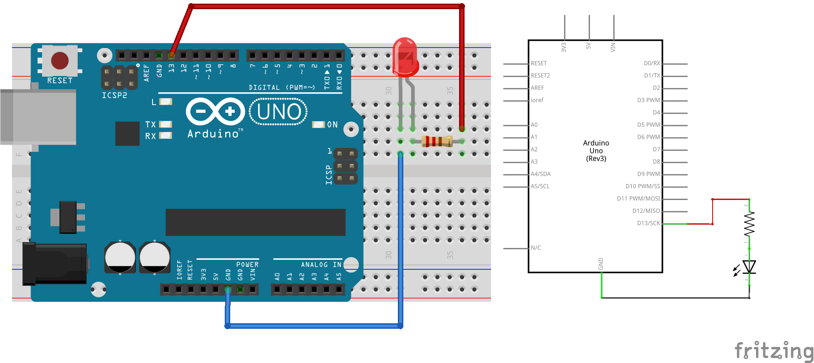

# Arduino & basic electronics Tutorial 
_-- :flushed: level 1 --_

#### Contents
level 1 | level 2
:--- | :--- 
1 [Introduction](#intro) | 
2 [The Arduino Platform](#platform) |
3 [the Arduino Board](#board) |
4 [The Software (IDE)](#software) |
4.1 [Arduino IDE Installation Guide](#IDE) |
4.2 [Port Identification & Board Selection](#portID) |
4.3 [The User Interface](#UI) |
5 [Getting Started: Hello World!](#started) |
6 Wiring Diagrams & Schematics |
7 Next step: a Pushbutton |
8 Analog In |
9 Anolog Out |
10 Serial Connection |


## <a name="intro">1. Introduction</a>

[Arduino](https://www.arduino.cc/) is an open source physical computing platform based on a simple input/output (I/O) board and a development environment that is based on [Processing](http://www.processing.org). Arduino can be used to develop standalone interactive objects or can be connected to software on your computer, such as [Processing](https://processing.org/), P5JS with [the p5.bots library](https://github.com/sarahgp/p5bots), [TouchDesigner](https://www.derivative.ca/), [VVVV](https://vvvv.org/), [Max](https://cycling74.com/products/max/), ...  

## <a name="platform">2. The Arduino Platform

Arduino is composed of two major parts: **the Arduino board**, which is the piece of hardware you work on when you build your objects, and **the Arduino IDE**, the software you run on your computer. In the IDE you write a sketch (a computer program with a set of instructions) that you upload to the Arduino board. This program tells the board what to do.

Community
https://forum.arduino.cc/
https://www.arduino.cc/en/Tutorial/HomePage
https://create.arduino.cc/projecthub

[Hackster.io](https://www.hackster.io/) is the world’s fastest growing developer community for learning, programming, and building hardware.

## <a name="hardware">3. The Arduino Board
The Arduino board is a small microcontroller or, in other words, a small computer chip on a circuitboard. This computer is at least a thousand times less powerful than your laptop, but it’s a lot cheaper and very useful to build interesting devices. 

We will be using an [keyestudio Uno R3](https://www.keyestudio.com/keyestudio-uno-r3-atmega328p-development-board-usb-cable-for-arduino-p0513-p0513.html) arduino clone. 


Looking at the Arduino board: you’ll see a black chip with 28 *legs*. That chip is the ATmega328P, the heart of your board. 
The arduino UNO / ATmega328 features:
- **14 Digital IO pins** (pins 0–13). These can be inputs or outputs, which is specified by the sketch you create.
- **6 Analog In pins** (pins 0–5). These dedicated analog input pins take analog values (0-5V) (i.e. voltage readings from a sensor) and convert them into a number between 0 and 1023 (= 10 bit).
- **6 PWM pins** (pins 3, 5, 6, 9, 10, and 11). These are actually 6 of the digital pins that can be reprogrammed for *analog output*.
- The board can be **powered** from your computer’s USB port (5V), most USB chargers, or an AC adapter (7-12V recommended, 2.1mm barrel tip, center positive).
- And another Atmega16U2 programmed as a **USB-to-serial converter**.


*The complete parts  of an Arduino Uno*

The arduino reference can be found [here](https://www.arduino.cc/en/Reference/Board).
The complete schematic of Arduino Uno can be found [here](https://www.arduino.cc/en/uploads/Main/arduino-uno-schematic.pdf).

### The keyestudio Sensor Kits
We will use Arduino starter kits developed by Keyes. Each kit contains a UNO R3 Controller board, some sensor modules (e.g. a joystick, three axis acceleration, rotary encoder, potentiometer, soil humidity, line tracking, LM35 temperature, photocell, vibration, gas, water, PIR, color, air quality, sound, ...), some actuators (e.g. LEDs, RGB LED, passive & active buzzer, relay, ...), a Breadboard, some resistors, buttons, jumper wire & a
USB cable. 

~~Keyestudio also provides a wiki with detailed tutorials using the provided hardware module. The tutorial include connection diagrams and sample codes.
See the tutorials for [Kit 1](https://wiki.keyestudio.com/Ks0178_keyestudio_Sensor_Kit_for_ARDUINO_starters-_K1), [Kit 2](https://wiki.keyestudio.com/Ks0179_keyestudio_Sensor_Kit_for_ARDUINO_starters-_K2), [Kit 3](https://wiki.keyestudio.com/Ks0179_keyestudio_Sensor_Kit_for_ARDUINO_starters-_K3) & [Kit 4](https://wiki.keyestudio.com/Ks0179_keyestudio_Sensor_Kit_for_ARDUINO_starters-_K4)~~

## <a name="software">4. The Software (IDE)
The programs you write for your Arduino are known as sketches. They are written in C/C++.


### <a name="IDE">4.1 Arduino IDE Installation Guide
Download the latest stable version for your operating system from the [Arduino Software Centre.](https://www.arduino.cc/en/Main/Software).        
#### MacOS
1. [Download the Application zip file](https://www.arduino.cc/en/Main/Software) whose name will be something along the lines of  Arduino-1.8.9-macosx.zip.
2. Extract the zip file.
3. Open the extracted folder. 

4. Copy the Arduino application into the Applications folder 

5. You are done! 

#### Windows
You have some options to install the Arduino IDE. Download & install it [manually](https://www.arduino.cc/en/Guide/Windows) or trough the [MS store](https://www.microsoft.com/fr-be/p/arduino-ide/9nblggh4rsd8?ocid=badge&rtc=1&activetab=pivot:overviewtab).

#### Linux
Get the latest version from the [download page](https://www.arduino.cc/en/Main/Software). You can choose between the 32, 64 and ARM versions. Install it following [this quick start guide](https://www.arduino.cc/en/Guide/Linux).

    
### <a name="portID">4.2 Port Identification & Board Selection
The process for setting up your Arduino and connecting the software to your board differs also related to the computer you are using. 

#### MacOS / Linux
1. Go to Tools >> Serial Port >> then the port beginning with /dev/cu.usbmodem...

2. Select the right board. Go again to Tools >> Board and select "Arduino/Genuino Uno"

#### Windows
1. Selecting a port requires an extra step on Windows. The port does not say whether it is connected to the Arduino, so you will have to go the device manager to find which port to connect to. You can find the device manager by searching for it in Start. Then select Ports to display the list of ports. In this example, the Arduino is connected to COM18.


2. In the Arduino IDE, select Tools >> Ports >> The number that your Arduino is connected to.


3. Here too. Select the right board. Go again to Tools >> Board and select "Arduino/Genuino Uno"

### <a name="UI">4.3 The User Interface


## <a name="started">5. Getting Started: Hello World!<br>☞ 𝔻𝕚𝕘𝕚𝕥𝕒𝕝 𝕆𝕦𝕥𝕡𝕦𝕥𝕤 


A "Hello World!" in the Arduino sphere is a blinking LED.  
You just need an Arduino and a USB cable. Open an new file in the IDE, name and save it.  
Then type the following text into the Arduino sketch editor but you can skip the lines starting with a `//` as they are comments.

```C++
const int ledPin = 13; 
// LED connected to digital pin 13  
 
void setup() {
// the setup function runs once when you press reset 
// or power the board
  pinMode(ledPin, OUTPUT);
// initialize digital pin 13 as an output.
}

void loop() {
// the loop function runs over and over
  digitalWrite(ledPin, HIGH);   
  // turn the LED on (HIGH is the voltage level)
  delay(1000);               
  // wait for 1000 milliseconds or 1 second
  digitalWrite(ledPin, LOW);    
  // turn the LED off by making the voltage LOW
  delay(1000);               
  // wait for another second
}
```
Press the **Verify** button to check your code is correct.  
If everything is fine, you’ll see the message **“Done compiling”** appear at the bottom of the Arduino IDE. The Arduino IDE has translated your sketch into an executable program that can be run by the board.  
Now you can **upload** it into the board.  
Press the Upload to I/O Board button. This will reset the board and force it to stop its current functions. Then sends the current compiled sketch is send to the board, got stored it in its memory. Then the board will run it. When it went fine you'll see the message **“Done uploading”** appear to let you know the process has completed correctly.

Note the 2 RX and TX LEDs on the board. These flash every time a byte is sent or received. They will flicker during the upload process. If you don’t see that, or if you get an error message instead of “Done uploading”, then there is a communication problem between your computer and Arduino. Make sure you’ve selected the right serial port and confirm that the correct model of Arduino is selected.
   
Once the code is in your Arduino board, it will stay there until you put another sketch on it. 

Assuming that the sketch has been uploaded correctly, you will see the LED turn on for a second and then turn off for a second.


:mag: **A closer look at the code**

`const int ledPin = 13;`   
Here we specify that the LED we’re blinking is connected to the Arduino pin 13. We are defining a variable of the **type int** with the **name ledpin** and a **value 13**. **Const** stands for constant. It modifies the behavior of the variable by making it **read-only**. The value of the variable  cannot be changed.     
Alternatively you can use `#define lepdin 13`. It is like an automatic search and replace for your code. In this case, it’s telling Arduino to write the number 13 every time the word *ledPin* appears.

Arduino always expects two functions to exists: `setup()` and `loop()`. The `setup()` function runs once at the beginning of program execution. The `loop()` function is called repeatedly during program execution.   

`pinMode()` tells Arduino how to configure a certain pin. Digital pins can be used either as INPUT or OUTPUT.

`digitalWrite()` is able to turn on or off any pin that has been configured as an OUTPUT. The first argument specifies which pin, the second argument specifies on (HIGH) or off (LOW). It will actually turn the output pin to 5V, and if you connect an LED, it will light up.   

`delay()` waits for the given number of milliseconds.     

Writing comments in Arduino; any text beginning with `//` is ignored or use this `/*` `*/` at the start & end for a block of comments. 

See the [reference page](http://arduino.cc/en/Reference/HomePage) for documentation of Arduino language constructs. 

Do fiddle a bit with the parameters of the delays to see changes in blinking rhythm.

## 6. Wiring Diagrams & Schematics
Next we want to wire an external LED to the board. I could explain you here in steps how to make the connections *- the anode (longest) leg of an LED is connected to pin 13 on the Arduino, the negative or cathode (shortest) leg of the LED is then connected Ground -* but wouldn't it be much easier to draw you a sketch or diagram with the wires and components connected to the Arduino?!

Being able to read these diagrams is a very important part of building circuits. Schematics are universal pictograms that allow people all over the world to understand and build electronics. Every electronic component has a very unique schematic symbol. These symbols are then assembled into circuits using a variety of programs. You could also draw them out by hand. If you want to dive deeper in the world of electronics and circuit building, learning to read schematics is a very important step in doing so.

Below is the schematics for the above circuit and, at the right, a much easier to read and wire diagram (made with [Fritzing](http://fritzing.org/home/)). We will mainly use this kind of wiring diagams in this tutorial.


Have a look at this more elaborate tutorial [How to Read a Schematic](https://learn.sparkfun.com/tutorials/how-to-read-a-schematic). 

Without soldering or metal-wire-knotting we are not able to make this connections. A  **solderless breadboard** comes in handy here. 

A breadboard is a small plastic board full of holes, each of which contains a spring-loaded contact. You can push
a component’s leg into one of the holes, and it will establish an electrical connection with all of the other holes in the same vertical column of holes.


More on [How to Use a Breadboard](https://learn.sparkfun.com/tutorials/how-to-use-a-breadboard/)

So our wiring diagram on a breadboard will look more or less like this:


## 7. Next step: a Pushbutton<br>☞ 𝔻𝕚𝕘𝕚𝕥𝕒𝕝 𝕀𝕟𝕡𝕦𝕥𝕤

:triangular_flag_on_post:  
In our first example, the LED was our actuator, and our Arduino was controlling it. If we image an outside parameter to take control over this LED we need **a sensor**. And the simplest form of sensor available is **a pushbutton**.

Let's make our wiring diagram first.  
 
The circuit:
- LED attached from pin 13 to ground
- pushbutton attached to pin 2 from +5V
- 10K resistor attached to pin 2 from ground
 


:scream_cat: Hold on! [What is a resistor]([https://learn.sparkfun.com/tutorials/resistors])?!  


The code:
```c++
// constants don't change:
const int buttonPin = 2;
const int ledPin =  13;

// variables will change:
int buttonState = 0;         // variable for reading the pushbutton status

void setup() {
  // initialize the LED pin as an output 
  // & the pushbutton pin as an input
  pinMode(ledPin, OUTPUT);
  pinMode(buttonPin, INPUT);
}

void loop() {
  // read the state of the pushbutton value:
  buttonState = digitalRead(buttonPin);

  // check if the pushbutton is pressed. 
  // If it is, the buttonState is HIGH:
  if (buttonState == HIGH) {
    // turn LED on:
    digitalWrite(ledPin, HIGH);
  } else {
    // turn LED off:
    digitalWrite(ledPin, LOW);
  }
}
```
If everything is correct, the LED will light up when you press the button. Yes?! Good!

:mag: **A closer look at the code**  
Now here is the `digitalRead()` function and the `if` `else` instructions. The latter is a very important one in programming. It allows the computer to make decisions.       
`digitalRead()` reads the value from a specified digital pin, either HIGH or LOW.

Notice the difference between the ```==``` sign and the ```=```. The former is used when two entities are compared, and returns TRUE or FALSE. The latter assigns a value to a variable. 

:triangular_flag_on_post:  
Holding your finger on the button for as long as you need light is not practical. 
Lets program **a second behaviour** that to make the on button “stick”. We therefore must implement some form of “memory”, in the form of a software mechanism that will remember when we have pressed the button and will keep the light on even after we have released it.

```c++ 
// Turn on LED when the button is pressed
// and keep it on after it is released

const int buttonPin = 2;
const int ledPin =  13;

int buttonState = 0;  // variable for reading the pushbutton status
int val = 0;          // val will be used to store the state of the input pin
int old_val = 0;      // this variable stores the previous value of "val"

void setup() {
  // initialize the LED pin as an output
  // & the pushbutton pin as an input
  pinMode(ledPin, OUTPUT);
  pinMode(buttonPin, INPUT);
}

void loop() {
  // read the state of the pushbutton value:
  val = digitalRead(buttonPin);

  // check if there was a transition
  if ((val == HIGH) && (old_val == LOW)) {
    buttonState = 1 - buttonState;
    delay(10);    // small delay for debouncing
  }

  old_val = val;  // val is now old, let's store it

  // check if the pushbutton is pressed. If it is, the buttonState is HIGH:
  if (buttonState == 1) {
    digitalWrite(ledPin, HIGH); // turn LED on
  } else {
    digitalWrite(ledPin, LOW);  // turn LED off
  }
}
```

:scream_cat: Hold on! Debouncing?! [Explained and illustrated with a better / non-freezing method](https://www.arduino.cc/en/tutorial/debounce). 

:triangular_flag_on_post:   
Now that you’ve learned how to use a pushbutton, you should know that there are other basic sensors that work according to the same *on/off* principle, as: 
* **Switches** are just like a pushbutton, but doesn’t automatically change state when released.
* **Thermostats** is a switch that opens when the temperature reaches a set value.
* **Magnetic switches** (or “reed relays”)
have two contacts that come together when they are near a magnet. 
* **Carpet switches** are small mats that you can place under a carpet or a doormat to detect the presence of a human being (or heavy cat).
* **PIR** or Passive InfraRed sensor. This small device triggers when a human being (or other living being) moves within its proximity. 
* **Tilt switches** are electronic components that contains two contacts and a little metal ball. 
You can try some!

## 8. Advanced Sensors<br>☞ 𝔸𝕟𝕒𝕝𝕠𝕘 𝕀𝕟𝕡𝕦𝕥𝕤
:triangular_flag_on_post:  
In order to read this type of sensor, we need **a different type of pin**. In the lowerright part of the Arduino board, you’ll see six pins marked **“Analog In”**.   
These are special pins that can tell us not only whether there is a voltage applied to them, but if so, also its value. By using the `analogRead()` function, we can read the voltage applied to one of the pins. This function returns a number between 0 and 1023, which represents voltages between 0 and 5 volts. For example, if there is a voltage of 2.5 V applied to pin number 0, analogRead(0) returns 512.

The next sketch & electronics diagram demonstrates analog input by reading an analog sensor on analog pin 0 and turning on and off a LED connected to digital pin 2. The amount of time the LED will be on and off depends on the value obtained by analogRead(). 

The circuit:
- potentiometer: center pin of the potentiometer to the analog input 0, one side pin (either one) to ground, the other side pin to +5V 
- LED: a 220Ω resister bridges digital output 2 to the  anode (long leg) of the LED, the cathode (short leg) attached to ground.   
Actually the resistor can also go in between the cathode and ground as in a series circuit the order of components does not matter as the current has to pass through all the parts!


The code:
```c++
int sensorPin = A0;    // select the input pin for the potentiometer
int ledPin = 13;      // select the pin for the LED
int sensorValue = 0;  // variable to store the value coming from the sensor

void setup() {
  // declare the ledPin as an OUTPUT:
  pinMode(ledPin, OUTPUT);
}

void loop() {
  // read the value from the sensor:
  sensorValue = analogRead(sensorPin);
  // turn the ledPin on
  digitalWrite(ledPin, HIGH);
  // stop the program for <sensorValue> milliseconds:
  delay(sensorValue);
  // turn the ledPin off:
  digitalWrite(ledPin, LOW);
  // stop the program for for <sensorValue> milliseconds:
  delay(sensorValue);
}
```
:triangular_flag_on_post:  
serial monitor   
:triangular_flag_on_post:  
voorbeeld met een voltage devider  
:triangular_flag_on_post:
andere sensoren

## 9. PWM <br>☞ 𝔸𝕟𝕒𝕝𝕠𝕘 𝕆𝕦𝕥𝕡𝕦𝕥𝕤
:triangular_flag_on_post:  
PWM, short for **Pulse Width Modulation**, is a technique used to encode analog signal level into digital ones. A computer cannot output analog voltage but only digital voltage values such as 0V or 5V. So we use a high resolution counter to encode a specific analog signal level by modulating the duty cycle of PMW. The PWM signal is also digitalized because in any given moment, fully on DC power supply is either 5V (ON), or 0V (OFF). The voltage or current is fed to the analog load (the device that uses the power) by repeated pulse sequence being ON or OFF.    
The output voltage value is calculated via the on and off time. Output voltage = (turn on time/pulse time) * maximum voltage value

PWM has many applications: lamp brightness regulating, motor speed regulating, sound making, etc.


                                
1. The amplitude of pulse width (minimum / maximum)
2. The pulse period (The reciprocal of pulse frequency in 1 second)
3. The voltage level（such as：0V-5V）

There are 6 PMW interfaces on an Arduino Uno; Digital pins 3, 5, 6, 9, 10, and 11.  
    
The circuit:


The code:
```c++
int ledPin = 3;      // LED connected to digital pin 3
int fadeAmount = 5;  // how many points to fade the LED by


void setup() {
  // nothing happens in setup
}

void loop() {
  // fade in from min to max in increments of ? points:
  for (int fadeValue = 0 ; fadeValue <= 255; fadeValue += fadeAmount) {
    // sets the value (range from 0 to 255):
    analogWrite(ledPin, fadeValue);
    // wait for 30 milliseconds to see the dimming effect
    delay(30);
  }

  // fade out from max to min in increments of ? points:
  for (int fadeValue = 255 ; fadeValue >= 0; fadeValue -= fadeAmount) {
    // sets the value (range from 0 to 255):
    analogWrite(ledPin, fadeValue);
    // wait for 30 milliseconds to see the dimming effect
    delay(30);
  }
}
```

**Now lets connect our Input with the Output.**
In a previous experiment, we have done a *button-controlled LED*, using digital signal to control digital pin. Now we will use a potentiometer to control the brightness of the LED.

The input of potentiometer is analog, so we connect it to analog port, and LED to PWM port.

The circuit:


In the program compiling process, we will use the analogWrite (PWM interface, analog value) function. In this experiment, we will read the analog value of the potentiometer and assign the value to PWM port, so there will be corresponding change to the brightness of the LED. One final part will be displaying the analog value on the screen. You can consider this as the "analog value reading" project adding the PWM analog value assigning part. Below is a sample program for your reference.


After downloading the program, when we rotate the potentiometer knob, we can see changes of the displaying value, also obvious change of the LED brightness on the breadboard.

The code:
```c++
/*
  Set the brightness of ledpin to a brightness specified by the
  value of the analog input
*/

const int ledPin = 3;      // LED connected to digital pin 9
const int analogPin = 0;   // potentiometer connected to analog pin 0

int val = 0;         // variable to store the read value


void setup() {
  // Noting here as: Analog pins are automatically set as inputs & 
  // it is not needed to set the pin as an output before calling analogWrite()
}
void loop() {
  // read the value from the sensor
  val = analogRead(analogPin); 
  // turn the ledpin on at the brightness set by the sensor
  analogWrite(ledpin, val / 4);
  delay(10);
}
```

## 10. Serial Connection <br>𝕊𝕖𝕣𝕚𝕒𝕝 ℂ𝕠𝕟𝕟𝕖𝕔𝕥𝕚𝕠𝕟


Let's open Arduino software and compile code that enables Arduino to print "Hello World!" under your instruction. Of course, you can compile code for Arduino to continuously echo "Hello World!" without instruction. A simple If () statement will do the instruction trick. With the onboard LED connected to pin 13, we can instruct the LED to blink first when Arduino gets an instruction and then print "Hello World!”. 

```c++
int val;          //define variable val
int ledpin = 13;  // define digital interface 13

void setup()
{
  Serial.begin(9600);// set the baud rate at 9600 to match the software set up. When connected to a specific device, (e.g. bluetooth), the baud rate needs to be the same with it.
  pinMode(ledpin,OUTPUT);// initialize digital pin 13 as output. When using I/O ports on an Arduino, this kind of set up is always needed.
}

void loop()
{
  val=Serial.read();// read the instruction or character from PC to Arduino, and assign them to Val.
  if(val=='R')// determine if the instruction or character received is “R”.
  {  // if it’s “R”,    
    digitalWrite(ledpin,HIGH);// set the LED on digital pin 13 on. 
    delay(500);
    digitalWrite(ledpin,LOW);// set the LED on digital pin 13 off.   
    delay(500);
    Serial.println("Hello World!");// display“Hello World！”string.
  }
}
```
*TODO serial send example*


https://learn.sparkfun.com/tutorials/connecting-arduino-to-processing/all
