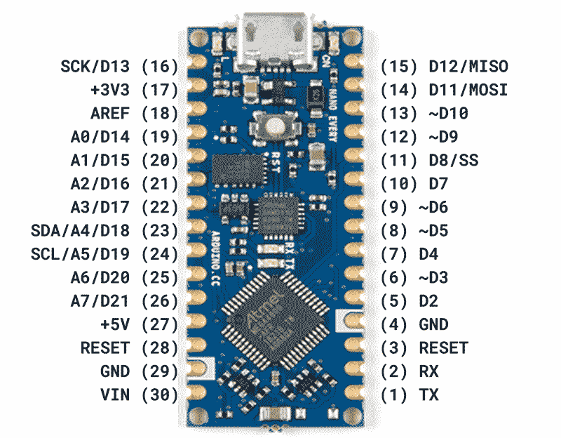
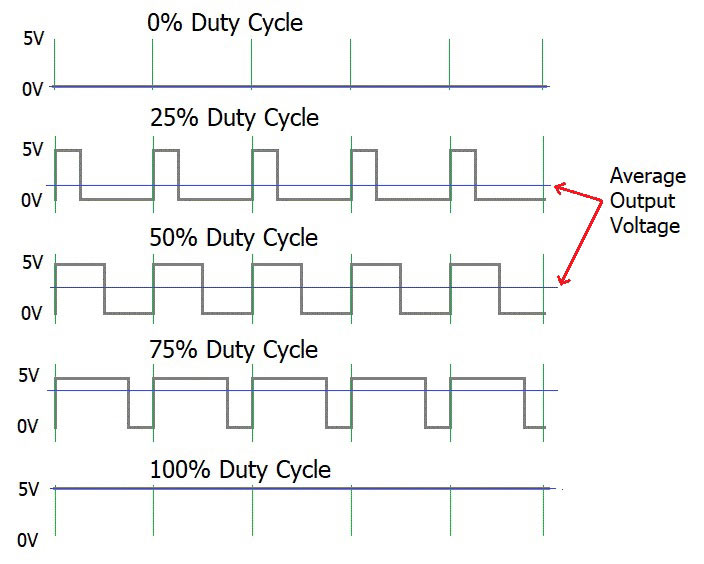
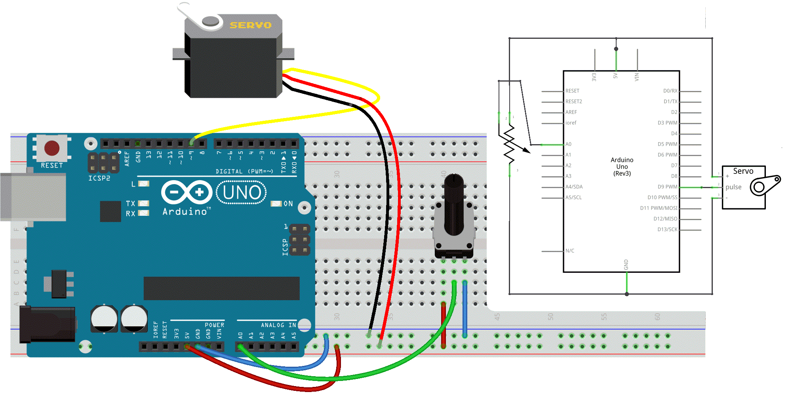

# Physical Computing with the Arduino
<sup>last updated: 9/9/2022</sup>

👋🏼 Hi, welcome 👋🏼   
You will learn the basics of physical computing <sup>[1](#1)</sup> with the Arduino. This includes learning to know and setting up the workflow, reading and reproducing circuits, program the Arduino, ...


<details>
  <summary>TOC 👈🏻 Click to expand</summary>

<!-- TOC depthFrom:2 depthTo:3 withLinks:1 updateOnSave:1 orderedList:0 -->

- [1. Introduction](#1-introduction)
- [2. The Arduino Platform](#2-the-arduino-platform)
- [3. The Arduino Board](#3-the-arduino-board)
	- [The UNO](#the-uno)
	- [The Nano Every](#the-nano-every)
- [4. The Software (IDE)](#4-the-software-ide)
	- [:flags:  the Arduino IDE Installation Guide](#flags-the-arduino-ide-installation-guide)
	- [:flags:  Upload a Sketch with the Arduino IDE 2.0](#flags-upload-a-sketch-with-the-arduino-ide-20)
- [5. Getting Started: Hello World! ☞ 𝔻𝕚𝕘𝕚𝕥𝕒𝕝 𝕆𝕦𝕥𝕡𝕦𝕥𝕤](#5-getting-started-hello-world-)
	- [:flags:  Hello World!](#flags-hello-world)
	- [:flags: Lingua Arduino](#flags-lingua-arduino)
	- [:flags: Fiddle the parameters](#flags-fiddle-the-parameters)
	- [:flags: Other actuators](#flags-other-actuators)
- [6. Wiring Diagrams & Schematics](#6-wiring-diagrams-schematics)
- [7. Let's Get Physical](#7-lets-get-physical)
	- [breadboard](#breadboard)
	- [:flags: Other Common Components](#flags-other-common-components)
- [8. Next step: a Pushbutton ☞ 𝔻𝕚𝕘𝕚𝕥𝕒𝕝 𝕀𝕟𝕡𝕦𝕥𝕤](#8-next-step-a-pushbutton-)
	- [:flags: Push the button](#flags-push-the-button)
	- [:flags: Sticky on/off button](#flags-sticky-onoff-button)
	- [:flags: Other On/Off Sensors](#flags-other-onoff-sensors)
- [9. Advanced Sensors ☞ 𝔸𝕟𝕒𝕝𝕠𝕘 𝕀𝕟𝕡𝕦𝕥𝕤](#9-advanced-sensors-)
	- [:flags:  ADC](#flags-adc)
	- [:flags: talk2me](#flags-talk2me)
	- [:flags: more toys](#flags-more-toys)
- [10. PWM ☞ 𝔸𝕟𝕒𝕝𝕠𝕘 𝕆𝕦𝕥𝕡𝕦𝕥𝕤](#10-pwm-)
	- [:flags:  PWM, a fading LED](#flags-pwm-a-fading-led)
	- [:flags:  Input 2 Output](#flags-input-2-output)
	- [:flags:  Servo Motor Control](#flags-servo-motor-control)

<!-- /TOC -->
</details>

## 1. Introduction

[Arduino](https://www.arduino.cc/) is an open source physical computing platform based on a simple input/output (I/O) board and a development environment that is based on [Processing](http://www.processing.org).     
Arduino can be used to develop standalone interactive objects or can be connected to software on your computer, such as [Processing](https://processing.org/), the internet with a.o. [P5.JS](https://p5js.org/) with [the p5.bots library](https://github.com/sarahgp/p5bots), [Pure Data](https://puredata.info/), [TouchDesigner](https://www.derivative.ca/), [VVVV](https://vvvv.org/), [Max](https://cycling74.com/products/max/), ...  

## 2. The Arduino Platform

Arduino is composed of two major parts: **the Arduino board**, which is the piece of hardware you work on when you build your objects, and **the Arduino software**, an editor (IDE) that runs on your computer or in a webbrowser. In the editor you write a sketch (a computer program with a set of instructions) that you upload to the Arduino board. This program tells the board what to do.

Arduino has a worldwide **community** of over 30 million active users. The Arduino website is a nice place to start exploring projects built on Arduino, learn, ask for help etc.  
👉🏻the [Forum](https://forum.arduino.cc/)    
👉🏻a series of [tutorials](https://docs.arduino.cc/tutorials/)    
👉🏻the deprecated [playground](https://playground.arduino.cc/) user section with projects and tutorials and it's new version, [the projecthub] (https://create.arduino.cc/projecthub)    

## 3. The Arduino Board
The Arduino board is a small microcontroller or, in other words, a small computer chip on a circuitboard. This computer is at least a thousand times less powerful than your laptop, but it is also a lot cheaper and very useful to build interesting devices.

There are many different Arduino boards on the market. All official boards are listed [here](https://www.arduino.cc/en/hardware).

We have 2 different Arduino boards in use: the [Arduino Uno Rev3](https://store.arduino.cc/products/arduino-uno-rev3) in both the official version and [keyestudio Uno R3](https://www.keyestudio.com/keyestudio-uno-r3-atmega328p-development-board-usb-cable-for-arduino-p0513-p0513.html) (a clone) and the [Arduino Nano Every](https://store.arduino.cc/products/arduino-nano-every).

### The UNO


Looking at the Arduino board: you’ll see a black chip with 28 *legs*. That chip is the ATmega328P, the heart of your board.
The arduino UNO / ATmega328 features:
- **14 Digital IO pins** (pins 0–13). These can be inputs or outputs, which is specified by the sketch you create.
- **6 Analog In pins** (pins A0–5). These dedicated analog input pins take analog values (0-5V) (i.e. voltage readings from a sensor) and convert them into a number between 0 and 1023 (or 1024 values = 10 bit).
- **6 PWM pins** (pins 3, 5, 6, 9, 10, and 11). These are actually 6 of the digital pins that can be reprogrammed for *analog output*. They are indicated with a ~(tilde).
- The board can be **powered** from your computer’s USB port (5V), most USB chargers, or an AC adapter (7-12V recommended, 2.1mm barrel tip, center positive).
- And another Atmega16U2 programmed as a **USB-to-serial converter**.
- ...

    
*The complete parts of an Arduino Uno*

The arduino reference can be found [here](https://docs.arduino.cc/tutorials/uno-rev3/intro-to-board).
The complete schematic of Arduino Uno can be found [here](https://www.arduino.cc/en/uploads/Main/arduino-uno-schematic.pdf).

### The Nano Every


The Arduino Nano Every is an evolution of the classic Arduino Nano sharing the same exact pinout but featuring the a more powerful processor, more CPU Flash memory and a higher clock speed. It has a tiny footprint of 45mm by 18mm.

This small footprint (and low price) make it make it well suited for wearable inventions, low cost robotics, electronic musical instruments, ... A minor inconvenience is that you cannot read off the function of the various pins from the board itself. You need a [Pinout diagram](https://content.arduino.cc/assets/Pinout-NANOevery_latest.pdf) for that.

The Nano Every / ATMega4809 features:
- **20 digital I/o pins** that can be used as an input or output. They operate at 5 volts.
- **8 analog inputs** (ADC 10 bit).
- 5 pins are **PWM** (Pulse Width Modulation) capable (8-bit), these are 3, 5, 6, 9 & 10.
- A **micro-USB port** that is used to power the board (5V) and to connect the board to the computer.
- An **Inbuilt LED** connected to pin n° 13.
- A power LED indicating that the Every is powered.
- 2 LEDs connected to the UART pin 17(RX) and 30(TX).
- the **Vin** pin is an INPUT. Respect the voltage limits of 7-21V to assure the proper functionality of the board.
- the **5V** pin outputs 5V from the board when powered from the USB connector or from the VIN pin of the board.
- the **3.3V** pin outputs 3.3V through the on-board voltage regulator.
- 2 **GND** pins.
- Clock Speed 20MHz, CPU Flash Memory 48KB, SRAM 6KB (ATMega4809), EEPROM 256byte
- UART, SPI & I2C for serial communication

    
*The complete parts of an Arduino Nano Every*

These are the complete [datasheet](https://docs.arduino.cc/static/f0b9dbf4880a49becb8453a10590d1ca/ABX00028-datasheet.pdf) and [schematics](https://docs.arduino.cc/static/1d097e7f46445e1d9a88348af88dcb4f/schematics.pdf) of Arduino Nano Every.


## 4. The Software (IDE)
The programs you write for your Arduino are known as sketches. They are written in C/C++ using a code editor. There are 3 options made available by the Arduino team to program your boards:
- An IDE or integrated development environment. It is software you install and run on your computer. We will use a stable beta version of 2.0 (a complete rewrite of the IDE).
- A web editor to code online. You need to make a login to save your sketches in the cloud.
- And CLI or Command Line Interface, if you don't want to use a user interface. The CLI runs also on the back of IDE 2.0.  

First we wil download & install the Arduino IDE 2.0 and then we go through the process of uploading a Sketch from the IDE to the board.

### :flags:  the Arduino IDE Installation Guide
Download the latest stable version for your operating system from the [Arduino Software Page.](https://www.arduino.cc/en/software) or alternatively start by [selecting your board on the website](https://docs.arduino.cc/) and then follow the *quickstart* guide.        

#### MacOS
Double click Application dmg file whose name will be something along the lines of "arduino-ide_2.****_macOS_64bit.dmg" and copy the Arduino IDE app into the Applications folder. You are done!

#### Windows
Simply run the file downloaded from the software page.

#### Linux
- Download the AppImage file whose name will be something along the lines of "arduino-ide_2.****_Linux_64bit.AppImage".
- Place it in a proper location, e.g /home/username/Appimages.
- Before we can run it we need to make it executable
  - right-click the file,
  - choose Properties,
  - select Permissions tab,
  - tick the Allow executing file as program box.
- You can now double click the file to launch the Arduino IDE 2 on your Linux machine.

Alternatively you can also download the zip file. Unzip it, change permissions also above on the 'arduino-ide' in the folder and then run it.

Additionally you can fix an *Add-to-Favorites option* for the Arduino IDE 2.0 application with [this guide](https://averagelinuxuser.com/ubuntu_custom_launcher_dock/)

### :flags:  Upload a Sketch with the Arduino IDE 2.0
The process for setting up your Arduino and connecting the software to your board slightly differs related on the computer you are using and the Arduino board itself.

Unlike the Arduino UNO R3, the Arduino Nano Every requires an additional step during installation. Via the **Boards manager** pane (left) you need to install the "Arduino megaAVR Boards". You can use the search input on 'every'. [More on Using the Board Manager](https://docs.arduino.cc/software/ide-v2/tutorials/ide-v2-board-manager).

    
*screenshot of the board manager*

Then, we need to select the board that we are going to use. We can do this by navigating to Tools > Port > {Board}. The board(s) that are connected to your computer should appear here, and we need to select it by clicking it.

    
*screenshot of the board & port select procedure*

To finally upload some code we first take a look at the toolbar at the top of the editor. At the very left, there are 2 buttons: a **checkmark**, used used *to verify* and **an arrow pointing right**, used *to upload*.    
The verify tool simply goes through your sketch, checks for errors and compiles it. The upload tool does the same, but when it finishes compiling, it also uploads it to the board.

On **Linux** however we probably need to take an **extra step**. It might happen that when you upload a sketch - after you have selected your board and the serial port - you get an error such as "... Permission denied". If you get this error (and also we you did not get an error), you need to **set serial port permission**.

To do this, open your Terminal and type:
```
ls -l /dev/ttyACM*
```
you will get something like:
```
crw-rw---- 1 root dialout 188, 0 5 apr 23.01 ttyACM0
```
The "0" at the end of ACM might be a different number, or multiple entries might be returned. The data we need is "dialout" (is the group owner of the file).

Now we just need to add our user to the group:
```
sudo usermod -a -G dialout <username>
```
where <username> is your Linux user name.
You will need to log out and log in again for this change to take effect.

After this procedure, you should be able to proceed normally and upload the sketch to your board or use the Serial Monitor.

Finally you can follow [this guide](https://docs.arduino.cc/software/ide-v2/tutorials/getting-started-ide-v2) if you want to get basics of the Arduino IDE 2.0 with a detailled overview of the UI, links to special features as autocompletion and debugging.

## 5. Getting Started: Hello World! ☞ 𝔻𝕚𝕘𝕚𝕥𝕒𝕝 𝕆𝕦𝕥𝕡𝕦𝕥𝕤

### :flags:  Hello World!
A "Hello World!" in the Arduino sphere is a blinking LED.  
You just need an Arduino board and a USB cable.    
Open a new file in the IDE. The lines of code below are already written. They form the basis of every program. More about that later.

```C++
void setup() {
  // put your setup code here, to run once:

}

void loop() {
  // put your main code here, to run repeatedly:

}
```
Name and save it.
Then type the following text into the Arduino sketch editor but you can skip the lines starting with a `//` as they are comments.

```C++
// LED connected to digital pin 13
const int ledPin = 13;

// the setup function runs once when you press reset
// or power the board
void setup() {
    // initialize digital pin 13 as an output.
  pinMode(ledPin, OUTPUT);

}

  // the loop function runs over and over
void loop() {
  // turn the LED on (HIGH is the voltage level)
  digitalWrite(ledPin, HIGH);
  // wait for 1000 milliseconds or 1 second
  delay(1000);
  // turn the LED off by making the voltage LOW
  digitalWrite(ledPin, LOW);
  // wait for another second
  delay(1000);
}
```
Press the **Verify** button to check if your code is correct.  
If everything is fine, you’ll see the message **“Done compiling”** appear at the bottom of the Arduino IDE. The Arduino IDE has translated your sketch into an executable program that can be run by the board.  
Now you can **upload** it into the board.  
Press the Upload to I/O Board button. This will reset the board and force it to stop its current functions. Then sends the current compiled sketch is send to the board, got stored it in its memory. Then the board will run it. When it went fine you'll see the message **“Done uploading”** appear to let you know the process has completed correctly.

:zap: Note the 2 RX and TX LEDs on the board. These flash every time a byte is sent or received. They will flicker during the upload process. If you don’t see that, or if you get an error message instead of “Done uploading”, then there is a communication problem between your computer and Arduino. Make sure you’ve selected the right serial port and confirm that the correct model of Arduino is selected.

Once the code is in your Arduino board, it will stay there until you put another sketch on it.

Assuming that the sketch has been uploaded correctly, you will see the LED turn on for a second and then turn off for a second.


:mag: **A closer look at the code**

`const int ledPin = 13;`    
Here we specify that the LED we’re blinking is connected to the Arduino pin 13. We are defining a variable of the **type int** with the **name ledpin** and a **value 13**.    
**Const** stands for constant. It modifies the behavior of the variable by making it **read-only**. The value of the variable cannot be changed. It is mandatory to use, `int ledPin = 13;` will also work.     
Alternatively you can use `#define lepdin 13`. It is like an automatic search and replace for your code. In this case, it’s telling Arduino to write the number 13 every time the word *ledPin* appears.

Arduino always expects two functions to exists: `setup()` and `loop()`. The `setup()` function runs once at the beginning of program execution. The `loop()` function is called repeatedly during program execution.   

`pinMode()` tells Arduino how to configure a certain pin. Digital pins can be used either as INPUT or OUTPUT.

`digitalWrite()` is able to turn on or off any pin that has been configured as an OUTPUT. The first argument specifies which pin, the second argument specifies on (HIGH) or off (LOW). It will actually turn the output pin to 5V, and if you connect an LED, it will light up.   

`delay()` waits for the given number of milliseconds.     

Writing comments in Arduino; any text beginning with `//` is ignored or use this `/*` `*/` at the start & end for a block of comments.

### :flags: Lingua Arduino
The Arduino programming language can be divided in three main parts: functions, values (variables and constants), and structure. See the [reference page](http://arduino.cc/en/Reference/HomePage) for documentation of Arduino language constructs.

### :flags: Fiddle the parameters
You can adjust the values of the 2 delay times to see changes in blinking rhythm. Don't forget to compile and upload the code after you made changes.

### :flags: Other actuators
The LED can easily be substituted by other actuator as:
- A Buzzer or beeper is a little device that makes a buzzing noise and is used for signalling.
- A **relay** is an electrically operated switch. It uses a low voltage control signal to switch, usually higher voltage. It can also be used to control lighting, electrical and other equipment.
- ...
but therefore we need to know how we can hook them up.

## 6. Wiring Diagrams & Schematics
Next we want to wire an external LED to the board. I could explain you here in steps how to make the connections *- the anode (longest) leg of an LED is connected to pin 13 on the Arduino, the negative or cathode (shortest) leg of the LED is then connected Ground -* but wouldn't it be much easier to draw you a sketch or diagram with the wires and components connected to the Arduino?!

Being able to read these diagrams is a very important part of building circuits. Schematics are universal pictograms that allow people all over the world to understand and build electronics. Every electronic component has a very unique schematic symbol. These symbols are then assembled into circuits using a variety of programs. You could also draw them out by hand. If you want to dive deeper in the world of electronics and circuit building, learning to read schematics is a very important step in doing so.

Below is the schematics for the above circuit and, at the right, a much easier to read and wire diagram (made with [Fritzing](http://fritzing.org/home/)). We will mainly use this kind of wiring diagams in this tutorial.


Have a look at this more elaborate tutorial [How to Read a Schematic](https://learn.sparkfun.com/tutorials/how-to-read-a-schematic).

## 7. Let's Get Physical
Let's get on with some real physical computing and electronic components we can connect and control.
Without soldering or metal-wire-knotting we are not able to make this connections. A solderless breadboard comes in handy here.

### breadboard
A [breadboard](https://en.wikipedia.org/wiki/Breadboard), also known as a solderless breadboard, is a small plastic board full of holes, each of which contains a spring-loaded contact (in metal). You can push a component’s leg into one of the holes, and it will establish an electrical connection with all of the other holes in the same vertical column of holes. Many breadboards also include sections for power distribution, making it easier to build your circuits.


More on [How to Use a Breadboard](https://learn.sparkfun.com/tutorials/how-to-use-a-breadboard/)

If you want some extra help check this: [How to Use a Breadboard](https://learn.sparkfun.com/tutorials/how-to-use-a-breadboard/)

### :flags: Other Common Components
The following a handful of common components that we will use in the following circuits.

#### wires
The wire used to connect components. They come in a wide range of sizes and types. There are 2 main varieties; solid core or stranded. Solid core is stiffer, stranded wire is more flexible. We will use jumper wires, also known as jumper leads on our breadboard.
#### switches
Switches pass or interrupt the flow of electricity. You can attach wires to 2 contacts and they are put in contact by activating the switch. Switches can be momentary and toggles switches. A toggle switch stays in it last position. A momentary switch (or pushbutton) spring back to their default position. We will use the latter.
#### light-emitting diodes (LED)
LED's are the most common for of output from a microcontroller as they need very little power to be turned on. A LED is a diode that emits light. We need to understand how a diode operates.    
A diode is like a one-way street: it only allows electricity to flow in one direction. In other words diodes are polarized. The 2 sides of a diode are called a cathode (-) and an anode (+).
#### resistors
Resistors give electricity something to do: the convert electricity to heat. In this way, they prevent the infamous short circuit. Resistors have 2 leads and no polarity.     
Resistors are rated in Ohms (Ω), indicating how much resistance they offer. Below you can learn to read the colour codes.
#### potentiometers
Potentiometers, or pots for short, are variable resistors. Potentiometers have three legs. The power of a potentiometer is in the middle leg. It's  resistance varies depends on the potentiometer’s rotating (or sliding) contact (the wiper) position. It is best to use it as a voltage divider with our Arduino. This means we have all 3 contacts connected: 1 to GND (or 3v3), 2 to ADC, 3 to 3V3 (or GND).       
Other common variable resistors are photocells (LDR), termistors, force-sensitive (FSR) and bend-sensors. These are all two-legged (or “two-lead”). In order to make them work optimally on our Pico we need to add a 2nd resistor (later more).    

See also https://makeabilitylab.github.io/physcomp/electronics/

## 8. Next step: a Pushbutton ☞ 𝔻𝕚𝕘𝕚𝕥𝕒𝕝 𝕀𝕟𝕡𝕦𝕥𝕤

### :flags: Push the button
In our first example, the LED was our actuator, and our Arduino was controlling it. If we image an outside parameter to take control over this LED, our finger, we need **a sensor**. And the simplest form of sensor available is **a pushbutton**.

Let's make our wiring diagram first.  

#### Circuit
- LED attached from pin 13 to ground
- pushbutton attached to pin 2 from +5V
- 10K resistor attached to pin 2 from ground


#### Code
```c++
// constants don't change:
const int buttonPin = 2;
const int ledPin =  13;

// variables will change:
int buttonState = 0;         // variable for reading the pushbutton status

void setup() {
  // initialize the LED pin as an output
  // & the pushbutton pin as an input
  pinMode(ledPin, OUTPUT);
  pinMode(buttonPin, INPUT);
}

void loop() {
  // read the state of the pushbutton value:
  buttonState = digitalRead(buttonPin);

  // check if the pushbutton is pressed.
  // If it is, the buttonState is HIGH:
  if (buttonState == HIGH) {
    // turn LED on:
    digitalWrite(ledPin, HIGH);
  } else {
    // turn LED off:
    digitalWrite(ledPin, LOW);
  }
}
```
If everything is correct, the LED will light up when you press the button. Yes?! Good!

:mag: **A closer look at the code**  
Now here is the `digitalRead()` function and the `if` `else` instructions. The latter is a very important one in programming. It allows the computer to make decisions.       
`digitalRead()` reads the value from a specified digital pin, either HIGH or LOW.

Notice the difference between the ```==``` sign and the ```=```. The former is used when two entities are compared, and returns TRUE or FALSE. The latter assigns a value to a variable.

### :flags: Sticky on/off button
Holding your finger on the button for as long as you need light is not practical.
Lets program **a second behaviour** that to make the on button “stick”. We therefore must implement some form of “memory”, in the form of a software mechanism that will remember when we have pressed the button and will keep the light on even after we have released it.

```c++
/* Turn on LED when the button is pressed
  and keep it on after it is released */

const int buttonPin = 2;
const int ledPin =  13;

int val = 0;          // val will be used to store the state of the input pin
int old_val = 0;      // this variable stores the previous value of "val"
int buttonState = 0;  // variable that will store the pushbutton status

void setup() {
  // initialize the LED pin as an output
  // & the pushbutton pin as an input
  pinMode(ledPin, OUTPUT);
  pinMode(buttonPin, INPUT);
}

void loop() {
  // read the state of the pushbutton value:
  val = digitalRead(buttonPin);

  // check if there was a transition
  if ((val == HIGH) && (old_val == LOW)) {
    buttonState = 1 - buttonState;
    delay(10);    // small delay for debouncing
  }

  old_val = val;  // val is now old, let's store it

  // check if the pushbutton is pressed. If it is, the buttonState is HIGH:
  if (buttonState == 1) {
    digitalWrite(ledPin, HIGH); // turn LED on
  } else {
    digitalWrite(ledPin, LOW);  // turn LED off
  }
}
```

:scream_cat: Hold on! Debouncing?! [Explained and illustrated with a better / non-freezing method](https://www.arduino.cc/en/tutorial/debounce).

### :flags: Other On/Off Sensors
Now that you’ve learned how to use a pushbutton, you should know that there are other basic sensors that work according to the same *on/off* principle, as:
* **Switches** are just like a pushbutton, but doesn’t automatically change state when released.
* **Thermostats** is a switch that opens when the temperature reaches a set value.
* **Magnetic switches** (or “reed relays”)
have two contacts that come together when they are near a magnet.
* **Carpet switches** are small mats that you can place under a carpet or a doormat to detect the presence of a human being (or heavy cat).
* **PIR** or Passive InfraRed sensor. This small device triggers when a human being (or other living being) moves within its proximity.
* **Tilt switches** are electronic components that contains two contacts and a little metal ball.
You can try some!
* ...

## 9. Advanced Sensors ☞ 𝔸𝕟𝕒𝕝𝕠𝕘 𝕀𝕟𝕡𝕦𝕥𝕤

### :flags:  ADC

In order to read a more advanced sensor then a On/Off button we need **a different type of pin**. In the lower-right part of the Arduino board, you’ll see six pins marked **“Analog In”**.   
These are special pins that can tell us not only whether there is a voltage applied to them, but if so, also its value. The Arduino has a 10 bit **A**nalog to **D**igital **C**onverter. By using the `analogRead()` function, we can read the voltage applied to one of the pins. This function returns a number between 0 and 1023, which represents voltages between 0 and 5 volts. For example, if there is a voltage of 2.5 V applied to pin number 0, `analogRead(0)` returns 512.

The next sketch & electronics diagram demonstrates analog input by reading an analog sensor as a potentiometer (or trimpot) on analog pin 0 and turning on and off a LED connected to digital pin 2. The amount of time the LED will be on and off depends on the value obtained by `analogRead()`.

#### Circuit
- potentiometer: center pin of the potentiometer to the analog input 0, one side pin (either one) to ground, the other side pin to +5V
- LED: a 220Ω resister bridges digital output 2 to the  anode (long leg) of the LED, the cathode (short leg) attached to ground.   
Actually the resistor can also go in between the cathode and ground as in a series circuit the order of components does not matter as the current has to pass through all the parts!


#### Code
```c++
int sensorPin = A0;   // select the input pin for the potentiometer
int ledPin = 2;      // select the pin for the LED
int sensorValue = 0;  // variable to store the value coming from the sensor

void setup() {
  // declare the ledPin as an OUTPUT
  pinMode(ledPin, OUTPUT);
  // there is no need to set our analog in pin
}

void loop() {
  // read the value from the sensor:
  sensorValue = analogRead(sensorPin);
  // turn the ledPin on
  digitalWrite(ledPin, HIGH);
  // stop the program for <sensorValue> milliseconds:
  delay(sensorValue);
  // turn the ledPin off:
  digitalWrite(ledPin, LOW);
  // stop the program for for <sensorValue> milliseconds:
  delay(sensorValue);
}
```
:zap: :zap: :zap:    
As you might have noticed in the example above the blinking interval is not always changed immediately after turning the knob. Especially when there are long breaks. The reason for this is that `delay()` pauses the program completely for time specified. We better use `millis()` when timing is key. See [the blink-without-delay example](https://www.arduino.cc/en/Tutorial/BlinkWithoutDelay) and also [this blogpost](https://www.norwegiancreations.com/2017/09/arduino-tutorial-using-millis-instead-of-delay/).    
:zap: :zap: :zap:

### :flags: talk2me
Wouldn't it be handy if we could check our incoming values? We actually can by establishing **Serial Communication** from our Arduino to our computer.   
We call this "serial" communication because the connection appears to both the Arduino and the computer as a serial port, even though it may actually use a USB cable. Bytes are sent one after another (serially) from the Arduino to the computer.  
In the code below we will map the 0-1023 values to a custom range 10-500, send the 2 variables over the serial port and the Arduino Serial Monitor to view them. Click the serial monitor button in the toolbar and select the same baud rate used in the call to begin().  

The circuit remains the same.  

#### Code
```c++
int sensorPin = A0;    // select the input pin for the potentiometer
int ledPin = 2;        // select the pin for the LED
int sensorValue = 0;   // variable to store the value coming from the sensor
int outputValue = 0;   // variable to store a scaled value of the sensorvalue

void setup() {
  // declare the ledPin as an OUTPUT
  pinMode(ledPin, OUTPUT);
  // initialize serial communications at 9600 bps
  Serial.begin(9600);
}

void loop() {
  // read the value from the sensor:
  sensorValue = analogRead(sensorPin);

  // map or scale it to a custom range:
  outputValue = map(sensorValue, 0, 1023, 10, 500);

  // print the results to the Serial Monitor:
  Serial.print("sensor = ");
  Serial.print(sensorValue);
  Serial.print("\t output = ");
  Serial.println(outputValue);

  // turn the ledPin on
  digitalWrite(ledPin, HIGH);
  // stop the program for <sensorValue> milliseconds:
  delay(sensorValue);
  // turn the ledPin off:
  digitalWrite(ledPin, LOW);
  // stop the program for for <sensorValue> milliseconds:
  delay(sensorValue);
}
```
:mag: **A closer look at the code**  
In the setup() function we open the serial communication set the data rate in bits per second (baud), here 9600bps, with the command `Serial.begin(9600);`.   

`Serial.print()` prints the data to the serial port as human-readable ASCII text. This command can take many forms. Numbers are printed using an ASCII character for each digit. Floats are similarly printed as ASCII digits, defaulting to two decimal places. Bytes are sent as a single character. Characters and strings are sent as is.   
For example:
Serial.print(78) gives "78"
Serial.print(1.23456) gives "1.23"
Serial.print('N') gives "N"
Serial.print("Hello world.") gives "Hello world."  

`Serial.println()` takes the same forms as Serial.print() but the message is followed by a carriage return character (ASCII 13, or '\r') and a newline character (ASCII 10, or '\n').

### :flags: more toys
The Keyestudio starter kits contain a lot of usefull sensor modules, as:
- An **Alcohol Sensor** :grinning: to make a breath analiser.
- A **Gas Sensor** or the MQ2. This sensor is suitable for detecting LPG, I-butane, propane, methane, alcohol, Hydrogen and smoke. It has high sensitivity and quick response.
- A **Temperature Sensor** used to detect ambient air temperature (range from 0° to 100° C).
- A **Photocell** or LDR is a variable resistor, which produces a resistance proportional to the amount of light it senses.
- A **joystick** is in fact a double potentiometer placed on the X & Y axis. Connecting it to two analog inputs. It also features a switch that can be connected to a digital pin.
- A **Soil Humidity Sensor**. Two probes are inserted into the soil and current flow through the soil from one probe to the other. The sensor will get a resistance value by reading the current changes between the two probes and convert such resistance value into moisture content. The higher moisture (less resistance), the higher conductivity the soil has.
- and many more

:zap: :zap: :zap:    
If we need to leave the keyestudio playgarden and make use of other sensors we might need to do some more circuit magic for a sensor to work. A very common and simple circuit is [the voltage divider](https://learn.sparkfun.com/tutorials/voltage-dividers/all). It turns a large voltage into a smaller one. See [this Analog Input tutorial](https://www.arduino.cc/en/tutorial/AnalogInput).    
:zap: :zap: :zap:

:zap: :zap: :zap:    
You might also come across an even more advanced sensor module in the Keyestudio kits. These modules are connected to the Arduino board through UART, SPI, or I2C (3 common communication peripherals found on Arduino). Lets not make it more complex then needed here. If you want to learn more [this post](https://maker.pro/arduino/tutorial/common-communication-peripherals-on-the-arduino-uart-i2c-and-spi) is a good start and the code in the Keyestudio can get you started.    
:zap: :zap: :zap:

## 10. PWM ☞ 𝔸𝕟𝕒𝕝𝕠𝕘 𝕆𝕦𝕥𝕡𝕦𝕥𝕤
### :flags:  PWM, a fading LED
PWM, short for **Pulse Width Modulation**, is a technique used to encode analog signal level into a digital one. A computer cannot output analog voltage but only digital voltage values such as 0V or 5V. We use it to control dimming of RGB LEDs or to control the direction of a servo motor, sound synthesis, etc. We can accomplish a range of results in both applications because PWM allows us to vary how much time the signal is high as in an analog fashion. While the signal can only be high (5V) or low (0V) at any time, we can change the proportion of time the signal is high compared to when it is low over a consistent time interval. We call this modulating the duty cycle.




- The amplitude of pulse width (minimum / maximum)
- The pulse period (The reciprocal of pulse frequency in 1 second)
- The voltage level（such as：0V-5V）

There are 6 PMW interfaces on an Arduino Uno: Digital pins 3, 5, 6, 9, 10, and 11, all are indicated with a ~ (tilde).

We will explore this PWM magic by changing the brightness of a LED over time.  

#### Circuit


#### Code
```c++
int ledPin = 3;      // LED connected to digital pin 3
int fadeAmount = 5;  // how many points to fade the LED by


void setup() {
  // nothing happens in setup
}

void loop() {
  // fade in from min to max in increments of ? points:
  for (int fadeValue = 0 ; fadeValue <= 255; fadeValue += fadeAmount) {
    // sets the value (range from 0 to 255):
    analogWrite(ledPin, fadeValue);
    // wait for 30 milliseconds to see the dimming effect
    delay(30);
  }

  // fade out from max to min in increments of ? points:
  for (int fadeValue = 255 ; fadeValue >= 0; fadeValue -= fadeAmount) {
    // sets the value (range from 0 to 255):
    analogWrite(ledPin, fadeValue);
    // wait for 30 milliseconds to see the dimming effect
    delay(30);
  }
}
```

### :flags:  Input 2 Output
**Now lets connect our Input with the Output.**
In a previous experiment, we have done a *button-controlled LED*, using digital signal to control digital pin. Now we will use a potentiometer to control the brightness of the LED.

The Arduino will read the analog value of the potentiometer and assign this value to PWM port. But since PWM works only in the range from 0 - 255 we need map the input from our sensor down, thus a value between 0 - 1024 to one between 0 - 255.  

#### Circuit


#### Code
```c++
/* Set the brightness of ledPin to a brightness specified by the
  value of the analog input */

const int ledPin = 3;      // LED connected to digital pin 9
const int analogPin = A0;  // potentiometer connected to analog pin 0

int val = 0;               // variable to store the read value
int ledVal;                // variable to store the output value


void setup() {
  // Noting here as: Analog pins are automatically set as inputs &
  // it is not needed to set the pin as an output before calling analogWrite()
}
void loop() {
  // read the value from the sensor
  val = analogRead(analogPin);
  // turn the ledpin on at the brightness set by the sensor
  //Mapping the Values between 0 to 255 because we can give output
  //from 0 -255 using the analogwrite funtion
  ledVal = map(val, 0, 1023, 0, 255);
  analogWrite(ledPin, ledVal);
  delay(10);
}
```

After downloading the program, when we rotate the potentiometer knob, we can see the brightness of the LED change.


### :flags:  Servo Motor Control
Now, lets substitute our LED for a **Servo Motor**.   

Servos are motors with a shaft that can turn to a specified position. They usually have a range from 0 to 180 degrees. With an Arduino we can tell a servo to go to a specified position. In this part we will see how to connect a servo motor and then how to turn it to different positions defined by the value of our potentiometer.

A servo motor consists of some parts to function: a motor, a gearbox and a feedback circuit. It just needs a power line, a connection to ground, and one to a control pin.

*There is a second, different, kind of servo that features a continuous rotation of the shaft, that can be set to various speeds. This is a very useful motor for small geared vehicles.*

#### Circuit
Our servo motor has a female connector with three pins.
- The darkest, brown here, is usually the ground. Connect it to the Arduino GND.
- Connect the power cable that in all standards should be red to 5V on the Arduino.
- Connect the remaining line on the servo connector to a digital 9 (or 10) on the Arduino.    



*Note that servos can draw considerable power, so if you need to drive more than one or two, you'll probably need to power them from a separate supply (i.e. not the +5V pin on your Arduino).*


#### Code
In this example we will use **a specific library** that will make coding a lot easier.   
Just like with most programming platforms the Arduino Software can be extended through the use of Libraries. They provide extra functionalities and make programming the Arduino much easier since they contain the code needed to control certain modules, sensors, etc… A number of libraries come installed with the IDE, but you can also download or create your own.


To use a library in a sketch, select it from Sketch > Import Library or just type in the `#include <name_of_library>` command.

```c++
#include <Servo.h>

Servo myservo;    // create servo object to control a servo

int potpin = A0;  // analog pin used to connect the potentiometer
int val;          // variable to read the value from the analog pin

void setup() {
  myservo.attach(9);  // attaches the servo on pin 9 to the servo object
}

void loop() {
  // read the value of the potentiometer
  val = analogRead(potpin);
  // scale it to use it with the servo (value between 0 and 180)
  val = map(val, 0, 1023, 0, 180);
  // sets the servo position according to the scaled value
  myservo.write(val);
  // waits for the servo to get there
  delay(15);
}
```
Make sure you always check the dos and don'ts on how to use a library on its reference page! [This is the servo reference page](https://www.arduino.cc/en/reference/servo)

The key functions used here are:
- Servo *objectname*;
- *objectname*.attach*(interface)* select the pin for servo. This can only use pin 9 or 10.
- *objectname*.write*(angle)* used to control the angle of the servo (0 to 180 degree).

You can also choose not to use a library here (and for other functions) as libraries can also introduce unnecessary dependencies & possible incompatibilities.  
See controlling servos without the Servo Library in [this tutorial of keyestudio](https://wiki.keyestudio.com/Ks0194_keyestudio_Micro_Servo).

That's it for now.    
There is [a second part of this tutorial](ArduinoPlus.md) in the make about connecting Arduino with other programs as Max, PD, Processing, Python, a webpage, etc.    
👋🏼

<hr>
<span name="1">1.</span> What Is Physical Computing?     
All computing is physical. We work with computational systems by taking action with our bodies, on devices. The construction of computing devices, and their use, consumes raw materials and energy as well. In short, the virtual always has physical consequences.  
Physical Computing here refers especially to creating or using devices that interact with the world around them. A computer senses its environment (as touch, movement, temperature, ...), processes that information, and then performs some action (with lights, motors, ...).

<div style="text-align:center;">This tutorial is licensed under a Creative Commons Attribution-NonCommercial-ShareAlike 3.0 Unported (CC BY-NC-SA 3.0)</div>
