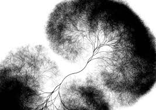

*---[ A crashcourse in Code]---*

# Context Free • an introduction

> Context Free is a program that generates images from written instructions called a grammar. The program follows the instructions in a few seconds to create images that can contain millions of shapes.

Context Free [download the software](https://www.contextfreeart.org/downloads.html) (mac, windoze & linux)    
Here you can find [the official documentation](https://github.com/MtnViewJohn/context-free/wiki)    
And these are [the tutorial files](code/CFA/CFA.zip) (zip compressed) 

## Intro
1. [primitives](code/CFA/01_primitives.cfdg)
  * Code with Shapes, thus the output is always an image.
  * Introduction of the 3 primitive shapes `SQUARE []`, `CIRCLE[]` & `TRIANGLE[]`
  *	Comments start with `//`
2. [transform](code/CFA/02_transform.cfdg)
  * Position
  * Rotation
  * Brackets & formatting
  * positive & negative values
  * positive rotation is CCW
  * run = compile	
3. [two shapes](code/CFA/03_twoShapes.cfdg)
  * redefine startshape
  * Variables
    * text color
    * reserved names
    * assign, recall
4. Loop
 *	2 kinds of transform operations
 *	everything is relative
5. [Multiple shapes](code/CFA/05_multipleShapes.cfdg)
 * more complex shapes
 * again: 2 kinds of transform operations
 * transform: scale
6. [noise](code/CFA/06_noise.cfdg)
  * rand(a,b)
  * a..b
7. [random](code/CFA/07_random.cfdg)
 * Y-position relative to previous shape affected by rotation.
 * random shape select
 * seed
8. [recursion](code/CFA/08_recursion.cfdg)
 * Dangerous
 * Terminate by size (less than 1 pixel)
9. [fractal](code/CFA/09_fractal.cfdg)
 * Multiple series of recursion
 * variables
10. [rules](code/CFA/10_rules.cfdg)
* weight: control probability
* executing specific actions without losing 
* track of position in the recursion chain
11. [underground](code/CFA/11_underground.cfdg)
* step by step
* modular approach
* Recursion terminates by having a rule NOT calling itself
* color
  * Brightness
  * Hue
  * Saturation

## Extras
* Plotting
  * Path, goto, lineto, stroke
  * [Install Axidraw software](https://wiki.evilmadscientist.com/Axidraw_Software_Installation) 
 
* non-uniform scaling (s 2 3)

* transparency: a (from alpha)
	1 = opaque
	0 = transparent

* background & tiling
`CF::Background = [hue 163 b -.875 saturation .75]` = murky green
`CF::Tile = [s 10]`
`CF::Tile = [s 0 10]` if one of the 2 numbers is zero, it tiles as a horizontal or vertical band

* The adjustments are performed relative to the values of the parent shape, not in any absolute reference frame

* any number can be an expression

* simple variables

* range: 3..8 / rand(a, b)
