# Physical Computing with MAX and Arduino & DMX
<sup>last updated: 01/02/2022</sup>

This is the second part of the physical computing with [Arduino tutorial](ArduinoTutorial.md) but it could also be a follow-up to a Max workshop. It is all about interfacing [Max](https://cycling74.com/) with the physical world.    

On the Arduino website one finds [a number of options](https://playground.arduino.cc/Main/InterfacingWithSoftware/) for interfacing an Arduino with computer programs and mobile devices and applications, including [Max](https://playground.arduino.cc/Interfacing/MaxMSP/), [PureData or PD](https://playground.arduino.cc/Interfacing/PD/), [Processing](https://playground.arduino.cc/Interfacing/Processing/), [Python](https://playground.arduino.cc/Interfacing/Python/), ...     
On the Cycling74/Max website there is also a manual about [Serial Communication between Max & Arduino](https://docs.cycling74.com/max8/tutorials/communicationschapter02).    
And on the internet you will even find several pre-made packages, with the [firmata](https://www.arduino.cc/en/Reference/Firmata) Arduino-code as the most well known and comprehensive, and projects to iterface it other programs, as [Max](https://www.maxuino.org/), [Ableton Live](https://github.com/Ableton/m4l-connection-kit) [PD](https://puredata.info/downloads/pduino)), etc. making the coding job very simple.     
The drawback is that these packages are often quite complex and less efficient. The basics of serial communication are actually quite straightforward. Let's start with these.


Today we will see the nuts and bolts on how **serial data** is sent between the two environments, on how to use sensor data to activate, move, or distort sound and video but also how we can control light and movement with motors and electromagnets from Max.     
We will also see some basics of using **DMX**, a communication protocol used in lighting and event engineering, with Max.    

The example programs consist of Arduino sketches and Max patches. A logical structure has been provided with numbering, which is copied below. In some of the folders you will also find a pd patch. These are merely unfinished and not tested thoroughly.

<details>
  <summary>TOC 👈🏻 Click to expand</summary>

<!-- TOC depthFrom:2 depthTo:4 withLinks:1 updateOnSave:1 orderedList:0 -->

- [Serial Communication Intro](#serial-communication-intro)
- [Arduino & Serial Communication](#arduino-serial-communication)
- [Interfacing Max with Arduino and vice versa](#interfacing-max-with-arduino-and-vice-versa)
	- [1. Max→Arduino: A Digital output controlled from Max](#1-maxarduino-a-digital-output-controlled-from-max)
		- [Arduino code:](#arduino-code)
		- [Max code:](#max-code)
	- [2. Arduino→Max: A Digital Input (button) to be transferred to Max](#2-arduinomax-a-digital-input-button-to-be-transferred-to-max)
	- [3. Arduino→Max: An Analog Input (potentiometer) to be transferred to Max](#3-arduinomax-an-analog-input-potentiometer-to-be-transferred-to-max)
		- [Notes on the Arduino code:](#notes-on-the-arduino-code)
		- [Notes on the Max code:](#notes-on-the-max-code)
	- [4. Arduino→Max: Digital Inputs (buttons) to Max](#4-arduinomax-digital-inputs-buttons-to-max)
		- [The circuit is somewhat special:](#the-circuit-is-somewhat-special)
		- [Notes on the Arduino code:](#notes-on-the-arduino-code)
		- [Notes on the Max code:](#notes-on-the-max-code)
	- [5. Arduino→Max: Analog Inputs (potentiometers) to Max](#5-arduinomax-analog-inputs-potentiometers-to-max)
		- [two examples of many possible circuits.](#two-examples-of-many-possible-circuits)
	- [6. Arduino→Max: Analog & Digital Inputs to Max or sensors & buttons](#6-arduinomax-analog-digital-inputs-to-max-or-sensors-buttons)
	- [7. Max→Arduino: Analog output controlled from Max](#7-maxarduino-analog-output-controlled-from-max)
	- [8. Max→Arduino: More Analog outputs controlled from Max](#8-maxarduino-more-analog-outputs-controlled-from-max)
	- [9. Max→Arduino: Servo-motor controlled from Max](#9-maxarduino-servo-motor-controlled-from-max)
	- [10. Max→Arduino: Many Servo-motors controlled from Max](#10-maxarduino-many-servo-motors-controlled-from-max)
	- [11. Max→Arduino: 16-ChannelPWM/Servo Driver](#11-maxarduino-16-channelpwmservo-driver)
	- [12. Max→Arduino: A Stepper motor controlled from Max](#12-maxarduino-a-stepper-motor-controlled-from-max)
	- [13. Max→Arduino: 2 Stepper motors controlled from Max](#13-maxarduino-2-stepper-motors-controlled-from-max)
- [Max & DMX](#max-dmx)
	- [Enttec USB Pro](#enttec-usb-pro)
	- [Arduino as a DMX interface](#arduino-as-a-dmx-interface)
	- [Other DMX software](#other-dmx-software)
- [Inspiration & References](#inspiration-references)

<!-- /TOC -->

</details>


## Serial Communication Intro
Serial communication is a simple means of sending data quickly and reliably from one device to another. The data is sent, one bit at a time, one right after the other, over a single line. The data packages are electrical pulses, 5 volts represents a bit value of 1, and 0 volts a 0. In Arduino this equals setting a pin HIGH or LOW. It's a little like Morse code, where you can use dits and dahs to send messages by telegram.

A minimum of three lines are used for bidirectional communication: transmit (TX), receive (RX), and ground (GND). See [this tutorial](https://learn.sparkfun.com/tutorials/serial-communication/) is you want to read more on the basics of Serial Communication.    

## Arduino & Serial Communication
All Arduino boards have at least one serial port (also known as a UART or USART). It communicates on digital pins 0 (RX) and 1 (TX). The Arduino Uno boards we use have a chip to convert the hardware serial port on the Arduino chip to USB. Not all Arduino boards have this.    

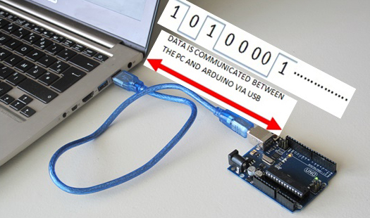    

We've actually used the Serial communications capability already quite a bit as that is how we send sketches to the Arduino! When you Compile/Verify what you're really doing is turning the sketch into binary data (ones and zeros). When you Upload it to the Arduino, the bits are shoved out one at a time through the USB cable to the Arduino where they are stored in the main chip.

[This](https://forum.arduino.cc/t/serial-input-basics-updated/382007) is a good introductory tutorial on using serial communication with Arduino.

## Interfacing Max with Arduino and vice versa
This is accomplished using the [serial object](https://docs.cycling74.com/max8/refpages/serial?q=serial) in Max and the [serial](https://www.arduino.cc/reference/en/language/functions/communication/serial/) functionality of the Arduino.

[Download the code examples for this tutorial as a zip file.](code/arduino-max/Archive.zip).

In the tutorial below almost no code is included. You will always need to open the files in their respective applications: Arduino & Max.

### 1. Max→Arduino: A Digital output controlled from Max
In this first example we want to control a LED with Max. Of course, the LED can be substituted by another actuator, although the circuit will probably have to be modified accordingly.    

The code is similar to the example "PhysicalPixel" with some minor differences.     
In both programmes (Arduino & Max) there are several notes or comments explaining what each function and code block does.

Max uses the serial object to send and receive data serially. The Baud rate specified must match that of the Arduino connection.

1. Obviously you need to connect the Arduino (board) to your computer.
2. Secondly, upload the Arduino-code to the board.
3. Then, Open the MAX patch, look for the right port using 'print' message and open that port. You can also change the port argument in the 'serial' object.
4. Click the 'toggle' to switch the LED on & off. Let it blink.

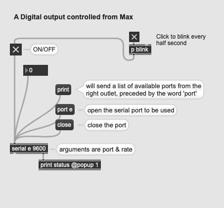

Notice: As we use the builtin LED on the Arduino we do not need to connect any other components. This will be different in all examples after this.    

#### Arduino code:
In the setup function we need to open the serial port & set data rate with `Serial.begin(9600);`. We only need to do this one, hence we place it in the setup and not the main loop. 9600 is one of the standard baudrates. It comes down to ca. 960 characters being transmitted per second. This is rather on the slow side but usually more than sufficiently fast.

The most import part in the Arduino code is this block.
```c+++
if (Serial.available() > 0) {
  byte value = Serial.read();
}
```
It checks that there is at least one data byte in the **Serial Buffer**. If this is the case `Serial.read()` brings out the data from the Serial Buffer and puts it in a variable with the name 'value'.

#### Max code:
See patch for details.


:zap: TAKE CARE!    
The Max Serial object cannot be open at the same time as the serial monitor in the Arduino IDE, nor can you flash a new sketch to your Arduino while the Max Serial object is connected.

:zap:  TECH ELABORATION !
When Max, or any other program, sends serial data to the Arduino it arrives into the Arduino input buffer at a speed set by the baud rate. At 9600 baud about 960 characters arrive per second which means there is a gap of just over 1 millisecond between characters. An Arduino can do a lot in 1 millisecond thus this serial data arrives relatively slowly we need to take this in account in more complex programs.*

### 2. Arduino→Max: A Digital Input (button) to be transferred to Max
In this second example we are going to control the playback of a video with a tactile switch or pushbutton switch connected to the Arduino.  When the button is pressed, the switches turn ON and starts the video and when the button is released, the switches turn OFF and stops the video.

To receive serial data in Max, the serial object must be polled at a certain time interval. The 'qmetro' object sends a bang message to the serial object, which outputs the received data at the interval specified in metro (in ms).

1. Make the circuit as below.
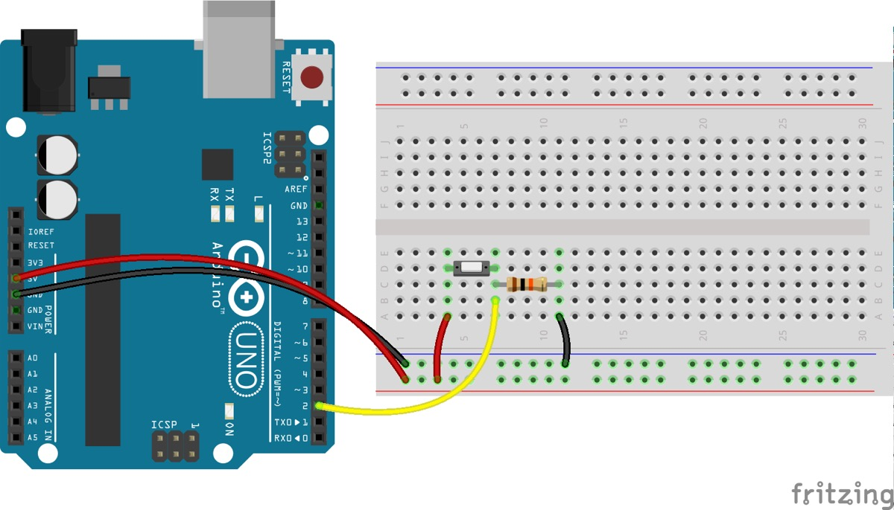
2. Upload the 'digital_input.ino' code to your Arduino.
3. Now, make sure your Arduino is attached, the serial monitor is closed and open the Max patch.
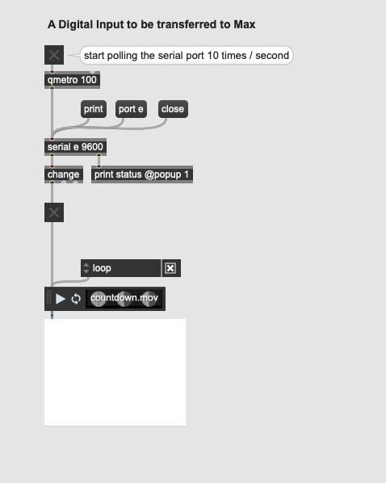
4. Hold the button on your breadboard to make the video play, let go to stop it.

`Serial.write();` is used here to send (or write) binary data to the serial port. This data is sent as a byte or series of bytes. A byte is consists of 8 bits and can have a value between 0 and 255.

:zap: BONUS!     
Right now, holding your finger on the button for as long as you want the video to play is not practical. We need a way to let the button stick to its current state. Like pushing the button once, starts the video. And pushing it again stops it. 'digital_input_sticky.ino' is a variation on the previous Arduino code to does this all the way.

### 3. Arduino→Max: An Analog Input (potentiometer) to be transferred to Max
A potentiometer connected to the Arduino is used to control the frequency of a virtual oscillator in Max. Things will get a bit more complicated now as the data is not passed though as binary data but as as human-readable [ASCII](https://www.ascii-code.com/) text.

1. A three-pin potentiometer is connected to the Arduino in the usual way.
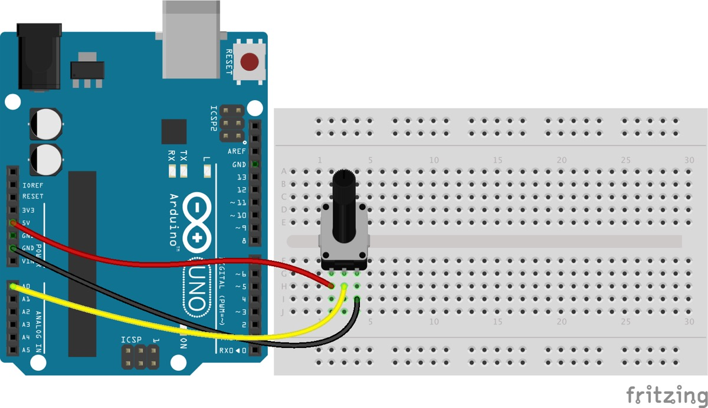
2. Upload the 'analog_input.ino' code to your Arduino.
3. Open the Max patch, open the serial port and start the 'qmetro' and dsp (sound).
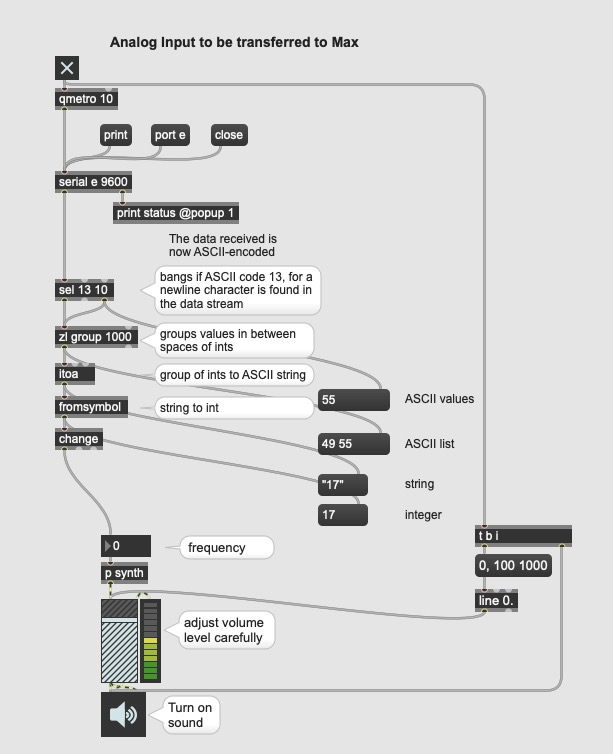
4. Twiddle that knob like an expert!

#### Notes on the Arduino code:

Different from previous example we use `Serial.println()` to send our data as the Analog Input resolution of Arduino is 10-bit, with a range between 0 and 1023. As we saw `Serial.write()` is limited to 8-bit and and therefore not fit for the task.    

`Serial.print()` prints data to the serial port as human-readable ASCII text. Numbers are printed using an ASCII character for each digit. This ensures that we can transmit more complex data as the value of the potentiometer.     

`Serial.println()` is similar as print() but terminates its data-packet with a carriage return character (ASCII 13, or '\r') and a newline character (ASCII 10, or '\n'). These characters will be used in Max to determine the end of each value. Both are known as control characters, they don’t have any visual meaning. See [here](https://elextutorial.com/learn-arduino/arduino-serial-port-send-line-feed-carriage-return-new-line/) for more.     

#### Notes on the Max code:
<sup>words borrowed with gratitude from <a href="https://chariscat.wordpress.com/2020/12/06/serial-communications-between-arduino-and-max/">Charis Cat</a></sup>
##### Sel Object    
An important ASCII string is 13 10, which represents a carriage return & newline character.     
Using a ‘sel’ object with the arguments 13 10 will separate the sensor data from these 2 characters. When the ‘sel’ object reads a 13, or a carriage return, it outputs a bang from its left output and outputs the rest of the data from it’s right. Combining these into a group creates a list of the ASCII characters between carriage returns, a little closer to the required output.
##### Zl Group Object
Connecting the left and right outputs of the sel object into the hot input of a ‘zl group’ object creates this group. But it can’t do anything about the fact that the numbers are in ASCII.    
The ‘zl group’ object also needs a number argument specifying how long the group will be, and using the improbably high number of 1000 means that the list will always be read in full (Mckellar, 2016).
##### Itoa Object
There is an object called ‘itoa’ in Max. It stands for integer to ASCII – exactly what we need here!    
According to the documentation, the ‘itoa’ object ‘converts a stream or list of up to 256 integers into a symbol’. It recognises integers into its left input as in UTF-8 ASCII Unicode format, translates them into the correct characters, and outputs them as a symbol.    
The values which it outputs are between quotes, signifying that they are in symbol format, so there is still one more object to use.
##### Fromsymbol Object
The object which converts from symbol has a pretty handy name, it’s just ‘fromsymbol’. ‘fromsymbol’ reads the input and converts it into integers, by default using the space as the separator. This is why I have used a space between each number in the Arduino code.

### 4. Arduino→Max: Digital Inputs (buttons) to Max
This example is somewhat a combination of '2. Digital Input' and '3. Analog Input'.  Multiple, 4 in this case, pushbuttons are connected to the digital input pins and their state, pushed or not, is transferred over serial to Max in an ASCII string.    

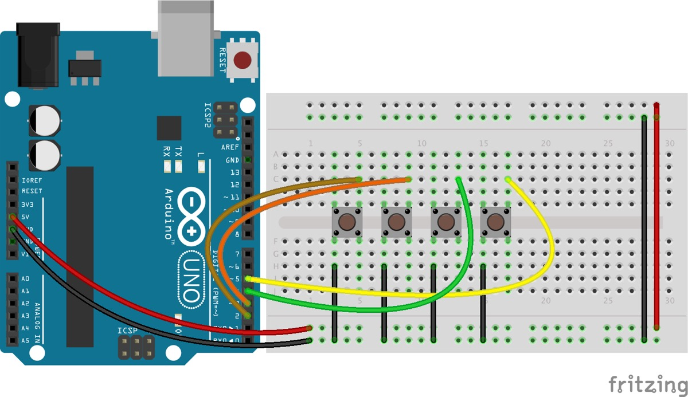

#### The circuit is somewhat special:    
4 pushbuttons are attached to pin 2,3,4,5 from GND. We don't need any resistors as we will use the `pinMode(INPUT_PULLUP)` method. See [this tutorial](https://www.arduino.cc/en/Tutorial/DigitalInputPullup). An internal 20K-ohm resistor is pulled to 5V. This configuration causes the input to read HIGH when the switch is open, and LOW when it is closed!

#### Notes on the Arduino code:
The code uses for loops to iterate through certain functions according to the number of pins (or connected pushbuttons) used. In this way the code is modular and efficient.    

Writing a button state over serial is done in 3 steps. First we write the number of pin. We start from one (1) because we, humans, find that more logical. This is followed by a empty space and then the button state, 1 or 0, followed by a carriage return character (ASCII 13, or '\r') character. See `Serial.print()` vs `Serial.println()`.
```C++
Serial.print(i+1);
Serial.print(" ");
Serial.println(0);
```

#### Notes on the Max code:
In Max we just have to route button states. This is easily done with the 'route' object followed by the button number, thus the output of this function `Serial.print(i+1);`.

### 5. Arduino→Max: Analog Inputs (potentiometers) to Max
I suspect you are slowly starting to get the hang of the system. So in this example, we are connecting multiple sensors to our Arduino board. We send out the data as an ASCII string. The sensor values are separated by spaces and the sequence is terminated with a carriage return & a newline character.

#### two examples of many possible circuits.
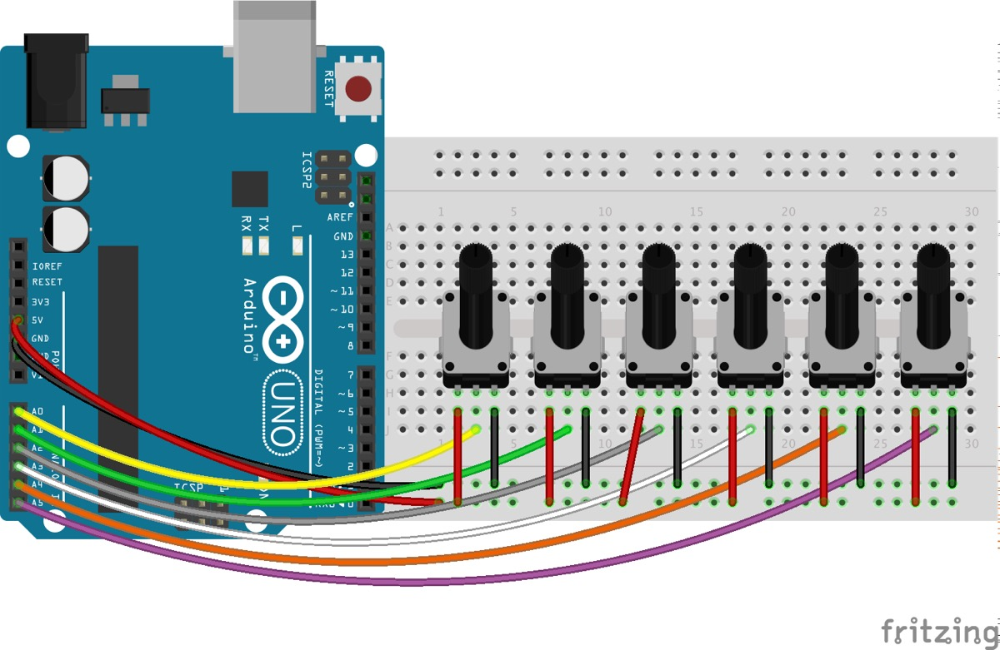    
6 potentiometers - easy peasy!

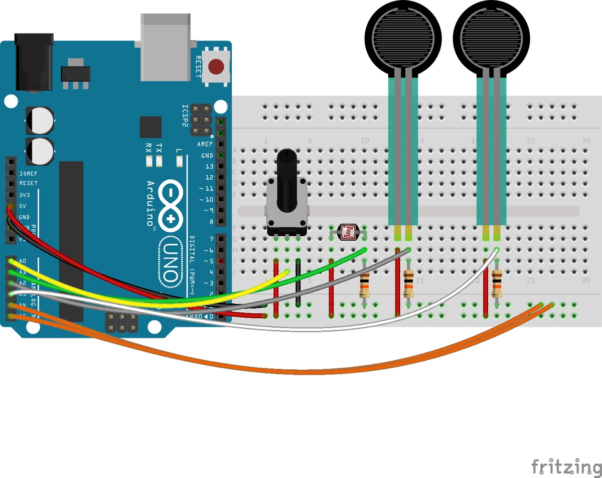    
4 sensors: a potentiometer, a LDR or photocell and 2 force sensors. These last 3 need a 10 kΩ resistor connected to ground.

A photocell is a variable resistor. It produces a resistance proportional to the amount of light it senses.  A force sensor is force-sensitive resistor thus also a variable resistor.

It turns out voltage is really easy for microcontrollers (those with analog-to-digital converters - ADC’s - at least) to measure. Resistance? Not so much. But, by adding another resistor to the resistive sensors, we can create a voltage divider. Once the output of the voltage divider is known, we can go back and calculate the resistance of the sensor.

For example, the photocell's resistance varies between 1kΩ in the light and about 10kΩ in the dark. If we combine that with a static resistance somewhere in the middle - say 5.6kΩ, we can get a wide range out of the voltage divider they create.

In this second example we only use 4 sensors. We could easily adapt the code only to read & send 4 but we can also leave the code alone. You will notice that the unconnected pins will be 'floating' somewhere between 5V and 0V. They will output random values (between 0 and 1024). Connecting them to ground, as in the circuit, will solve this.

### 6. Arduino→Max: Analog & Digital Inputs to Max or sensors & buttons
This is an example on how to use the full potential on how to use an arduino as sensor interface. It reads the 6 analog and 12 digital input pins of the Arduino and sends the values to Max.

It is based on [Arduino2Max](https://github.com/hendrikleper/arduino2max) a sketch and patch by Daniel Jolliffe & Thomas Ouellet Fredericks.

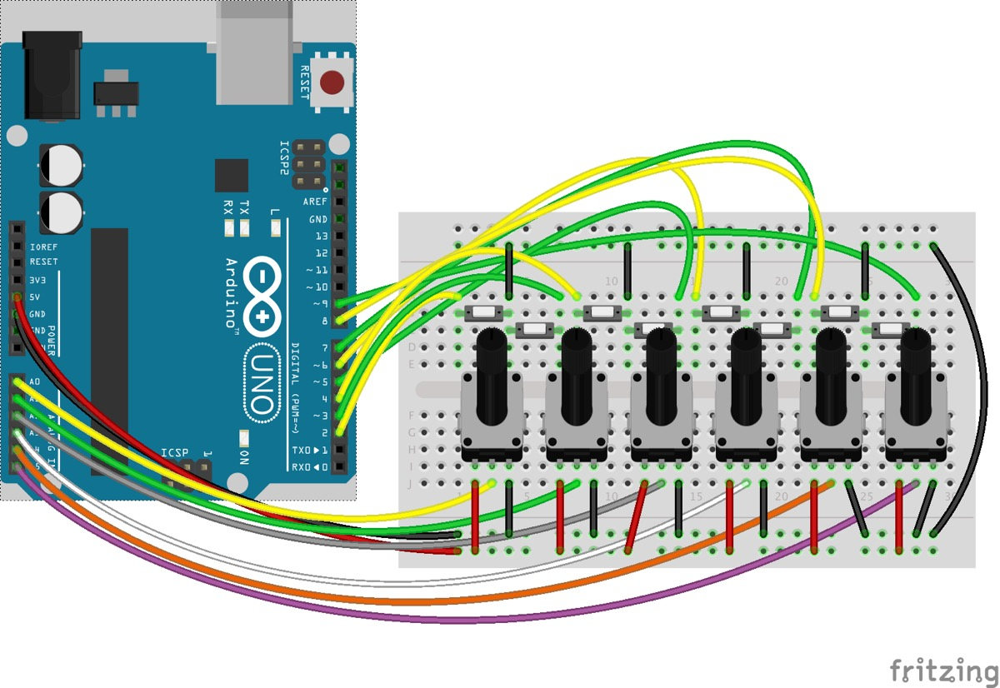

The patch and sketch more or less explain themselves. There is one new principle that comes up here and that is a Call and Response or Handshaking method. By sending an 'r' character, Max asks the Arduino to transmit new data.
We also raised the baud rate to 115200 for faster data transfer.

In the folder you'll also find Andrew Benson's SensorBox software. That is an alternative to the above but with more complex code using [bitshifting](https://www.interviewcake.com/concept/java/bit-shift).


### 7. Max→Arduino: Analog output controlled from Max
We reverse the communication again. Max is the sender, Arduino the receiver. There are 2 examples included. In the first we send the data in bytes (values between 0 and 255). In the 2nd we send an ASCII encoded string of values from 0 to 255. Each sequence is concludes with a newline character. Both examples are included in the max patch but there are 2 different Arduino sketches.

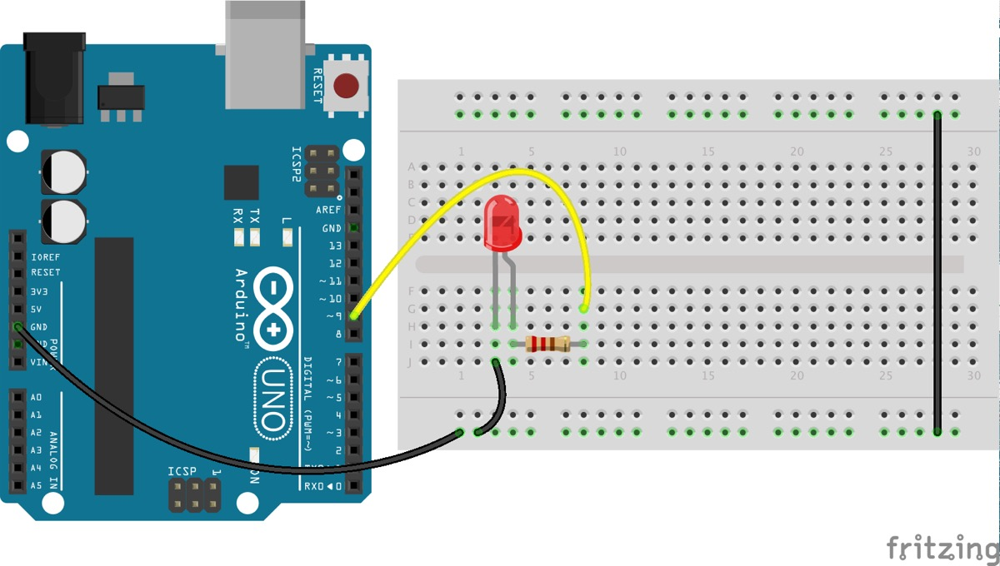
a basic circuit with an external LED and resistor

In Arduino we the `analogWrite()` function to generate an *analog value* to a pin. This is [not a true analog output](https://docs.arduino.cc/learn/microcontrollers/analog-output).    
You'll find explanation and clarification in the code examples as comments.    

The file 'getMaxBufferValue.js' is needed for a calculation in Max.

### 8. Max→Arduino: More Analog outputs controlled from Max
This example is similar to the example above where an ASCII encoded string of values is sent from Max. We now send all 3 values concluded with a newline character.

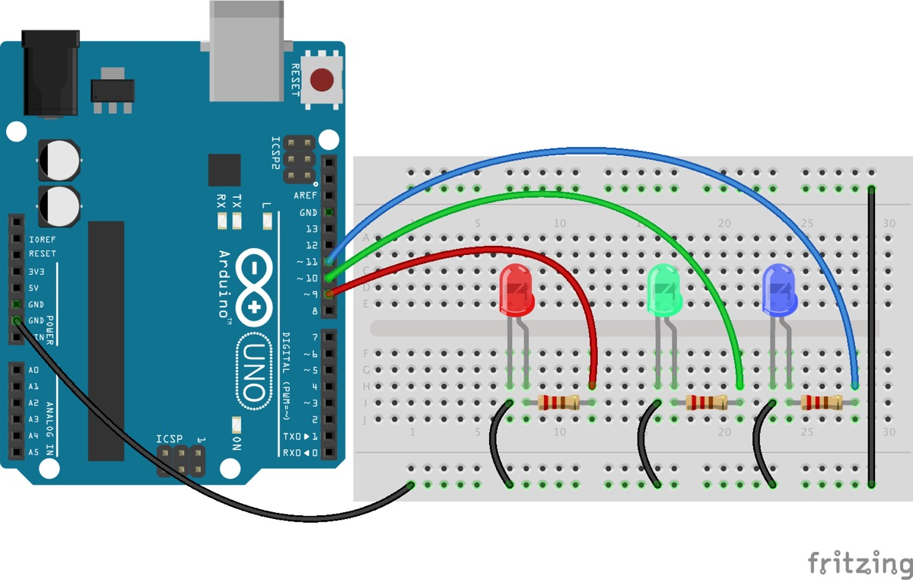
3 external LEDs are now connected to the Arduino

NOTE:    
On using an RGB LED and [why sharing one resistor on the common anode or cathode is not a good idea](https://www.circuitbread.com/tutorials/why-cant-i-share-a-resistor-on-the-common-anode-or-cathode-of-my-rgb-led).


### 9. Max→Arduino: Servo-motor controlled from Max
:construction: :construction: :construction: :construction:
https://www.makerguides.com/servo-arduino-tutorial/

https://howtomechatronics.com/how-it-works/how-servo-motors-work-how-to-control-servos-using-arduino/

https://dronebotworkshop.com/servo-motors-with-arduino/

Powering the servos through the Arduino is generally not a good idea. You can probably get away with it if you're using "micro" sized servos and not working them hard, but standard-sized servos (even 1, if it's heavily loaded), are likely to overtax the Arduino's regulator. If the servo sucks too much current, it could overload the power supply to the point where it drops out of regulation, or shuts itself down due to overheating. Plus, a servo is a motor, and most DC motors will spit noise into their power supply. Sometimes enough to make the system unreliable.


There’s also another way of controlling servos with Arduino, and that’s using the PCA9685 servo driver. This is a 16-Channel 12-bit PWM and servo driver which communicates with Arduino using the I2C bus. It has a built in clock so it can drive 16 servos free running, or independently of Arduino.

### 10. Max→Arduino: Many Servo-motors controlled from Max
:construction: :construction: :construction: :construction:

### 11. Max→Arduino: 16-ChannelPWM/Servo Driver
:construction: :construction: :construction: :construction:

https://www.adafruit.com/product/815

### 12. Max→Arduino: A Stepper motor controlled from Max
:construction: :construction: :construction: :construction:
code examples are finished

### 13. Max→Arduino: 2 Stepper motors controlled from Max
:construction: :construction: :construction: :construction:
code examples are finished

## Max & DMX
<sup>parts of this text are taken from https://cycling74.com/tutorials/working-with-hardware-dmx-part-1</sup>
DMX, or more accurately, DMX 512, is a network protocol most commonly used for the control of stage lighting and effects. The name “DMX” is short for “Digital Multiplex”. The “512” in DMX 512 represents the maximum number of devices (512) that can be controlled with a single data packet. This network of 512 devices is called a DMX *universe*.

In a typical DMX 512 network, devices are daisy chained together. The control device is at the beginning of the chain, with a cable running to one device, and a cable run from that device to the next device, and so on. DMX always travels in one direction – it is unidirectional, and the end of the chain needs to be terminated.

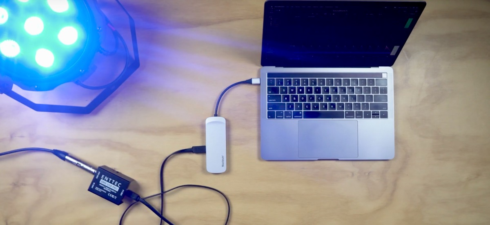
In this picture, we have a laptop running our Max patch connected to a DMX controller, which in turn sends packets down the DMX network cabling to connected lighting devices.

Devices in a DMX universe are specified by channel, with up to 512 channels in a single packet. A packet contains a header followed by the control data expressed as 8-bit values (bytes). Since this is 8-bit data, we use the values 0-255 (in decimal) when programming DMX data in Max.

There is no index in a DMX packet, so if a device thinks it is on channel one, it will look at the first data byte in a DMX packet and choose that value to set its state. If a device thinks it is on channel 53 in the current universe, then it will choose the 53rd byte in the packet for its value.

Each DMX controllable device has built-in channel selectors, allowing you to specify its channel numbers within the universe. When programming multi-channel DMX devices, you usually need to dig into the documentation for each device in order to find out how each channel is used.

The first thing we need is a DMX interface. We have an Enttec USB Pro in the equipment pool.

In addition to a controller, you’ll need devices to control and some cabling to hook it all up. DMX cables are a mix of 3 pin and 5 pin XLR. There is an incredible range of DMX controllable dimmers, lights, fog machines, lasers, servos, and amplifiers out there. In the studio and equipment pools we have 4-channel LED spots, a 4 channel dimmer, a fog machine, stroboscope, ...  

### Enttec USB Pro

In Max we make use of Thomas Ouellet Fredericks [Enttec DMX USB Pro patcher](https://github.com/thomasfredericks/DMX_USB_PRO_MAX) as a base patch to start of.


:construction: :construction: :construction: :construction:

### Arduino as a DMX interface

### Other DMX software
[Qlab](https://qlab.app/) or sound, video and lighting control for macOS.


## Inspiration & References
* [David Bowen](https://www.dwbowen.com/)
* [Christoph De Boeck](http://christophdeboeck.com/)
* [Edwin van der Heide](https://www.evdh.net/)
* [Marnix de Nijs](http://www.marnixdenijs.nl/)
* [Artificiel](https://www.artificiel.org/)
* [Hans Beckers](https://hansbeckers.be/works/)
* Hays + Ryan Holladay [Emergence](https://vimeo.com/171001689)
* [EJTECH](https://ejtech.studio/)
* [Jo Caimo](https://ejtech.studio/)
* [Jeroen Uyttendaele](http://www.jeroen-uyttendaele.org/)
* ....


<hr>
<div>This tutorial is licensed under a Creative Commons Attribution-NonCommercial-ShareAlike 3.0 Unported (CC BY-NC-SA 3.0)</div>
