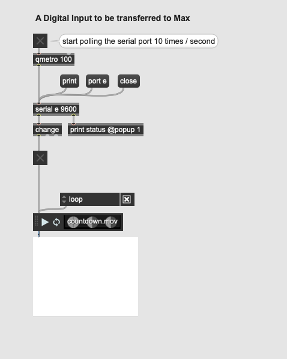

# Physical Computing with MAX and Arduino & DMX
<sup>last updated: 12/01/2022</sup>

This is the second part of the physical computing with [Arduino tutorial](ArduinoTutorial.md) but it could also be a follow-up to a Max workshop. This tutorial is all about interfacing [Max](https://cycling74.com/) with the physical world.    

There are [a number of options](https://playground.arduino.cc/Main/InterfacingWithSoftware/) for interfacing an Arduino with computer programs and mobile devices and applications, including [Max](https://playground.arduino.cc/Interfacing/MaxMSP/), [PureData or PD](https://playground.arduino.cc/Interfacing/PD/), [Processing](https://playground.arduino.cc/Interfacing/Processing/), [Python](https://playground.arduino.cc/Interfacing/Python/), ... There are also several pre-made packages, as [firmata](https://www.arduino.cc/en/Reference/Firmata), with code for Arduino and the other programs, making the coding job very simple. The disadvantage is that these packages are often quite complex and less efficient. The basics of serial communication are actually quite straightforward. Let's start with these.


So, we will learn the nuts and bolts on how **serial data** is sent between the two environments, on how to use sensor data to activate, move, or distort sound and video but also how we can control light and movement with motors and electromagnets from Max.     
We will also see some basics of using **DMX**, a communication protocol used in lighting and event engineering, with Max.    

The sample programmes consist of Arduino sketches and Max patches. A logical structure has been provided with numbering, which is copied below. In some of the folders you will also find a pd patch. These are merely unfinished and not tested thoroughly.

<details>
  <summary>TOC 👈🏻 Click to expand</summary>

<!-- TOC depthFrom:2 depthTo:3 withLinks:1 updateOnSave:1 orderedList:0 -->

- [1. Max→Arduino: A Digital output controlled from Max](#1-maxarduino-a-digital-output-controlled-from-max)
- [2. Arduino→Max: A Digital Input (button) to be transferred to Max](#2-arduinomax-a-digital-input-button-to-be-transferred-to-max)
- [3. Arduino→Max: An Analog Input (potentiometer) to be transferred to Max](#3-arduinomax-an-analog-input-potentiometer-to-be-transferred-to-max)
	- [Notes on the Arduino code:](#notes-on-the-arduino-code)
	- [Notes on the Max code:](#notes-on-the-max-code)
- [4. Arduino→Max: Digital Inputs (buttons) to Max](#4-arduinomax-digital-inputs-buttons-to-max)

<!-- /TOC -->

</details>


# Serial Communication Intro
Serial communication is a simple means of sending data quickly and reliably from one device to another. The data is sent, one bit at a time, one right after the other, over a single line. The data packages are electrical pulses, 5 volts represents a bit value of 1, and 0 volts a 0. In Arduino this equals setting a pin HIGH or LOW. It's a little like Morse code, where you can use dits and dahs to send messages by telegram.

A minimum of three lines are used for bidirectional communication: transmit (TX), receive (RX), and ground (GND). See [this tutorial](https://learn.sparkfun.com/tutorials/serial-communication/) is you want to read more on the basics of Serial Communication.    

# Arduino & Serial Communication
All Arduino boards have at least one serial port (also known as a UART or USART). It communicates on digital pins 0 (RX) and 1 (TX). The Arduino Uno boards we use have a chip to convert the hardware serial port on the Arduino chip to USB. Not all Arduino boards have this.    

    
<sup>image courtesy <a href="https://www.ladyada.net/learn/arduino/lesson4.html">ladyada</a></sup>

We've actually used the Serial communications capability already quite a bit as that is how we send sketches to the Arduino! When you Compile/Verify what you're really doing is turning the sketch into binary data (ones and zeros). When you Upload it to the Arduino, the bits are shoved out one at a time through the USB cable to the Arduino where they are stored in the main chip.

# Interfacing Max with Arduino and vice versa
This is accomplished using the **'serial'** object in Max and the Serial functionality in the Arduino.

The code examples we will use are attached to this tutorial. You can find the packed in a zip file [here](code/arduino-max/arduino-max.zip). These examples are partially based on the [Built-In Examples](https://www.arduino.cc/en/Tutorial/BuiltInExamples) chapter 04.Communication.

In the tutorial below no code is included. You will always need to open the files in their respective applications: Arduino & Max.

## 1. Max→Arduino: A Digital output controlled from Max
In this first example we want to control a LED with Max. Of course, the LED can be substituted by another actuator, although the circuit will probably have to be modified accordingly.    

The code is similar to the example "PhysicalPixel" with some minor differences.     
In both programmes (Arduino & Max) there are several notes or comments explaining what each function and code block does.

Max uses the serial object to send and receive data serially. The Baud rate specified must match that of the Arduino connection.

1. Obviously you need to connect the Arduino (board) to your computer.
2. Secondly, upload the Arduino-code to the board.
3. Then, Open the MAX patch, look for the right port using 'print' message and open that port. You can also change the port argument in the 'serial' object.
4. Click the 'toggle' to switch the LED on & off. Let it blink.


Notice: As we use the builtin LED on the Arduino we do not need to connect any other components. This will be different in all examples after this.    

Take care: You will need to unset the serial port in Max when uploading a new program to the Arduino board (and vice versa).


## 2. Arduino→Max: A Digital Input (button) to be transferred to Max
In this second example we are going to control the playback of a video with a tactile switch or pushbutton switch connected to the Arduino.  When the button is pressed, the switches turn ON and starts the video and when the button is released, the switches turn OFF and stops the video.

To receive serial data in Max, the serial object must be polled at a certain time interval. The 'qmetro' object sends a bang message to the serial object, which outputs the received data at the interval specified in metro (in ms).

1. Make the circuit as below.

2. Upload the 'digital_input.ino' code to your Arduino.
3. Now, make sure your Arduino is attached, the serial monitor is closed and open the Max patch.

4. Hold the button on your breadboard to make the video play, let go to stop it.

`Serial.write();` is used here to send (or write) binary data to the serial port. This data is sent as a byte or series of bytes. A byte is consists of 8 bits and can have a value between 0 and 255.

:zap: Bonus:     
Right now, holding your finger on the button for as long as you want the video to play is not practical. We need a way to let the button stick to its current state. Like pushing the button once, starts the video. And pushing it again stops it. 'digital_input_sticky.ino' is a variation on the previous Arduino code to does this all the way.

## 3. Arduino→Max: An Analog Input (potentiometer) to be transferred to Max
A potentiometer connected to the Arduino is used to control the frequency of a virtual oscillator in Max. Things will get a bit more complicated now as the data is not passed though as binary data but as as human-readable [ASCII](https://www.ascii-code.com/) text.

1. A three-pin potentiometer is connected to the Arduino in the usual way.

2. Upload the 'analog_input.ino' code to your Arduino.
3. Open the Max patch, open the serial port and start the 'qmetro' and dsp (sound).

4. Twiddle that knob like an expert!

### Notes on the Arduino code:

Different from previous example we use `Serial.println()` to send our data as the Analog Input resolution of Arduino is 10-bit, with a range between 0 and 1023. As we saw `Serial.write()` is limited to 8-bit and and therefore not fit for the task.    

`Serial.print()` prints data to the serial port as human-readable ASCII text. Numbers are printed using an ASCII character for each digit. This ensures that we can transmit more complex data as the value of the potentiometer.     

`Serial.println()` is similar as print() but terminates its data-packet with a carriage return character (ASCII 13, or '\r') and a newline character (ASCII 10, or '\n'). These characters will be used in Max to determine the end of each value. But     

### Notes on the Max code:
<sup>words borrowed with gratitude from <a href="https://chariscat.wordpress.com/2020/12/06/serial-communications-between-arduino-and-max/">Charis Cat</a></sup>
#### Sel Object    
An important ASCII string is 13 10, which represents a carriage return & newline character.     
Using a ‘sel’ object with the arguments 13 10 will separate the sensor data from these 2 characters. When the ‘sel’ object reads a 13, or a carriage return, it outputs a bang from its left output and outputs the rest of the data from it’s right. Combining these into a group creates a list of the ASCII characters between carriage returns, a little closer to the required output.
#### Zl Group Object
Connecting the left and right outputs of the sel object into the hot input of a ‘zl group’ object creates this group. But it can’t do anything about the fact that the numbers are in ASCII.    
The ‘zl group’ object also needs a number argument specifying how long the group will be, and using the improbably high number of 1000 means that the list will always be read in full (Mckellar, 2016).
#### Itoa Object
There is an object called ‘itoa’ in Max. It stands for integer to ASCII – exactly what we need here!    
According to the documentation, the ‘itoa’ object ‘converts a stream or list of up to 256 integers into a symbol’. It recognises integers into its left input as in UTF-8 ASCII Unicode format, translates them into the correct characters, and outputs them as a symbol.    
The values which it outputs are between quotes, signifying that they are in symbol format, so there is still one more object to use.
#### Fromsymbol Object
The object which converts from symbol has a pretty handy name, it’s just ‘fromsymbol’. ‘fromsymbol’ reads the input and converts it into integers, by default using the space as the separator. This is why I have used a space between each number in the Arduino code.

## 4. Arduino→Max: Digital Inputs (buttons) to Max


// The circuit is a bit special:
// pushbutton attached to pin 2,3,4,5 from GND
// we don't need any resistors as we will use pinMode(INPUT_PULLUP)
// https://www.arduino.cc/en/Tutorial/DigitalInputPullup


For two inputs, the following Max patch and Arduino code provide a starting point. Note that the values are separated by a space and each set of two values is delimited by a line break:

```C++
void setup()
{
  Serial.begin(115200);
}

void loop()
{
  // Read from two analog pins and put a space between values.
  for ( int i=2; i<4; i++) {
    Serial.print( analogRead(i) );
    Serial.print(' ');
  }
  Serial.println();

  delay( 100 );  // Delay a bit.
}
```


# DMX
from https://cycling74.com/tutorials/working-with-hardware-dmx-part-1
DMX, or more accurately, DMX 512, is a network protocol most commonly used for the control of stage lighting and effects. It is easily programmed in Max.

The name “DMX” is short for “Digital Multiplex”. The “512” in DMX 512 represents the maximum number of devices (512) that can be controlled with a single data packet. This network of 512 devices is called a DMX *universe*.

In a typical DMX 512 network, devices are daisy chained together. The control device is at the beginning of the chain, with a cable running to one device, and a cable run from that device to the next device, and so on. DMX always travels in one direction – it is unidirectional, and the end of the chain needs to be terminated.

Here’s a picture of the simple DMX network we used to make the video.

In this picture, we have a laptop running our Max patch connected to a DMX controller, which in turn sends packets down the DMX network cabling to connected lighting devices.

Devices in a DMX universe are specified by channel, with up to 512 channels in a single packet. A packet contains a header followed by the control data expressed as 8-bit values (bytes). Since this is 8-bit data, we use the values 0-255 (in decimal) when programming DMX data in Max.

There is no index in a DMX packet, so if a device thinks it is on channel one, it will look at the first data byte in a DMX packet and choose that value to set its state. If a device thinks it is on channel 53 in the current universe, then it will choose the 53rd byte in the packet for its value.

Each DMX controllable device has built-in channel selectors, allowing you to specify its channel numbers within the universe. Let’s look again at our example DMX network.

The first device is a 6-channel LED “spot”. The 2nd device is a 4 channel dimmer starting on channel 8, with 2 light bulbs hooked up on the first two channels.
As an example, if we send a DMX packet with the following data:
255 255 255 0 0 0 0 127  255
The result will be to set the RGB led to white, the first light in the dimmer to half way on, and the 2nd light in the dimmer to all the way on. Notice a few interesting things about this data packet:

We don’t need to send all 512 data values; but we do have to send data for all the devices in our DMX universe.
The LED spot only uses 3 channels of color data, even though it is a “6-channel” device.

There needs to be 7 channels of data allocated before we get to first channel in our dimmer (channel 8). Since we are only using 3 channels to drive the LED, we need to pad out the packet with data for the unused channels.

Many DMX devices are like the 6-channel RGB spot, which has multiple channels to control various parameters of their state; for example, a DMX led array can have hundreds of channels of control. When programming multi-channel DMX devices, you usually need to dig into the documentation for each device in order to find out how each channel is used.

Connecting a DMX Network to Max
The first thing we need is a DMX interface. We have an Enttec USB Pro in the equipment pool.

https://github.com/thomasfredericks/DMX_USB_PRO_MAX


In addition to a controller, you’ll need devices to control and some cabling to hook it all up. DMX cables are a mix of 3 pin and 5 pin XLR, so expect that you’ll need to buy some adapters. There is an incredible range of DMX controllable dimmers, lights, fog machines, lasers, servos, and amplifiers out there.

Our “hello universe” Patch
Once we have downloaded and installed the LanBox Max externs and examples from their site, setting up for patching is straightforward. You can follow along with the LanBox documentation concerning setting an IP address for the LanBox on your network, or you may be lucky enough to find out that the default IP address for the LanBox works fine at your location.
For my example, I have an American DJ P36 LED spot connected as the first device on my DMX daisy chain. This light has 6 channels of DMX control. Next comes an Elation DP 415 4 channel dimmer pack, and I have placed standard incandescent light bulbs on channels 1 and 2 of that device.
On the back of the 4 channel dimmer, I’ve set the DMX channel offset dipswitches so that the dimmer’s first channel is channel 8.
Here is the patch I’ve created:

Let’s walk through the patch a bit.
There are many ways you can manage lists of numbers in Max. To make things obvious, I’ve decided to go with message boxes.
The swatch object is set to “Output Old Style 0-255 values” in its inspector. This gives me the exact range I need for my DMX channels. The first 3 channels on my LED spot are for R, G and B, so I’m setting them up as the first three values in my message box labeled “channels 1-7”. I have to pad out the message box with unused channels because the first channel on the dimmer box is set to channel 8, so it will use the 8th value in the DMX packet.
The output from the sliders and toggles intended to drive the light bulbs is made into a similar message, which represents the 4 channels on my dimmer. I then join the two messages together and use them to set the contents of a third message box, which is the whole packet I need to set state in this system.
My LanBox has a hardware clock which runs at 20fps, so I’m using a qmetro to update the state of the DMX network every 50 ms.
Finally the lcudp-pack object, which is provided by LanBox, formats the packet for the network and passes it to the udpsend object via the “FullPacket” message - and off it goes to my light show!


<hr>
<div>This tutorial is licensed under a Creative Commons Attribution-NonCommercial-ShareAlike 3.0 Unported (CC BY-NC-SA 3.0)</div>
