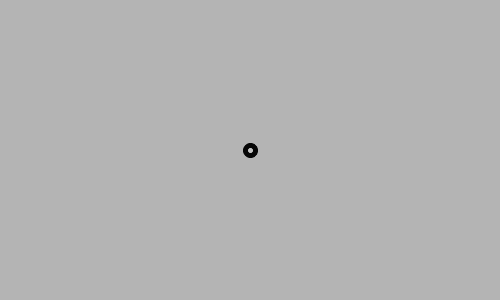

# Processing - Generative Art / Design Tutorial
_-- Getting Started --_

*The following tutorial was original compiled by Manuel Kretzer. It is a combination of text excerpts and illustrations from [“Learning Processing, Second Edition: A Beginner’s Guide to Programming Images, Animation, and Interaction”](http://learningprocessing.com/) by Daniel Shiffman (2015) and [“Make: Getting Started with Processing”](https://www.makershed.com/products/getting-started-with-processing-2nd-edition) by Casey Reas and Ben Fry (2010) as well as online sources such as [tutorials provided on the Processing website](https://processing.org/tutorials/).*    
*The current (Oct. 2019) version features an approach by the Tim Holman lecture ["Generative Art Speedrun"](https://www.youtube.com/watch?v=4Se0_w0ISYk) (2018) with the toolbelt paradigm, hence the :hammer_and_wrench: icons.* 
 

<!-- All sketches in this tutorial can be downloaded [here](downloads/processing/sketches.zip).     
And [these](downloads/processing/recode.zip) are some examples of recoded historical algorithmical or computational artworks. -->

#### Contents
| Getting Started | Having Fun | Advanced Stuff |
|--- |--- |---|
1 [Introduction](#intro) | 13 [Random](ProcessingTutorial2.md#random) :hammer_and_wrench: | 20 [Arrays](ProcessingTutorial3.md#arrays) |
2 [Sketching](#sketching) | 14 [Conditionals](ProcessingTutorial2.md#conditionals) | 21 [Recursion](ProcessingTutorial3.md#recursion) :hammer_and_wrench:  |
3 [Libraries](#libraries) | 15 [While Loop - Repetition](ProcessingTutorial2.md#while) :hammer_and_wrench:   | 22 [Algorithm](ProcessingTutorial3.md#algo) :hammer_and_wrench:  |
4 [Your First Program](#program) | 16 [For Loop - Tiling](ProcessingTutorial2.md#for) :hammer_and_wrench: | 23 [Export](ProcessingTutorial3.md#export) :hammer_and_wrench: |
5 [The Coordinate System](#coordinate) | 17 [Color](ProcessingTutorial2.md#color) :hammer_and_wrench: |  |
6 [Functions](#functions) | 18 [Translate & Rotate - Displacement](ProcessingTutorial2.md#displacement) :hammer_and_wrench: |  |
7 [Lines, Basic Shapes & Modes](#shapes) :hammer_and_wrench:  | 19 [Advanced Shapes](ProcessingTutorial2.md#shapesplus)  :hammer_and_wrench: |  | 
8 [Comments](#comments) |  |  |
9 [Mathematics](#math) |  |  |
10 [Drawing Order](#order) |  |  |
11 [Variables](#variables) |  |  |
12 [Structure](#structure) |  |  |
  
## <a name="intro">1. Introduction</a>

Processing is a simple programming environment that was created to make it easier to develop visually oriented applications with an emphasis on animation and providing users with instant feedback through interaction. The developers wanted a means to **sketch** ideas in code.

As its capabilities have expanded over the past decade, Processing has come to be used for more advanced production-level work in addition to its sketching role. Originally built as a domain-specific extension to Java targeted towards artists and designers, Processing has evolved into a full-blown design and prototyping tool used for large-scale installation work, motion graphics, and complex data visualization. 

Examples of Processing usages can be found on https://processing.org/exhibition/

The latest version of Processing can be downloaded at [http://processing.org/download](http://processing.org/download)

## <a name="sketching">2. Sketching</a>

A Processing program is called **a sketch**. The idea is to make Java-style programming feel more like scripting, and adopt the process of scripting to quickly write code. Sketches are stored in the sketchbook, a folder that’s used as the default location for saving all of your projects. Sketches that are stored in the sketchbook can be accessed from File → Sketchbook. Alternatively, File → Open... can be used to open a sketch from elsewhere on the system.


_The Processing Development Environment_

The large area is the **Text Editor**, the row buttons on  top is the tool-bar. Below the editor is the **Console**, which can be used for messages and more technical details. The small square is the Display Window, the graphical output of the Sketch.


## <a name="libraries">3. Libraries</a>

The core functionality of Processing should be sufficient in the beginning.   
Yet, if you need to do something that’s not available in Processing, you can use a library that adds the functionality you need. Libraries can be installed by opening Sketch → Import Library → Add Library.


_The Processing Contribution Manager_

*We will use one (or two) libraries for exporting our created content to bitmap or vector images.*

## <a name="program">4. Your First Program</a>

In the editor, type the following:

```java
ellipse(50, 50, 80, 80);
```
This line of code means “draw an ellipse, with the center 50 pixels over from the left and 50 pixels down from the top, with a width and height of 80 pixels.” Click the Run button in the tool-bar or Sketch → Run.


If you’ve typed everything correctly, you’ll see the ellipse image above. If you didn’t type it correctly, the Console Area will turn red and complain about an error. If this happens, make sure that you’ve copied the example code exactly: the numbers should be contained within **parentheses** and have **commas** between each of them, and the line should end with a **semicolon**.
One of the most difficult things about getting started with programming is that you have to **be very specific about the syntax**. The Processing software isn’t always smart enough to know what you mean, and can be quite fussy about the placement of punctuation. You’ll get used to it with a little practice.


## <a name="coordinate">5. The Coordinate System</a>

Processing uses the upper-left corner for the origin of the window. CAD applications usually prefer a different point for the origin of their drawing surface.

The  `size()`  function sets the dimensions of the sketch window. The default is size(100,100). The first parameter is used to set the value of the **system variable** **width**, the second parameter is used to set the value of the system variable **height**. So, if the display window is 100×100 pixels, the upper-left is (0, 0), the center is at (50, 50), and the lower-right
is (99, 99) or (width-1, height-1). If you now want to draw a point at the origin, you’ll use:

```java
point(0, 0);
```
This line of code will fill the first pixel on the first row. As we start counting at 0, the last pixel on that row would be 99, or width-1. The same is true for the height.

The following code will draw a red point with a thickness of five pixels at (0,0) and another one at (99,99)

```java
strokeWeight(5);
stroke(255,0,0);
point(0, 0);
point(width-1, height-1);
```


_The Processing coordinate system_

## <a name="functions">6. Functions</a>

Functions are **the basic building blocks** of a Processing program. The behaviour of a function is defined by its parameters, a set of arguments enclosed in parentheses. Each function call must always **end with a semicolon**.
Processing will execute a sequence of functions one by one and finish by displaying the drawn result in a window. An overview of all functions can be found in the Processing reference (https://processing.org/reference/). The usage of a certain function is explained by highlighting a function and right-clicking or through Help → Find in Reference.


_Finding a function in reference_


_Description of the point() function as found in the reference_


## <a name="shapes">7. Lines, Basic Shapes & Modes :hammer_and_wrench:</a>

Processing includes a group of functions to draw basic shapes or 2D primitives. Simple shapes like lines can be combined to create more complex forms like a leaf or a face. To draw a single line, we need four parameters: two for the starting location and two for the end.

The basic shape primitive functions are: 
[`arc()`](https://processing.org/reference/arc_.html), [`circle()`](https://processing.org/reference/circle_.html), [`ellipse()`](https://processing.org/reference/ellipse_.html), 
[`line()`](https://processing.org/reference/line_.html), [`point()`](https://processing.org/reference/point_.html), [`quad()`](https://processing.org/reference/quad_.html), 
[`rect()`](https://processing.org/reference/rect_.html), [`square()`](https://processing.org/reference/square_.html), [`triangle()`](https://processing.org/reference/triangle_.html).


_common shapes in Processing and their parameters_

You must have noticed that `rect()` and `ellipse()` deal differently with the location from which they are drawn. You can change this default behaviour with the functions [`rectMode()`](https://processing.org/reference/rectMode_.html) & [`ellipseMode()`](https://processing.org/reference/ellipseMode_.html) to either CORNER, CORNERS, CENTER, or RADIUS.


  
_the 4 different drawmodes of a rect & ellipse_

As you might have noticed in the code examples above the color and thickness of lines and lines around shapes can be adjusted with `stroke()` and `strokeWeight()`. We will come back to this.

### :hammer_and_wrench: We have our **first 2 tools** earned. Let's test them!
```java
// Lines
size(300, 300);
stroke(0);
background(255);
noSmooth();
// a diagonal line
line(0, 0, width, height);
// the other diagonal
line(0, height, width, 0);
// horizontal line through the middle
line(0, height/2, width, height/2);
// vertical line through the middle
line(width/2, 0, width/2, height);
```
```java
// Shapes
size(300, 300);
stroke(0);
background(255);
noFill();
// circle
ellipse(width/2, height/2, width, height);
// rect
rect(44, 44, width-88, height-88);
// triangle
triangle(width/2, 1, 284, 212, 16, 212);
```

## <a name="comments">8. Comments</a>

Comments are parts of the program that are ignored when the program is run. They are useful for making notes for yourself that explain what’s happening in the code. If others are reading your code, comments are especially important to help them understand your thought process. Comments are also useful for trying things in your code
without loosing the original attempt.

```java
// This is a comment on one line
/* This is a comment that
spans several lines
of code */
```
## <a name="math">9. Mathematics
We can use mathematical operators with numbers and variables in Processing. This is incredibly useful. 

#### Yet there are some rules to remember:
- The order of operations matters, [the PEMDAS rule](https://en.wikipedia.org/wiki/Order_of_operations). 3+2&ast;3 will yield 9. If you want it to yield 15 then you must write it as (3+2)*3. 
- You can not use **x** as a symbol for multiplication. x is a letter and will be viewed by Processing as a variable.
- An equals sign works a bit differently than it does in math class.

#### Common Mathematical Operators:

| Character | Operator |
| :-: | --- |
| +	| Addition |
| -	| Subtraction |
| *	| Multiplication |
| /	| Division |
| ^	| Exponent |
| = |	Assignment |
 
The equals sign is used to assign a value to a variable. Processing will not rearrange an equation to solve for a value. So:
int Y = 3;
6 = Y &ast; X;
Processing will not be able to determine that X is 2. If you want to assign the value of 2 to X based on the relationship above you must write it as:
int X = 6 / Y
Mathematically 6 = Y &ast; X and X = 6 / Y are equivalent. However, Processing is only able to understand the second expression. In plain english, X = 6 / Y means, "Assign the value of 6 / Y to the variable X".


## <a name="order">10. Drawing Order</a>

When a program runs, the computer starts at the top and reads each line of code until it reaches the last line and then stops. If you want a shape to be drawn on top of all other shapes, it needs to follow the others in the code.


_Processing drawing order_

## <a name="variables">11. Variables</a>

A variable stores a value **in memory** so that it can be used later in a program. The variable can be used many times within a single program, and the value is easily changed while the program is running. When you create variables, you determine **the name**, **the data type**, and **the value**.   

**The name** is what you decide to call the variable. Choose a name that is informative about what the variable stores, but be consistent and not too verbose. For instance, the variable name “radius” will be clearer than “r” when you look at the code later. 

When declaring a variable, you also need to specify its **data type** (such as int), which indicates what kind of information is being stored. There are data types to store each kind of data: integers (whole numbers), floating-point (decimal) numbers, characters, words, images, fonts, and so on. 

After the data type and name are set, **a value** can be assigned to the variable. Remember that each variable can only be used once with the same name in the same part of the program.

```java
int x = 12; // Declare x as an int variable and assign a value
```
The most common Processing data types:

Data | Type | Example of Usage | Usage Description
--- | --- | --- | ---
char | char | varName =’a’; | A letter or Unicode symbol, such as a or #. Note the single quotation marks used around the symbol.
int | int | varName = 12; | An integer (a whole number). Can be positive or negative.
float | float | varName = 1.2345; | A floating-point number. A number that may have a decimal point.
boolean | boolean | varName = true; | A true or false value. Used for logical operations because it can only ever be one of two states.
String | String | varName = “hello”; | A list of chars, such as a sentence. Note the capital S on String, signifying that this is a composite type (a collection of chars).

## <a name="structure">12. Structure: setup() and draw()</a>

In Processing scripts can be structured into two distinct parts, so-called function blocks: `setup()` and `draw()`. A function block is a way of chunking a group of commands together.
    
The code inside the setup() function block is called **once when the program launches**, so it should contain all your initialization code as setting the canvas size, setting the background color, initializing variables, and so on. 

The code you write inside draw() is then called repeatedly, **triggered on every frame**. You can set the speed with which draw() is called by using the `frameRate()` function. If you give it a number (12, 24, 25, and 30 are typical), it will attempt to maintain that rate, calling draw() regularly. Otherwise, it will perform the frame loop as quickly as the machine can handle (sketch_03).

```java
int diam = 5;

void setup() {
  size(500, 300);
  frameRate(24);
  background(180);
  stroke(0);
  strokeWeight(5);
  fill(255);
}

void draw() {
  background(180);
  ellipse(width/2, height/2, diam, diam);
  diam += 1;
}
```



When you run this you’ll see a circle grow slowly. The diameter is kept in a variable. The frame loop redraws the background, draws the circle, and increases the diameter by 1. The effect is that the circle grows pixel by pixel and finally grows bigger then our screen. 

Notice that if you create a variable inside of setup(), you can’t use it inside of `draw()` and vice versa. A variable within a function block is only available within that block - **locally**. It’s good practice to do this if a variable is only needed within a single function. Yet in order to make variables available everywhere, you need to place them somewhere else. Such variables are called global variables, because they can be used anywhere or **globally** in the program. 

This is clearer when we list the order in which the code is run:   
1. Variables declared outside of `setup()` and `draw()` are created.   
2. Code inside `setup()` is run once.   
3. Code inside `draw()` is run continuously.


Usually Processing sketches are structured upon these two core functions. For our goals, drawings or designs that will be plotted by pen plotters, that is not always necessary. For the export function however it necessary to use setup and draw and therefore we will continue to use it. See 23 [Export](ProcessingTutorial3.md#export). 

With the `noLoop()` function you can interrupt the loop and with the `exit()` function you can stop the program yourself.
