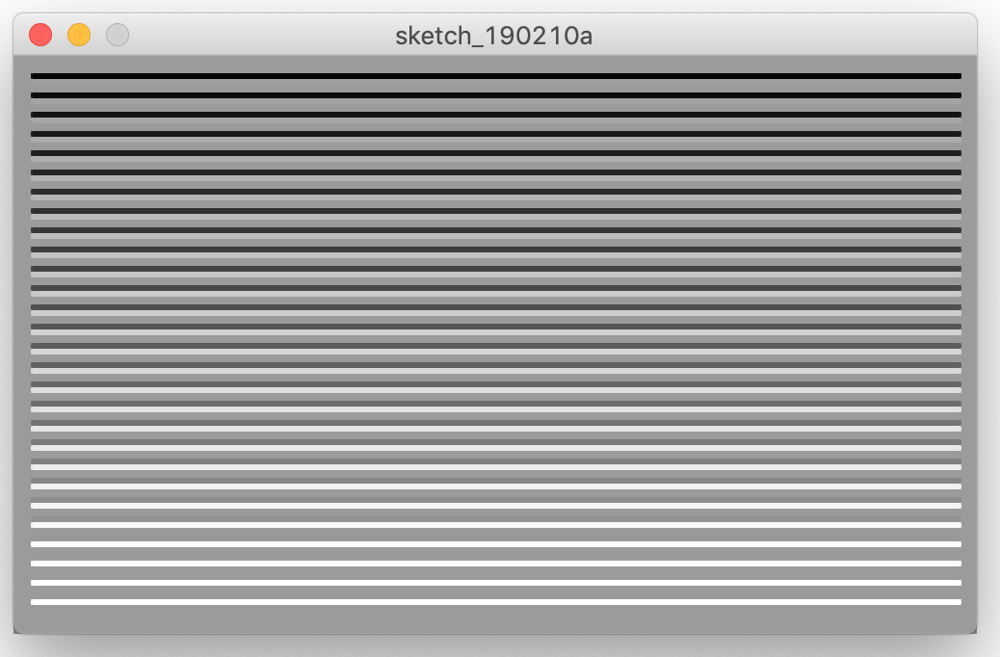

# Processing - Generative Art / Design Tutorial
_-- Having Fun --_

#### Contents
| Getting Started | Having Fun | Advanced Stuff |
|--- |--- |---|
1 [Introduction](ProcessingTutorial1.md#intro) | 13 [Random](#random) :hammer_and_wrench: | 20 [Arrays](ProcessingTutorial3.md#arrays) |
2 [Sketching](ProcessingTutorial1.md#sketching) | 14 [Conditionals](#conditionals) | 21 [Recursion](ProcessingTutorial3.md#recursion) :hammer_and_wrench:  |
3 [Libraries](ProcessingTutorial1.md#libraries) | 15 [While Loop - Repetition](#while) :hammer_and_wrench:   | 22 [Algorithm](ProcessingTutorial3.md#algo) :hammer_and_wrench:  |
4 [Your First Program](ProcessingTutorial1.md#program) | 16 [For Loop - Tiling](#for) :hammer_and_wrench: | 23 [Export](ProcessingTutorial3.md#export) :hammer_and_wrench: |
5 [The Coordinate System](ProcessingTutorial1.md#coordinate) | 17 [Color](#color) :hammer_and_wrench: |  |
6 [Functions](ProcessingTutorial1.md#functions) | 18 [Translate & Rotate - Displacement](#displacement) :hammer_and_wrench: |  |
7 [Lines, Basic Shapes & Modes](ProcessingTutorial1.md#shapes) :hammer_and_wrench:  | 19 [Advanced Shapes](#shapesplus)  :hammer_and_wrench: |  | 
8 [Comments](ProcessingTutorial1.md#comments) |  |  |
9 [Mathematics](ProcessingTutorial1.md#math) |  |  |
10 [Drawing Order](ProcessingTutorial1.md#order) |  |  |
11 [Variables](ProcessingTutorial1.md#variables) |  |  |
12 [Structure](ProcessingTutorial1.md#structure) |  |  |
  

## <a name="random">13. Random :hammer_and_wrench:</a>

Unlike the smooth, linear motion common to computer graphics, motion in the physical world is usually idiosyncratic. We can simulate the unpredictable qualities of the world by generating random numbers. The `random()` function calculates these values; we can set a range to tune the amount of disarray in a program. The following short example prints random values to the console, with the range limited by the position of the mouse. The ‘random()’ function always returns a floating-point value, so be sure the variable on the left side of the assignment operator (=) is a float.

```java
void draw() {
  float r = random(0, mouseX);
  println(r);
}
```

#### :hammer_and_wrench:  Now we can make our line act less predictable.
```java
// Every time we run the sketch the line might change orientation
boolean leftToRight = random(1) >= 0.5; 
size(300, 300);
stroke(0);
background(255);
noSmooth();
if (leftToRight) {
  // a diagonal line
  line(0, 0, width, height);
} else {
  // the other diagonal
  line(0, height, width, 0);
}
```

## <a name="conditionals">14. Conditionals</a>

Conditions are like questions. They allow a program to decide to take one action if the answer to a question is "true" or to do another action if the answer to the question is "false."    
Thus, it checks that a condition has been met before executing the code inside the block marked by the braces that follow it. In the case below, the conditional asks whether the value of diam is less than or equal to 400. If it is, the code in the block executes. If not, the code in the block is skipped:

```java
// check a condition
if (diam <= 400) {
// execute code between the braces
// if condition is met
}
```
You can also use an else clause to provide a block of code to be executed if the condition isn’t met:

```java
if (diam <= 400) {
// execute this code if diam <= 400
} else {
// execute this code if diam > 400
}
```


If you imagine the flow of execution as a trickle of water running down the script, by setting a conditional you’re effectively creating different channels for the stream to follow.   
With an if ... else clause, the stream can go one of two ways, either through the block or around. 

**The most common relational operators are:**     
`>` Greater than     
`<`Less than     
`>=` Greater than or equal to     
`<=` Less than or equal to     
`==` Equal to     
`!=` Not equal to     

In addition you can also use **logic operators** to group conditions:    
`||` logical OR    
`&&` logical AND    
`!` logical NOT

#### :hammer_and_wrench:  Lets try a more advanced conditional with 2 tests
```java
// Draw a Random Shape
float dice = random(1);
int border = 10;

size(300, 300);
stroke(0);
background(255);
fill(0);
rectMode(CENTER);

if (dice < 0.333) { 
  // circle
  ellipse(width/2, height/2, width-border, height-border);
} else if ((dice > 0.333) && (dice < 0.666)) {
  // rect
  rect(width/2, height/2, width-border, height-border);
} else {
  // triangle
  triangle(border/2, 0+border/2, width-border/2, height-border/2, border/2, height-border/2);
}
```
#### :hammer_and_wrench:  Lets try a more advanced conditional with 2 tests
```java
// Draw a Random Shape 
// If it is a triangle if has 4 possible orientations
float dice = random(1);
float dice2 = random(1);
int border = 10;

size(300, 300);
stroke(0);
background(255);
fill(0);
rectMode(CENTER);

if (dice <= 0.333) { 
  // circle
  println("circle");
  ellipse(width/2, height/2, width-border, height-border);
} else if ((dice > 0.333) && (dice < 0.666)) {
  // rect
  println("square");
  rect(width/2, height/2, width-border, height-border);
} else {
  if (dice2 <= 0.25) {
    // triangle 1
    println("triangle 1");
    triangle(border/2, border/2, width-border/2, height-border/2, border/2, height-border/2);
  } else if ((dice2 > 0.25) && (dice2 <= 0.5)) {
    // triangle 2
    println("triangle 2");
    triangle(border/2, border/2, width-border/2, 0+border/2, width-border/2, height-border/2);
  } else if ((dice2 > 0.5) && (dice2 <= 0.75)) {
    // triangle 3
    println("triangle 3");
    triangle(border/2, border/2, width-border/2, 0+border/2, border/2, height-border/2);
  } else {
    // triangle 4
    println("triangle 4");
    triangle(width-border/2, border/2, width-border/2, height-border/2, border/2, height-border/2);
  }
}
```

## <a name="while">15. While Loop - Repetition :hammer_and_wrench:</a>

As you write more programs, you’ll notice that patterns occur when lines of code are repeated, but with slight variations. A code structure called **a loop** makes it possible to run a line of code more than once to condense this type of repetition into fewer lines. This makes your programs more modular and easier to change.

```java
int number = 99;
while (number > 0) {
  println(number);
  number--;
}
println(“zero”);
```
This outputs the value of the variable *'number'* to the console window 99 times. The while command checks a condition and, if the condition is met, executes the code inside the braces; it then loops back up to the top of the block. The execution continues to the final line only after the condition is no longer met (in this case, when 'number' is 0).

Note that if you don’t include the 'number--' line inside the loop, which subtracts 1 from the number every time it loops, the condition will never be met and the loop will go on forever.


_Flow diagram of a while loop_


#### :hammer_and_wrench:  Lets draw a line repeatedly with a random displacement of the 2 coordinates.
```java
// a while loop example
int x = 0;
int y = 0;
int size = 10;
float displRange = 5;
float displ;
background(255);
stroke(0);

size (800,500);
while (x < width) {
  displ = random(-displRange,displRange);
  line (x-displ,0,x+displ,height);
  x+=size; // this is shorthand code for x = x + size
}
```
## <a name="for">16. For Loop - Tiling :hammer_and_wrench</a>

The for loop is used when you want to iterate through a set number of steps, rather than just wait for a condition to be satisfied. The syntax is as follows:

```Java
for (init; test; update) {
  code to be executed
}
```
The code between the curly brackets { } is called **a block**. This is the code that will be repeated on each iteration of the loop. Inside the parentheses are **three statements**, separated by semicolons, that work together to control how many times the code inside is run. From left to right, these statements are referred to as **the initialization** (init), **the test**, and **the update**. The ‘init’ typically declares a new variable to use within the for loop and assigns a value. The variable name ‘i’ is frequently used. The ‘test’ evaluates the value of this variable, and the ‘update’ changes it’s value.


_Flow diagram of a for loop_

The test statement is always **a relational expression** that compares two values with a **relational operator**. As mentioned already the common relational operators are:   
`>` Greater than, `<` Less than, `>=` Greater than or equal to, `<=` Less than or equal to, `==` Equal to, `!=` Not equal to    
The relational expression always evaluates to **true** or **false**. When it’s true, the code inside the block is run, when it’s false, the code inside the block is not run and the for loop ends.

```Java
size(500, 300);
background(155);
strokeWeight(3);
for (int h = 10; h <= (height - 15); h+=10) {
  stroke(0, 255-h);
  line(10, h, width - 10, h);
  stroke(255, h);
  line(10, h+3, width - 10, h+3);
}
```


The initial state of the for loop sets a variable h to 10. The code in the loop executes until h <= (height-15) (the end condition). Every time the loop is executed, the value of h increases by 10, according to the step you’ve defined (h += 10). This means the code inside the parentheses of the for loop will execute 28 times, with h set to 10, 20, 30 ... 270, 280. Knowing that the h variable follows this pattern, you can use it in multiple ways. The lines you’re drawing are in 10-pixel steps down the canvas, because you use h for the y value. But the alpha transparency of the lines also varies as h varies: the black line gets lighter, and the white line gets darker.

#### :hammer_and_wrench:  Time for some serious Tiling.
```java
// for loop example 1
int diam = 30;
int step = 5;

size(500,200);
noFill();

for (int x = diam; x<width-diam; x+= step) {
  ellipse(x, height/2, diam, diam); 
}
```

```Java
// for loop example with a nested for loop
int diam = 30;
int step = 5;

size(601, 211);
noFill();

for (int x = diam/2; x<width-diam/2; x+= diam) {
  for (int y = diam/2; y<height-diam/2; y+= diam) {
    ellipse(x, y, diam, diam);
  }
}
```
#### :hammer_and_wrench:  Finally we can go the GOTO 10 example. 
"goto 10" refers to "10 PRINT CHR$(205.5+RND(1)); : GOTO 10"      
a random maze generation program in one line of Commodore 64 Basic.

```Java
// GOTO 10 or Random Diagonal Lines in a grid
float dice = 0;
int tile = 20;

size(600, 600);
background(255);
stroke(0);

for (int x = tile/2; x <= width; x+=tile) {
  for (int y = tile/2; y <= height; y+=tile) {
    dice = random(1);
    if (dice <= 0.5) { 
      line(x-tile/2, y-tile/2, x+tile/2, y+tile/2);
    } else {
      line(x-tile/2, y+tile/2, x+tile/2, y-tile/2);
    }
  }
}
```
```java
// GOTO 10 the Horizontal / Vertical approach
float dice = 0;
int tile = 20;

size(600, 600);
background(255);
stroke(0);

for (int x = tile/2; x <= width; x+=tile) {
  for (int y = tile/2; y <= height; y+=tile) {
    dice = random(1);
    if (dice <= 0.5) { 
      line(x, y-tile/2, x, y+tile/2);
    } else {
      line(x-tile/2, y, x+tile/2, y);
    }
  }
}
```
```Java
// Draw Random Shapes in a 10 by 10 grid
float dice = 0;
int tile = 30;
int gutter = 3;

size(300, 300);
background(255);
stroke(0);
fill(0);
rectMode(CENTER);

for (int x = tile/2; x <= width; x+=tile) {
  for (int y = tile/2; y <= height; y+=tile) {
    dice = random(1);
    if (dice <= 0.5) { 
      ellipse(x, y, tile-gutter, tile-gutter);
    } else {
      rect(x, y, tile-gutter, tile-gutter);
    }
  }
}
```
```Java
// Draw a Full Grid of Random Shape 
// Triangles can be orientated in 4 directions
float dice = 0;
float dice2 = 0;
int tile = 150;
float border = tile/10;

size(300, 300);
background(255);
fill(0);
noStroke();
rectMode(CENTER);

for (int x = tile/2; x <= width; x+=tile) {
  for (int y = tile/2; y <= height; y+=tile) {
    dice = random(1);    
    dice2 = random(1);
    if (dice <= 0.333) { 
      // circle
      println("circle");
      ellipse(x, y, tile-border, tile-border);
    } else if ((dice > 0.333) && (dice < 0.666)) {
      // rect
      println("square");
      rect(x, y, tile-border, tile-border);
    } else {
      if (dice2 <= 0.25) {
        // triangle 1
        println("triangle 1");
        triangle(x-tile/2+border/2, y-tile/2+border/2, x+tile/2-border/2, y+tile/2-border/2, x-tile/2+border/2, y+tile/2-border/2);
      } else if ((dice2 > 0.25) && (dice2 <= 0.5)) {
        // triangle 2
        println("triangle 2");
        triangle(x-tile/2+border/2, y-tile/2+border/2, x+tile/2-border/2, y-tile/2+border/2, x+tile/2-border/2, y+tile/2-border/2);
      } else if ((dice2 > 0.5) && (dice2 <= 0.75)) {
        // triangle 3
        println("triangle 3");
        triangle(x-tile/2+border/2, y-tile/2+border/2, x+tile/2-border/2, y-tile/2+border/2, x-tile/2+border/2, y+tile/2-border/2);
      } else {
        // triangle 4
        println("triangle 4");
        triangle(x+tile/2-border/2, y-tile/2+border/2, x+tile/2-border/2, y+tile/2-border/2, x-tile/2+border/2, y+tile/2-border/2);
      }
    }
  }
}
```


## <a name="color">17. Color :hammer_and_wrench:</a>

To change color in your shapes use the `background()`, `fill()`, and `stroke()` functions. The values of the parameters are in the range of **0 to 255**, where 255 is white, 128 is medium gray, and 0 is black. To move beyond gray-scale values, you use three parameters to specify the **red**, **green**, and **blue** components of a color. They also range from 0 to 255. Using RGB color isn’t very intuitive, so to choose colors, you can use Tools → Color Selector. By adding an optional fourth parameter to fill() or stroke(), you can control the transparency. This **fourth parameter** is known as the **alpha value**, and also uses the range 0 to 255 to set the amount of transparency. The value 0 defines the color as entirely transparent (it won’t display), the value 255 is entirely opaque, and the values between these extremes cause the colors to mix on screen (sketch_02).

```java
size(255, 255);
for (int y=0; y<height; y+=1) {
  for (int x=0; x<width; x+=1) {
    stroke(x, y, 122);
    point(x, y);
  }
}
```


When one for loop is embedded inside another, the number of repetitions is multiplied. For each line in y-direction (y < height) the code iterates through every pixel in x-direction (x < width) and draws a point at the respective location with a red and green color value corresponding to x and y.

####:hammer_and_wrench: Our last sketch with color
```Java
// Draw a Full Grid of Random Shape 
// Triangles can be orientated in 4 directions
// With colors this time
float dice = 0;
float dice2 = 0;
int tile = 50;
float border = tile/10; 

size(300, 300);
noStroke();
background(255);
fill(0);
rectMode(CENTER);
colorMode(HSB, 360, 100, 100);

for (int x = tile/2; x <= width; x+=tile) {
  for (int y = tile/2; y <= height; y+=tile) {
    dice = random(1);    
    dice2 = random(1);
    fill(60*dice+60,dice2*100,100); 
    if (dice <= 0.333) { 
      // circle
      println("circle");
      ellipse(x, y, tile-border, tile-border);
    } else if ((dice > 0.333) && (dice < 0.666)) {
      // rect
      println("square");
      rect(x, y, tile-border, tile-border);
    } else {
      if (dice2 <= 0.25) {
        // triangle 1
        println("triangle 1");
        triangle(x-tile/2+border/2, y-tile/2+border/2, x+tile/2-border/2, y+tile/2-border/2, x-tile/2+border/2, y+tile/2-border/2);
      } else if ((dice2 > 0.25) && (dice2 <= 0.5)) {
        // triangle 2
        println("triangle 2");
        triangle(x-tile/2+border/2, y-tile/2+border/2, x+tile/2-border/2, y-tile/2+border/2, x+tile/2-border/2, y+tile/2-border/2);
      } else if ((dice2 > 0.5) && (dice2 <= 0.75)) {
        // triangle 3
        println("triangle 3");
        triangle(x-tile/2+border/2, y-tile/2+border/2, x+tile/2-border/2, y-tile/2+border/2, x-tile/2+border/2, y+tile/2-border/2);
      } else {
        // triangle 4
        println("triangle 4");
        triangle(x+tile/2-border/2, y-tile/2+border/2, x+tile/2-border/2, y+tile/2-border/2, x-tile/2+border/2, y+tile/2-border/2);
      }
    }
  }
}
```

## <a name="displacement">18. Transformation & Displacement :hammer_and_wrench</a>
### (circular) Motion?
:construction:

### Translate, Rotate, Scale
**[see the tutorial 2D transformations by J David Eisenberg](https://processing.org/tutorials/transform2d/)**

## <a name="shapes">19. Advanced Curves and Shapes</a>
**[see the tutorial Curves by J David Eisenberg](https://processing.org/tutorials/curves/)**
