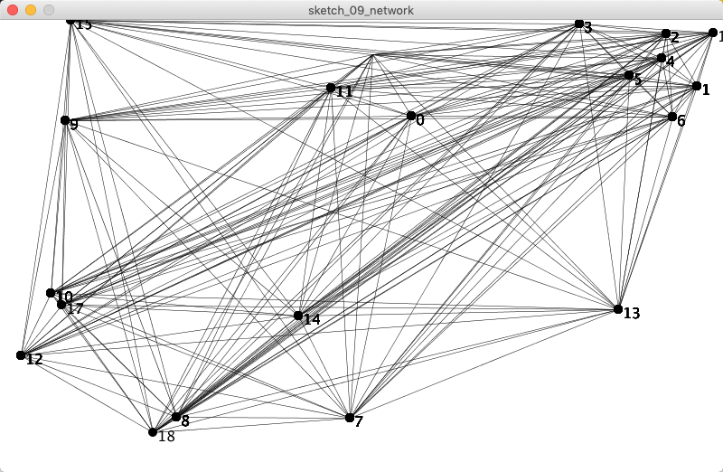

# Processing - Generative Art / Design Tutorial
_-- Advanced Stuff --_

#### Contents
*--[Getting Started](ProcessingTutorial1.md)--*
*--[Having Fun](ProcessingTutorial2.md)--*
*--Advanced Stuff--*
21 [functions](ProcessingTutorial3.md#functions)
22 [Arrays](ProcessingTutorial3.md#arrays)
23 [Recursion](ProcessingTutorial3.md#recursion) :hammer_and_wrench:
24 [Algorithm](ProcessingTutorial3.md#algo) :hammer_and_wrench: 
25 [Export](ProcessingTutorial3.md#export) :hammer_and_wrench:
26 [Object Oriented Programming](ProcessingTutorial3.md#OOP)
27 [Anatomy of a Program](ProcessingTutorial3.md#anatomy)
28 [Sources](ProcessingTutorial3.md#sources)
29 [Further Links](ProcessingTutorial3.md#links)
30 [Example Sketches Generative Art](ProcessingTutorial3.md#sketches)
  
## <a name="functions">21 Functions</a>  

We now know how to call functions, use and create variables. We’ve also seen that functions can give us a value instead of doing something. The next section combines all of that to allow us to **create our own functions**. This will let us organise our code into smaller chunks and treat complicated tasks as a single step.    

To write your own function, you need to do 4 things:
* Write the **return type** of the function.
* Write the **name** of the function.
* Inside parenthesis **()**, list any **parameters** the function will take.
* Inside curly brackets **{}**, write **a series of steps** that will be followed whenever that function is called. This is called the body of the function.

**Return Types**
Remember that functions can either do something (like draw an ellipse or change the fill color) or give you a value (like a random value or the current time).    

*For example, the random() function gives you a float value, which you can store in a float variable. That means that the return type of the random() function is float. Compare that to the ellipse() function, which doesn’t give you a value. It wouldn’t make any sense to try to store it in a variable. We say that the return type of the ellipse() function is void, which just means that it doesn’t return anything.*

We’ll need to keep this in mind as we write our own functions. Most of the functions we write will do something instead of giving you a value, so you’ll see a lot of void return types.

Here’s a function that draws a red circle:

```java
void drawRedCircle(float circleX, float circleY, float circleDiameter) {
  fill(255, 0, 0);
  ellipse(circleX, circleY, circleDiameter, circleDiameter);
}
```

This function has a void return type (which just means it does something instead of giving you a value), and takes 3 parameters: circleX, circleY, and circleDiameter. In the body of the function, it changes the fill color to red and then uses the parameters to draw a circle.

To call this function, we’d just use its name and give it parameters, exactly like we’ve been calling preexisting functions:
```java
drawRedCircle(100, 200, 50);
```

This allows us to treat a task that takes multiple steps (like changing the fill color to red and drawing a circle) as a single step. As we do more complicated tasks, this becomes very useful.

**Below a more extensive example with smileys.**
```java
void smiley(int x, int y, int s) {
  noFill();
  stroke(0);
  strokeWeight(s/40);
  ellipse(x, y, s, s) ; // head
  ellipse(x-s/5, y-s/5, s/5, s/5);
  ellipse(x+s/5, y-s/5, s/5, s/5);
  arc(x, y, s*0.65, s*0.65, 0, PI, OPEN);
}

void setup() {
  size(520, 400);
  background(255);
  for (int x = 20; x < width; x+=40) {
    for (int y = 20; y < height; y+=40) {
      smiley(x, y, 40);
    }
  }
  smiley(width/2, height/2, 200);
}
```
  
## <a name="arrays">22. Arrays</a>
[see also the tutorial Arrays by Casey Reas and Ben Fry](https://processing.org/tutorials/arrays/)

**An array is a list of variables** that share a common name. Arrays are useful because they make it possible to work with more variables without creating a new name for each. Each item in an array is called **an element**, and each has an **index value** to mark its position within the array, starting from 0. 

So if you have an Array called cities[] then you might have items in that array called Gent, Brugge, Brussel and Antwerpen. We could then easily refer to any one of these items in the array by referring to the Array index number. Here is what the code would look like:

```java
String [] cities;          // Declare
cities = new String[4];    // Create
cities[0] = "Gent";        // Assign
cities[1] = "Brugge";
cities[2] = "Brussel";
cities[3] = "Antwerpen";

println(cities[2]);
```
The [] square bracket symbol denote that we are using an Array.    

You define an array first by **the data type** of object that will be held in it (in this case a String), followed by the **[] square brackets**, then **the name** of the Array.    
Then we need to create it. We repeat the given name, have **an equal sign** followed by **the word 'new'**. The new part tells Processing to free up some memory for the Array. We then denote the same Data Type that we were using in the beginning of the line of code. Finally, in the [] square brackets we put **how many items we want the array to hold**.

Thus: 
```Java
DataType [] ArrayName      
ArrayName = new DataType[length];
```
or shortened:
```Java
DataType [] ArrayName = new DataType[length];
```
You can also declare, create & assign an array in one go. 

```java
size(400,150);
strokeWeight(15);

int[] x = { 
  50, 61, 83, 69, 71, 50, 29, 31, 17, 39, 82, 93, 35, 96, 54
};

fill(0);
// Read one array element each time through the for loop
for (int i = 0; i < x.length; i++) {
  line(i*(width/x.length), height, i*(width/x.length), height-x[i]);
}
```

The `x.length` statement above queries the number of elements in an array. This .length is called dot operator.
```java
int[] data = { 19, 40, 75, 76, 90 };
println(data.length); // Prints "5" to the console
```

#### :hammer_and_wrench: An example: A Network

```java
// A Network
int points = 20;
int[] x = new int[points];
int[] y = new int[points];

void setup() {
  size(800, 500);
  for (int i = 0; i<points; i++) {
    x[i] = int(random(width));
    y[i] = int(random(height));
  }
  strokeWeight(1);
  fill(0);
  textSize(16);
}

void draw() {
  background(255);
  strokeWeight(0.5);
  for (int i =0; i<points; i++) {
    for (int j = i+1; j<points; j++) {
      noStroke();
      ellipse(x[i], y[i], 10, 10);
      text(i,x[i]+5, y[i]+10);
      stroke(0);
      line(x[i], y[i], x[j], y[j]);
      
    }
  }
}

```

_a Network_


## <a name="recursion">23. Recursion</a>
Recursion is a way of controlling the flow of a program with a function that calls itself. Unlike iteration, where we walk through a repeated series of commands step-by-step, recursion can create complex behaviour such as fractals that are impossible to make in another way.

A recursive function always:
1. Has a test to see if it's time to stop (otherwise it will continue forever and freeze your program!)
2. Calls itself, usually with modified data.
 
There are different ways to set a limit. You can use a variable to count the recursion depth, and stop when the depth is enough for you. You could also set a limit by drawing shapes that get smaller and smaller, and then stop when they are small enough.


```java
void setup() {
  size(900, 700);
  background(255);
  noFill(); 
  stroke(0);
  strokeWeight(1);
  rectMode(CENTER);
  noLoop();
}

void draw() {
  recursion(width/2, height/2, 320);
}

// this recursion function takes 3 arguments: location (x,y) and size (s)
void recursion(float x, float y, float s) {
  // The test: ensure that size s is greater than zero
  if (s > 3) {
    // an circle / square of size (s) at (x,y)
    //ellipse(x, y, s, s);
    rect(x, y, s, s);
    // and a recursion in half size and placed on both sides of the shape
    recursion(x + (s/2), y, s*0.5);
    recursion(x - (s/2), y, s*0.5);
    // and a a third recursion in half size and placed on top of the shape
    recursion(x, y- (s/2), s*0.5);
  }
}
```
```java
/*
Recursive Tree by Daniel Shiffman.
https://processing.org/examples/tree.html

Renders a simple tree-like structure via recursion. 
The branching angle is calculated as a function of the horizontal mouse location. 
Move the mouse left and right to change the angle.
*/

float theta;  
int lenght = 200;

void setup() {
  size(700, 700);
}

void draw() {
  background(0);
  frameRate(30);
  stroke(255);
  // Let's pick an angle 0 to 90 degrees based on the mouse position
  float a = (mouseX / (float) width) * 90;
  // Convert it to radians
  theta = radians(a);
  // Start the tree from the bottom of the screen
  translate(width/2,height);
  // Draw a line 120 pixels
  line(0,0,0,-200);
  // Move to the end of that line
  translate(0,-lenght);
  // Start the recursive branching!
  branch(lenght);

}

void branch(float h) {
  // Each branch will be 2/3rds the size of the previous one
  h *= 0.66;
  
  // All recursive functions must have an exit condition!!!!
  // Here, ours is when the length of the branch is 2 pixels or less
  if (h > 2) {
    pushMatrix();    // Save the current state of transformation (i.e. where are we now)
    rotate(theta);   // Rotate by theta
    line(0, 0, 0, -h);  // Draw the branch
    translate(0, -h); // Move to the end of the branch
    branch(h);       // Ok, now call myself to draw two new branches!!
    popMatrix();     // Whenever we get back here, we "pop" in order to restore the previous matrix state
    
    // Repeat the same thing, only branch off to the "left" this time!
    pushMatrix();
    rotate(-theta);
    line(0, 0, 0, -h);
    translate(0, -h);
    branch(h);
    popMatrix();
  }
}
```

see also https://natureofcode.com/book/chapter-8-fractals/

## <a name="algo">24. Algorithm</a>
:construction:


## <a name="export">25. Export :hammer_and_wrench:</a>

Processing includes a number of ways on exporting the created content.

**Bitmap images** can be saved using the [`saveFrame()`](https://processing.org/reference/saveFrame_.html) function. If
saveFrame() is used without parameters, it will save files as screen-0000.tif, screen-0001.tif, and so on. You can
specify the name of the sequence with the filename parameter, including hash marks (####), which will be replaced by the current frameCount value. The number of hash marks is used to determine how many digits to include in the file names. Append a file extension, to indicate the file format to be used: either TIFF (.tif), TARGA (.tga), JPEG (.jpg), or PNG (.png). Image files are saved to the sketch’s folder, which may be opened by selecting “Show Sketch Folder” from the “Sketch” menu.

Since our scripts due to the noLoop() function often only run once the default way of using saveFrame() would overwrite existing images each time the function is called. We therefore add the current time to the image name. This is done by adding

```java
import java.util.Calendar;
```
at the beginning of the script and creating two functions at the end:

```java
void keyPressed() {
  if (key == 's' || key == 'S') saveFrame(timestamp()+".png");
}

String timestamp() {
  Calendar now = Calendar.getInstance();
  return String.format("%1$ty%1$tm%1$td_%1$tH%1$tM%1$tS", now);
}

```
Now, whenever the key ‘s’ is pressed an image named with the current date and time is created.

**PDF vector files** can be saved using [`beginRecord()`](https://processing.org/reference/beginRecord_.html) and [`endRecord()`](https://processing.org/reference/endRecord_.html). The beginRecord() function requires two parameters, the first is the renderer and the second
is the file name. This function is always used with endRecord() to stop the recording process and close the file.
Note that beginRecord() will only pick up any settings that happen after it has been called. For instance, if you call
textFont() before beginRecord(), then that font will not be set for the file that you’re recording to.

In our case this requires to first add

```java
import processing.pdf.*;
```

at the top of the script and then include

```java
beginRecord(PDF, timestamp()+”.pdf”);
```
within the setup() function and

```java
endRecord();
```
at the end of the draw() function.


The complete ‘Polygon Scribble’ program would then look like this. Note that beginRecord() is in comments since otherwise a PDF would be created each time the script is run.

```java
import processing.pdf.*;
import java.util.Calendar;

int sides = 4;
float[] x = new float[sides];
float[] y = new float[sides];

float variance = 5;
int iterations = 30;
int radius = 100;

void setup() {
  size(800, 800);
  beginRecord(PDF, timestamp()+".pdf");
  smooth();
  float angle = radians(360/float(sides));
  for (int i=0; i<sides; i++) {
    x[i] = cos(angle*i+50) * radius;
    y[i] = sin(angle*i+50) * radius;
  }
  stroke(0);
  strokeWeight(1);
  background(255);
  noFill();
  //noLoop();
}

void draw() {
  background(255);
  for (int i=0; i< iterations; i++) {
    for (int a=0; a < sides; a++) {
      x[a] += random(-variance, variance);
      y[a] += random(-variance, variance);
    }
    beginShape();
    curveVertex(x[sides-1]+width/2, y[sides-1]+height/2);
    for (int a=0; a < sides; a++) {
      curveVertex(x[a]+width/2, y[a]+height/2);
    }
    curveVertex(x[0]+width/2, y[0]+height/2);
    curveVertex(x[1]+width/2, y[1]+height/2);
    endShape();
  }
}

void keyReleased() {
  if ((key == 's') || (key == 'S')) {        
    saveFrame(timestamp()+"_##.png");
    endRecord();
    exit();
  }
}

// timestamp
String timestamp() {
  Calendar now = Calendar.getInstance();
  return String.format("%1$ty%1$tm%1$td_%1$tH%1$tM%1$tS", now);
}
```
see also this tutorial https://processing.org/tutorials/print/


## <a name="OOP">Object Oriented Programming</a>
see https://processing.org/tutorials/objects/
:construction:

## <a name="anatomy">Anatomy of a Program</a>
see https://processing.org/tutorials/anatomy/
:construction:

## <a name="sources">Sources</a>
- “Learning Processing, Second Edition: A Beginner’s Guide to Programming
Images, Animation, and Interaction” by Daniel Shiffman (2015)
- “Generative Art” by Matt Pearson (2011)
- “Make: Getting Started with Processing” by Casey Reas and Ben Fry (2010)
- Processing documentation (https://processing.org/tutorials/)

## <a name="links">Further Links</a>
* https://processing.org/tutorials/
* [http://www.generative-gestaltung.de/](http://www.generative-gestaltung.de/)
* [http://www.openprocessing.org/](http://www.openprocessing.org/)
* [Learning Processing youtube playlist by Dan Shiffman](https://www.youtube.com/user/shiffman/playlists?shelf_id=2&view=50&sort=dd)


## <a name="sketches">Example Sketches Generative Art</a>
[download a .zip archive with code examples](downloads/processing/recode.zip) 
