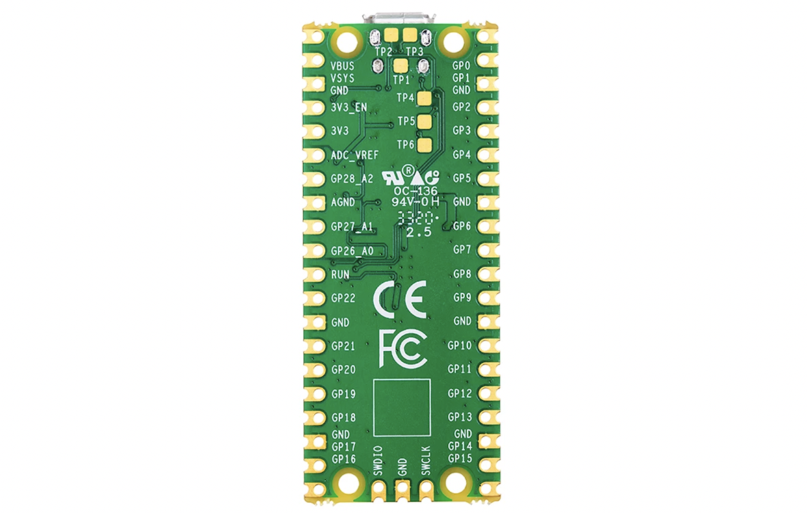

# Physical Computing with the Raspberry Pi PICO

This tutorial is based on the official guide ["Get Started with MicroPython on Raspberry Pi Pico"](https://www.raspberrypi.org/products/micropython-pico/). You you can [download a PDF version](https://hackspace.raspberrypi.org/books/micropython-pico) for free.

You will learn the basics of physical computing <sup>[1](#1)</sup> with this powerful microcontroller board. This includes learning to know and setting up workflow, reading and reproducing circuits, program the Pico with MicroPython, ...


#### Contents
-- Getting Prepped --
1. [Introduction](#intro)
1. [the Raspberry Pi Pico Board](#hardware)
1. [the MicroPython firmware](#firmware)
1. [the Software](#software)
-- Getting Started --
5. [What the Shell](#shell)
6. [Over to Script Mode](#scriptmode)
7. [Few extra Programming Principles](#pprinciples)
-- Getting Dirty Hands --
8. [Physical computing](#physicalcomputing)
9. [Wiring Diagrams & Schematics](#schematics)
1. [a Pushbutton - Digital Inputs](#digitalIn)
1. [Sensors - Analog Inputs](#analogIn)
1. [PWM - Analog Outputs](#analogOut)
1. [Serial Communication](#serial)


## <a name="intro">1. Introduction</a>
You probably have lots of microcontrollers in your house already. There’s a good chance your washing machine is controlled by a microcontroller, and maybe your watch is, and you might find one in your coffee machine or microwave. Of course, all these microcontrollers already have their programs and the manufacturers make it hard to change the software running on them. A Raspberry Pi Pico, on the other hand, can be easily reprogrammed over a USB connection.

[Raspberry Pi Pico](https://www.raspberrypi.org/products/raspberry-pi-pico/) is a microcontroller development board, meaning simply that it’s a printed circuit board housing a special type of processor designed for physical computing: the microcontroller. The RP Pico features the new [RP2040 chip](https://www.raspberrypi.org/products/rp2040/).

Raspberry Pi Pico - shortened to Pico - is designed for physical computing projects where it controls anything from LEDs and buttons to sensors, motors, and even other microcontrollers or software running on your computer or a webserver.

The Pico is programmable in C/C++ and MicroPython. In this tutorial we will focus on [MicroPython](https://micropython.org/) as it is the fastest and more straightforward way to get started.

MicroPython is an implementation of the Python programming language. It offers the same friendly syntax, as Python, and allows full control over Pico’s features. If you’ve programmed with Python before, you’ll find MicroPython immediately familiar. If not, don’t worry: it’s a friendly language to learn!

## <a name="hardware">2. the Raspberry Pi Pico Board</a>
This is a Raspberry Pi Pico. Let's call it the Pico to keep it short.


The gold-coloured sections at the outer edge of the board are **the pins** which provide the microcontroller with connections to the outside world – known as general purpose input/output (GPIO) Pins.

The chip at the centre of your Pico is a **the RP2040 IC**.

At the top of your Pico is a **micro USB port**. This provides power to make your Pico run, and also lets Pico talk to a computer via its USB
port – which is how you’ll load your programs onto your Pico.

Just below the micro USB port is a **small button** marked ‘**BOOTSEL**’, short for ‘boot selection’. This switches your Pico between two start-up modes when it’s first switched on. You’ll use the boot selection button later, as you get your Pico ready for programming with MicroPython.

At the bottom of your Pico are three smaller gold pads with the word ‘**DEBUG**’ above them. These are designed for debugging programs running on the Pico.



Now, turn your Pico over. You’ll see the underside has writing on it. This is known as a silk-screen layer, and **labels** each of the pins with its core function. You’ll see things like ‘GP0’ and ‘GP1’, ‘GND’, ‘RUN’, and ‘3V3’. If you ever forget which pin is which, these labels will tell you – but you won’t be able to see them when the Pico is pushed into a breadboard. Therefore the following diagram might come in handy.


:scream_cat: Wait. **What is a breadboard?**  
A [breadboard](https://en.wikipedia.org/wiki/Breadboard), also known as a solderless breadboard, can make physical computing projects considerably easier. Rather than having a bunch of separate components which need to be connected with wires, a breadboard lets you insert components and have them connected through metal tracks which are hidden beneath its surface. Many breadboards also include sections for power distribution, making it easier to build your circuits.


By soldering male pin headers in place pointing downwards, you can push your Pico into the breadboard to make connecting and disconnecting new hardware as easy as possible – great for experiments!

You can follow [this guide](https://magpi.raspberrypi.org/articles/how-to-solder-gpio-pin-headers-to-raspberry-pi-pico) to if you need to solder the pin headers. You’ll need a soldering iron, some solder, a cleaning sponge, your Pico, and two 20-pin male header strips. If you already have a solderless breadboard, you can use it to make the soldering process easier.


## <a name="software">3. the MicroPython firmware</a>
You can program your Pico by connecting it to a computer via USB, then dragging and dropping a file onto it.

1. Download the [MicroPython UF2](https://micropython.org/download/rp2-pico/rp2-pico-latest.uf2) file.

2. Push and hold the BOOTSEL button and plug your Pico into the USB port of your Raspberry Pi or other computer. Release the BOOTSEL button after your Pico is connected.

3. It will mount as a Mass Storage Device called RPI-RP2.

4. Drag and drop the MicroPython UF2 file onto the RPI-RP2 volume. Your Pico will reboot. You are now running MicroPython.


**Alternatively** you can get a copy of the MicroPython UF2 file from a webpage<sup>[2](#2)</sup> linked from INDEX.HTM that is on RPI-RP2 flash memory and copy it to your RPI-RP2 drive. Or you could use the tool provided in Thonny > [follow this guide](https://projects.raspberrypi.org/en/projects/getting-started-with-the-pico/3).

## <a name="software">4. the Software</a>
### :triangular_flag_on_post:  Bring Thonny in

An easy way to program in MicroPython on your Pico is with [Thonny](https://thonny.org/), a Python IDE (integrated development environment) for learning and teaching programming.


<div style=background-color:OrangeRed;>:warning: Make sure you download and install the latest version of Thonny as the Raspberry Pi Pico interpreter is not available on older versions.</div>

### :triangular_flag_on_post:  a walk through the Thonny UI


1. the *Toolbar** offers an icon-based quick-access system to commonly used program functions, like saving, loading, and running programs.

2. the **Script Area** is where your Python programs are written. It is split into a main area for your program and a small side margin for showing line numbers.

3. the **Python Shell** allows you to type individual instructions which are run as soon as you press the ENTER key, and also provides information about running programs. This is also known as **REPL**, for ‘read, evaluate, print, and loop.’

4. the **Interpreter** at the bottom-right of the Thonny window. It shows, and lets you change, the current Python interpreter or the version of Python used to run your programs.


### :triangular_flag_on_post: linking Thonny to Pico
Thonny is normally used to write programs that run on the same computer you’re using Thonny on. To switch to writing programs on your Raspberry Pi Pico, you’ll need to choose a new Python interpreter. See point 4 above. Look at the bottom-right of the Thonny window for the word ‘Python’ followed by a version number: that’s your current interpreter.

**Change it to ‘MicroPython’**. It will tell you it's version and that it’s running on ‘Raspberry Pi Pico’.

:clap: Congratulations: you’re ready to start programming.


## <a name="shell">5. What the Shell! Conversing with (Micro)Python</a>
Your first MicroPython program will be a classic Hello, World!

Click on the Python Shell Area (n°3) at the bottom of the Thonny window, just to the right of the interactive chevron >>> prompt and type the following instruction.

```Python
print("Hello, World!")
```
Then press the **ENTER** key.

Your program will run instantly. Python will respond, also in the Shell area, with the message ‘Hello, World!’. Just as you asked. That’s because the Shell is a direct line to the MicroPython interpreter running on your Pico, whose job it is to look at your instructions and interpret what they mean.

We are now in **interactive mode**. You can think of it like a face-to-face conversation with someone: as soon as you finish what you’re saying, the other person will respond, then wait for whatever you say next.

<div style=background-color:OrangeRed;>:warning: If your program doesn’t run but instead prints a ‘syntax error’ message to the Shell area, there’s a mistake somewhere in what you’ve written. All instructions needs to be written in a very specific way: miss a bracket or a quotation mark, spell ‘print’ wrong or give it a capital P, or add extra symbols somewhere and it won’t run.</div>

## <a name="scriptmode">6. Over to Script Mode</a>
###  :triangular_flag_on_post: switch that LED on and off
The Shell is useful to make sure everything is working and try out quick commands. However, it’s better to put longer programs in a file.

Thonny can save and run MicroPython programs directly on your Raspberry Pi Pico.

In this step, you will create a MicroPython program to blink the onboard LED on and off in a loop.

Type the following lines in the main script area (n°2) to toggle the LED.

```Python
from machine import Pin
led = Pin(25, Pin.OUT)
led.value(1)
```
Click the Run button to run your code.

Thonny will ask whether you want to save the file on This computer or the MicroPython device. Choose MicroPython device.

Enter blink.py (or another) as the file name.    
☞ You need to enter the .py file extension so that Thonny recognises the file as a Python file.

Thonny will save your program to your Raspberry Pi Pico and run it.

You should see the onboard LED switch on.    
Try to switch it off again.

:mag: Okay, what is happening here?! A closer look at the code.

`from machine import Pin`    
this tells MicroPython to import (or load) the ‘Pin’ function from the ‘machine’ library to the program. It is key to working with MicroPython on your Pico.     
`import machine` would also work. It simply loads the whole library (= more memory consumption).

`led = Pin(25, Pin.OUT)`     
We start by defining an object called 'led', or a name of your choice,  that we will refer to later in the program.    
The second part of the line calls the `Pin` function in the machine library. It is designed for handling the Pico’s GPIO pins. At the moment, none of the GPIO pins – including GP25, the pin connected to the on-board LED – knows what they’re supposed to be doing. The first argument, 25, is the number of the pin you’re setting up. The second, Pin.OUT, tells Pico the pin should be used as an output rather than an input.

`led.value(1)`    
This line takes the object and sets its value to 1 for ‘on’. Obviously, if you set the value to 0 again, it goes ‘off’.

Now, try the `led.toggle()` to alternate the output between 0 and 1 more easily.
```Python
from machine import Pin
led = Pin(25, Pin.OUT)
led.toggle()
```
###  :triangular_flag_on_post:  on/off in loop
Wouldn't it be easier if we didn't have to push the Run button all the time? Here comes an **infinite loop** function to the rescue.

To change our program from a definite loop to an infinite loop we need to add the line `while True:` before the `led.toggle()` function.

The colon symbol ( : ) tells MicroPython that the loop itself begins on the next line. To actually include a line of code in the loop, it has to be indented – moved in from the left-hand side of the script area. The next line starts with four blank spaces, which Thonny will have added automatically when you pressed ENTER after typing the colon symbol.

```Python
from machine import Pin
led = Pin(25, Pin.OUT)
while True:
    led.toggle()
```
If you run the code now, you will notice that the LED does not switch on and off but stays on. That is not quite the case. In fact, the code does exactly what we asked it to do, but the on and off switching is so fast that we don't notice it. That’s because Pico works far more quickly than you can see with the naked eye.

To fix that, you need to slow your program down by introducing a delay by importing the utime<sup>[3](#3)</sup> library at the start and adding a one-second sleep delay to the loop (you'll learn more about this library later). Your program should now look like this:

```Python
from machine import Pin
import utime
led = Pin(25, Pin.OUT)
while True:
    led.toggle()
    utime.sleep(1)
```

## <a name="pprinciples">7. Few extra Programming Principles</a>
###  :triangular_flag_on_post: another loop function: `for i in range()`
###  :triangular_flag_on_post: variables
###  :triangular_flag_on_post: conditionals


<hr>
<a name="1">1.</a> What Is Physical Computing?     
All computing is physical. We work with computational systems by taking action with our bodies, on devices. The construction of computing devices, and their use, consumes raw materials and energy as well. In short, the virtual always has physical consequences.  
Physical Computing here refers especially to creating or using devices that interact with the world around them. A computer senses its environment (as touch, movement, temperature, ...), processes that information, and then performs some action (with lights, motors, ...).

<a name="2">2.</a> [This webpage](https://www.raspberrypi.org/documentation/microcontrollers/) also includes a wealth of additional resources. Click on the tabs and scroll to access guides, projects, and the data book collection – a bookshelf of detailed technical documentation covering everything from the inner workings of the RP2040 microcontroller which powers your Pico to programming in both the Python and C/C++ languages.

<a name="3">3.</a> utime is a MycroPython library similar to the regular python time one. It is designed for microcontrollers, like the Pico. The ‘u’ stands for ‘μ’, the Greek letter ‘mu’, which is used as a shorthand for ‘micro’.

<hr>

<div style=text-align:center;>This tutorial is licensed under a Creative Commons Attribution-NonCommercial-ShareAlike 3.0 Unported (CC BY-NC-SA 3.0)</div>
