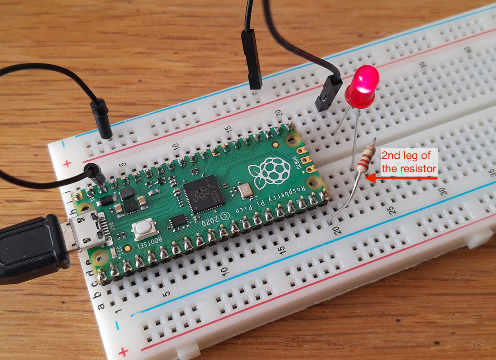

# Physical Computing with the Raspberry Pi PICO

<sup>This tutorial is based on the official guide ["Get Started with MicroPython on Raspberry Pi Pico"](https://www.raspberrypi.org/products/micropython-pico/). You you can [download a PDF version](https://hackspace.raspberrypi.org/books/micropython-pico) for free.</sup>

Hi, welcome 👋    
You will learn the basics of physical computing <sup>[1](#1)</sup> with this powerful microcontroller board. This includes learning to know and setting up the workflow, reading and reproducing circuits, program the Pico with MicroPython, ...


#### Contents
TOC

-- Getting Prepped --
1. [Introduction](#intro)
1. [the Raspberry Pi Pico Board](#hardware)
1. [the MicroPython firmware](#firmware)
1. [the Software](#software)    
-- Getting Started --
5. [What the Shell](#shell)
6. [Over to Script Mode](#scriptmode)
7. [Let's Get Physical](#physicalcomputing)
8. [Wiring Diagrams & Schematics](#schematics)
-- Getting Dirty Hands --
9. [Next level LED blinking](#externalled)
1. [a Pushbutton - Digital Inputs](#digitalIn)
1. [Sensors - Analog Inputs](#analogIn)
1. [PWM - Analog Outputs](#analogOut)
1. [Serial Communication](#serial)


## <a name="intro">1. Introduction</a>
You probably have lots of microcontrollers in your house already. There’s a good chance your washing machine is controlled by a microcontroller, and maybe your watch is, and you might find one in your coffee machine or microwave. Of course, all these microcontrollers already have their programs and the manufacturers make it hard to change the software running on them. A Raspberry Pi Pico, on the other hand, can be easily reprogrammed over a USB connection.

[Raspberry Pi Pico](https://www.raspberrypi.org/products/raspberry-pi-pico/) is a microcontroller development board, meaning simply that it’s a printed circuit board housing a special type of processor designed for physical computing: the microcontroller. The RP Pico features the new [RP2040 chip](https://www.raspberrypi.org/products/rp2040/).

Raspberry Pi Pico - shortened to Pico - is designed for physical computing projects where it controls anything from LEDs and buttons to sensors, motors, and even other microcontrollers or software running on your computer or a webserver.

The Pico is programmable in C/C++ and MicroPython. In this tutorial we will focus on [MicroPython](https://micropython.org/) as it is the fastest and more straightforward way to get started.

MicroPython is an implementation of the Python programming language. It offers the same friendly syntax, as Python, and allows full control over Pico’s features. If you’ve programmed with Python before, you’ll find MicroPython immediately familiar. If not, don’t worry: it’s a friendly language to learn!

## <a name="hardware">2. the Raspberry Pi Pico Board</a>
This is a Raspberry Pi Pico. Let's call it the Pico to keep it short.


The gold-coloured sections at the outer edge of the board are **the pins** which provide the microcontroller with connections to the outside world – known as general purpose input/output (GPIO) Pins.

The chip at the centre of your Pico is a **the RP2040 IC**.

At the top of your Pico is a **micro USB port**. This provides power to make your Pico run, and also lets Pico talk to a computer via its USB
port – which is how you’ll load your programs onto your Pico.

Just below the micro USB port is a **small button** marked ‘**BOOTSEL**’, short for ‘boot selection’. This switches your Pico between two start-up modes when it’s first switched on. You’ll use the boot selection button later, as you get your Pico ready for programming with MicroPython.

At the bottom of your Pico are three smaller gold pads with the word ‘**DEBUG**’ above them. These are designed for debugging programs running on the Pico.


Now, turn your Pico over. You’ll see the underside has writing on it. This is known as a silk-screen layer, and **labels** each of the pins with its core function. You’ll see things like ‘GP0’ and ‘GP1’, ‘GND’, ‘RUN’, and ‘3V3’. If you ever forget which pin is which, these labels will tell you – but you won’t be able to see them when the Pico is pushed into a breadboard. Therefore the following diagram might come in handy.


:scream_cat: Wait. **What is a breadboard?**  
A [breadboard](https://en.wikipedia.org/wiki/Breadboard), also known as a solderless breadboard, is a small plastic board full of holes, each of which contains a spring-loaded contact (in metal). You can push a component’s leg into one of the holes, and it will establish an electrical connection with all of the other holes in the same vertical column of holes. Many breadboards also include sections for power distribution, making it easier to build your circuits.


By soldering male pin headers in place pointing downwards, you can push your Pico into the breadboard to make connecting and disconnecting new hardware as easy as possible – great for experiments!

You can follow [this guide](https://magpi.raspberrypi.org/articles/how-to-solder-gpio-pin-headers-to-raspberry-pi-pico) to if you need to solder the pin headers. You’ll need a soldering iron, some solder, a cleaning sponge, your Pico, and two 20-pin male header strips. If you already have a solderless breadboard, you can use it to make the soldering process easier.


## <a name="software">3. the MicroPython firmware</a>
You can program your Pico by connecting it to a computer via USB, then dragging and dropping a file onto it.

1. Download the [MicroPython UF2](https://micropython.org/download/rp2-pico/rp2-pico-latest.uf2) file.

2. Push and hold the BOOTSEL button and plug your Pico into the USB port of your Raspberry Pi or other computer. Release the BOOTSEL button after your Pico is connected.

3. It will mount as a Mass Storage Device called RPI-RP2.

4. Drag and drop the MicroPython UF2 file onto the RPI-RP2 volume. Your Pico will reboot. You are now running MicroPython.


**Alternatively** you can get a copy of the MicroPython UF2 file from a webpage<sup>[2](#2)</sup> linked from INDEX.HTM that is on RPI-RP2 flash memory and copy it to your RPI-RP2 drive. Or you could use the tool provided in Thonny > [follow this guide](https://projects.raspberrypi.org/en/projects/getting-started-with-the-pico/3).

## <a name="software">4. the Software</a>
### :triangular_flag_on_post:  Bring Thonny in

An easy way to program in MicroPython on your Pico is with [Thonny](https://thonny.org/), a Python IDE (integrated development environment) for learning and teaching programming.


:zap::zap::zap: Make sure you download and install the latest version of Thonny as the Raspberry Pi Pico interpreter is not available on older versions.:zap::zap::zap:

### :triangular_flag_on_post:  a walk through the Thonny UI


1. the *Toolbar** offers an icon-based quick-access system to commonly used program functions, like saving, loading, and running programs.

2. the **Script Area** is where your Python programs are written. It is split into a main area for your program and a small side margin for showing line numbers.

3. the **Python Shell** allows you to type individual instructions which are run as soon as you press the ENTER key, and also provides information about running programs. This is also known as **REPL**, for ‘read, evaluate, print, and loop.’

4. the **Interpreter** at the bottom-right of the Thonny window. It shows, and lets you change, the current Python interpreter or the version of Python used to run your programs.


### :triangular_flag_on_post: linking Thonny to Pico
Thonny is normally used to write programs that run on the same computer you’re using Thonny on. To switch to writing programs on your Raspberry Pi Pico, you’ll need to choose a new Python interpreter. See point 4 above. Look at the bottom-right of the Thonny window for the word ‘Python’ followed by a version number: that’s your current interpreter.

**Change it to ‘MicroPython’**. It will tell you it's version and that it’s running on ‘Raspberry Pi Pico’.

:clap: Congratulations: you’re ready to start programming.


## <a name="shell">5. What the Shell! Conversing with (Micro)Python</a>
Your first MicroPython program will be a classic Hello, World!

Click on the Python Shell Area (n°3) at the bottom of the Thonny window, just to the right of the interactive chevron >>> prompt and type the following instruction.

```Python
print("Hello, World!")
```
Then press the **ENTER** key.

Your program will run instantly. Python will respond, also in the Shell area, with the message ‘Hello, World!’. Just as you asked. That’s because the Shell is a direct line to the MicroPython interpreter running on your Pico, whose job it is to look at your instructions and interpret what they mean.

We are now in **interactive mode**. You can think of it like a face-to-face conversation with someone: as soon as you finish what you’re saying, the other person will respond, then wait for whatever you say next.

:zap::zap::zap: If your program doesn’t run but instead prints a ‘syntax error’ message to the Shell area, there’s a mistake somewhere in what you’ve written. All instructions needs to be written in a very specific way: miss a bracket or a quotation mark, spell ‘print’ wrong or give it a capital P, or add extra symbols somewhere and it won’t run.:zap::zap::zap:

## <a name="scriptmode">6. Over to Script Mode</a>
###  :triangular_flag_on_post: switch that LED on and off
The Shell is useful to make sure everything is working and try out quick commands. However, it’s better to put longer programs in a file.

Thonny can save and run MicroPython programs directly on your Raspberry Pi Pico.

In this step, you will create a MicroPython program to blink the onboard LED on and off in a loop.

Type the following lines in the main script area (n°2) to toggle the LED.

```Python
from machine import Pin
led = Pin(25, Pin.OUT)
led.value(1)
```
Click the Run button to run your code.

Thonny will ask whether you want to save the file on This computer or the MicroPython device. Choose MicroPython device.

Enter blink.py (or something else) as the file name.    
☞ You need to enter the .py file extension so that Thonny recognises the file as a Python file.

Thonny will save your program to your Raspberry Pi Pico and run it.

You should see the onboard LED switch on.    
Try to switch it off again.

:mag: Okay, what is happening here?! A closer look at the code.

`from machine import Pin`    
this tells MicroPython to import (or load) the ‘Pin’ function from the ‘machine’ library to the program. It is key to working with MicroPython on your Pico.     
`import machine` would also work. It simply loads the whole library (= more memory consumption).

`led = Pin(25, Pin.OUT)`     
We start by defining an object called 'led', or a name of your choice,  that we will refer to later in the program.    
The second part of the line calls the `Pin` function in the machine library. It is designed for handling the Pico’s GPIO pins. At the moment, none of the GPIO pins – including GP25, the pin connected to the on-board LED – knows what they’re supposed to be doing. The first argument, 25, is the number of the pin you’re setting up. The second, Pin.OUT, tells Pico the pin should be used as an output rather than an input.

`led.value(1)`    
This line takes the object and sets its value to 1 for ‘on’. Obviously, if you set the value to 0 again, it goes ‘off’.

Now, try the `led.toggle()` to alternate the output between 0 and 1 more easily.
```Python
from machine import Pin
led = Pin(25, Pin.OUT)
led.toggle()
```
###  :triangular_flag_on_post:  on/off in loop
Wouldn't it be easier if we didn't have to push the Run button all the time? Here comes an **infinite loop** function to the rescue.

To change our program from a definite loop to an infinite loop we need to add the line `while True:` before the `led.toggle()` function.

The colon symbol ( : ) tells MicroPython that the loop itself begins on the next line. To actually include a line of code in the loop, it has to be indented – moved in from the left-hand side of the script area. The next line starts with four blank spaces, which Thonny will have added automatically when you pressed ENTER after typing the colon symbol.

```Python
from machine import Pin
led = Pin(25, Pin.OUT)
while True:
    led.toggle()
```
If you run the code now, you will notice that the LED does not switch on and off but stays on. That is not quite the case. In fact, the code does exactly what we asked it to do, but the on and off switching is so fast that we don't notice it. That’s because Pico works far more quickly than you can see with the naked eye.

To fix that, you need to slow your program down by introducing a delay by importing the utime<sup>[3](#3)</sup> library at the start and adding a one-second sleep delay to the loop (you'll learn more about this library later). Your program should now look like this:

```Python
from machine import Pin
import utime
led = Pin(25, Pin.OUT)
while True:
    led.toggle()
    utime.sleep(1)
```

## <a name="physicalcomputing">7. Let's Get Physical</a>
Let's get on with some real physical computing and learn more about Pico’s pins and electronic components we can connect and control.

### :triangular_flag_on_post: Your Pico’s pins
Most pins on the Picop work as a input/output (GPIO) pin. You can program them to act as an input or an output. Some pins have extra features and alternative modes for communicating with more complicated hardware, as analog in or PWM, but more in this later on. And other pins have a fixed purpose as providing connections for power.    

We will generally refer to a pin by it's function and not the physical pin number.     

Below the most important **pin-functions**.
|    |    |    |
|--- |--- |--- |
| 3V3   | 3.3v power | your Pico runs at 3.3v internally |
| VSYS | ~2-5v power | pin directly connected to your Pico’s internal power supply |
| VBUS | 5v power | 5v power taken from the Pico’s micro USB port > used to power components that need more than 3.3v |
| GND | 0v ground | a ground connection, used to complete a circuit connected to a power source |
| GPxx | General Purpose Input/Output pin number ‘xx’ | GPIO pins labelled ‘GP0’ to ‘GP28’ |
| GPxx_ADCx | GPIO pin number ‘xx’, with analog input number ‘x’ | These can pins can also be used as an analog input |


### :triangular_flag_on_post: Common Components
The following a handful of common components that we will use in the following circuits.
#### a breadboard
We already touched the breadboard but if you don't feel confident and want some extra help check this: [How to Use a Breadboard](https://learn.sparkfun.com/tutorials/how-to-use-a-breadboard/)
#### wires
The wire used to connect components. They come in a wide range of sizes and types. There are 2 main varieties; solid core or stranded. Solid core is stiffer, stranded wire is more flexible. We will use jumper wires, also known as jumper leads on our breadboard.
#### switches
Switches pass or interrupt the flow of electricity. You can attach wires to 2 contacts and they are put in contact by activating the switch. Switches can be momentary and toggles switches. A toggle switch stays in it last position. A momentary switch (or pushbutton) spring back to their default position. We will use the latter.
#### light-emitting diodes (LED)
LED's are the most common for of output from a microcontroller as they need very little power to be turned on. A LED is a diode that emits light. We need to understand how a diode operates.    
A diode is like a one-way street: it only allows electricity to flow in one direction. In other words diodes are polarized. The 2 sides of a diode are called a cathode (-) and an anode (+).
#### resistors
Resistors give electricity something to do: the convert electricity to heat. In this way, they prevent the infamous short circuit. Resistors have 2 leads and no polarity.     
Resistors are rated in Ohms (Ω), indicating how much resistance they offer. Below you can learn to read the colour codes.
#### potentiometers
Potentiometers, or pots for short, are variable resistors. They resist the flow of electricity according to the rotation angle of the shaft or knob.    
Other common variable resistors are photocells (LDR), termistors, forcesensitive (FSR) and bendsensors.    

see also https://makeabilitylab.github.io/physcomp/electronics/


### :triangular_flag_on_post: Reading resistor colour codes


## <a name="schematics">Wiring Diagrams & Schematics</a>
Our next step is to wire an external LED to the board using a breadboard. I could explain you here in steps how to make the connections *- the anode (longest) leg of an LED is connected to GP 15 on the Pico with a 330Ω resistor, the negative or cathode (shortest) leg of the LED is then connected Ground -* but wouldn't it be much easier to draw you a schematic  or drawing with the wires and components connected to the Pico plugged into the breadboard?!

Being able to read these schematics and diagrams is a very important part of building circuits. Schematics are universal pictograms that allow people all over the world to understand and build electronics. Every electronic component has a very unique schematic symbol. These symbols are then assembled into circuits using a variety of programs. You could also draw them out by hand. If you want to dive deeper in the world of electronics and circuit building, learning to read schematics is a very important step in doing so.

Below is the schematics for the above circuit and, at the right, a much easier to read and wire diagram (made with [Fritzing](http://fritzing.org/home/)). We will mainly use this kind of wiring diagams in this tutorial.


Have a look at this more elaborate tutorial [How to Read a Schematic](https://learn.sparkfun.com/tutorials/how-to-read-a-schematic).

So our after wiring pico and components on the breadboard according to the schematic (and wiring diagram) it will look more or less like this:


## <a name="externalled">Next level LED blinking.
Controlling an external LED in MicroPython is no different to controlling your Pico’s internal LED: only the pin number changes.     
Find the line:
`led_onboard = machine.Pin(25, machine.Pin.OUT)` and change 25 to 15.

```Python
from machine import Pin
import utime
led = Pin(15, Pin.OUT)
while True:
    led.toggle()
    utime.sleep(1)
```

Is it working? Great!     
Some challenges: Can you modify the program to light up both the on-board and external LEDs at the same time? Can you write a program which lights up the on-board LED when the external LED is switched off, and vice versa?

## a Pushbutton ☞ Digital Inputs
In prior examples, the LED was our actuator, and our Pico was controlling it. If we image an outside parameter to take control over this LED, our finger for example, we need **a sensor**. The simplest form of sensor available is ...
### :triangular_flag_on_post: a Pushbutton

Let's make our wiring diagram first.  

#### Circuit
- LED anode (long leg) connected to pin 15 using a 330Ω resistor
- LED anode connected to ground (GND)
- one leg of the pushbutton connects to pin 14
- the other leg need to connect to the Pico's 3V3 pin (you can use the powerrail to do so)

If you’re using a pushbutton with four legs, your circuit will only work if you use the correct pair of legs. So you need to either use the two legs on the same side or (as on the diagram below) diagonally opposite legs.


#### Code
```python
from machine import Pin
import utime

led = Pin(15, Pin.OUT)
button = Pin(14, Pin.IN, Pin.PULL_DOWN)

while True:
    if button.value() == 1:
        print("you pressed the button")
        led.value(1)
        utime.sleep(5)
    led.value(0)
```

Click the Run icon and save the program on your Pico. Nothing will happen until you push the button. The LED will light up. Let go of the button. After 5 seconds, the LED will go out again until you press the button again.

:mag: **A closer look at the code**  
Now here is `if` instruction followed by an `==` in the while loop. That is very important in programming. It allows the computer to test a condition and make decisions accordingly.       

Notice the difference between the ```==``` sign and the ```=```. The former is used when two entities are compared, and returns TRUE or FALSE. The latter assigns a value to a variable.

There’s also !=, which means not equal to – it’s the exact opposite of ==. These symbols are technically known as comparison operators.

:zap::zap::zap: Unlike an LED, a push-button switch doesn’t need a currentlimiting resistor but it does still need a resistor, though. It needs what is known as **a pull-up or pull-down resistor**, depending on how your circuit works. Without a pull-up or pull-down resistor, an input is known as **floating**. This means it has a ‘noisy’ signal which can trigger even when you’re not pushing the button.    
The resistor in this circuit is hidden in your Pico. Just like it has an onboard LED, your Pico includes an on-board programmable resistor connected to each GPIO pin. These can be set in MicroPython to pull-down resistors or pull-up resistors as required by your circuit.<br>
*What’s the difference?* A **pull-down** resistor connects the pin to **ground**, meaning when the push-button is **not pressed**, the input will be **0**.    
A **pull-up** resistor connects the pin to **3V3**, meaning when the push-button is **not pressed**, the input will be **1**.<br>
We will use the programmable resistors in the pull-down mode.
:zap::zap::zap:

### :triangular_flag_on_post: One circuit multiple behaviours
Lets program **a second behaviour** that to make the on button “stick”. The `.toggle` function is convenient for this application but we must also implement some form of 'memory', in the form of a software mechanism that will remember when we have pressed the button and will keep the light on even after we have released it.

```python
from machine import Pin
import utime

led = Pin(15, Pin.OUT)
button = Pin(14, Pin.IN, Pin.PULL_DOWN)

last_state = False
current_state = False

while True:
    current_state = button.value()

    if last_state == 0 and current_state == 1:
        led.toggle()

    last_state = current_state
```

!! ! !explain !!!! ! ! !
see https://www.youtube.com/watch?v=j0QcDQz-ukc

### :triangular_flag_on_post: Other On/Off Sensors
Now that you’ve learned how to use a pushbutton, you should know that there are other basic sensors that work according to the same *on/off* principle, as:
* **Switches** are just like a pushbutton, but doesn’t automatically change state when released.
* **Thermostats** is a switch that opens when the temperature reaches a set value.
* **Magnetic switches** (or “reed relays”)
have two contacts that come together when they are near a magnet.
* **Carpet switches** are small mats that you can place under a carpet or a doormat to detect the presence of a human being (or heavy cat).
* **PIR** or Passive InfraRed sensor. This small device triggers when a human being (or other living being) moves within its proximity.
* **Tilt switches** are electronic components that contains two contacts and a little metal ball.
You can try some!
* ...

## Sensors ☞ Analog Inputs
A digital input is either on or off, a binary state. Your Pico can accept another type of input signal with **analog input**. The analog signal can be anything from completely off to completely on – a range of possible values. It works through a piece of hardware known as an analog-to-digital converter (ADC).    
An ADC has two key features:
- its resolution, measured in digital bits &
- its channels, or how many analog signals it can accept and convert at once.     
The ADC in your Pico has a resolution of 12 bits, meaning that it can transform an analog signal into a digital signal as a number ranging from 0 to 4095. But - and this is a bit odd - it is transformed to a 16-bit number ranging from **0 to 65.535**, so that it behaves similar as other MicroPython microcontrollers.    
The Pico **3 channels** brought out to the GPIO pins: GP26, GP27, and GP28, which are also known as GP26_ADC0, GP27_ADC1, and GP28_ADC2 for analog channels 0, 1, and 2. There’s also a fourth ADC channel, which is connected to a temperature sensor built into RP2040.

Our wiring diagram first.  

#### Circuit


#### Code

```python
from machine import Pin, ADC
import utime

potentiometer = ADC(Pin(26))

while True:
    print(potentiometer.read_u16())
    utime.sleep_ms(5)
```

Controlling the blinking speed of our LED with a potentiometer.
see https://www.youtube.com/watch?v=WZfekCJor7I&list=PLUwmiNOPP-7h9B5LB3iMBIyfKgj5bZFpG&index=3

```python
from machine import Pin, ADC
import utime

potentiometer = ADC(Pin(26))
led = Pin(15, Pin.OUT)
conversion_factor = 3.3 / (65535)

while True:
    voltage = (potentiometer.read_u16()) * conversion_factor
    print(voltage)
    led.toggle()
    utime.sleep(voltage)
```

## PWM - Analog Outputs

see https://www.youtube.com/watch?v=WZfekCJor7I&list=PLUwmiNOPP-7h9B5LB3iMBIyfKgj5bZFpG&index=3


## Serial Communication


<hr>
<a name="1">1.</a> What Is Physical Computing?     
All computing is physical. We work with computational systems by taking action with our bodies, on devices. The construction of computing devices, and their use, consumes raw materials and energy as well. In short, the virtual always has physical consequences.  
Physical Computing here refers especially to creating or using devices that interact with the world around them. A computer senses its environment (as touch, movement, temperature, ...), processes that information, and then performs some action (with lights, motors, ...).

<a name="2">2.</a> [This webpage](https://www.raspberrypi.org/documentation/microcontrollers/) also includes a wealth of additional resources. Click on the tabs and scroll to access guides, projects, and the data book collection – a bookshelf of detailed technical documentation covering everything from the inner workings of the RP2040 microcontroller which powers your Pico to programming in both the Python and C/C++ languages.

<a name="3">3.</a> utime is a MycroPython library similar to the regular python time one. It is designed for microcontrollers, like the Pico. The ‘u’ stands for ‘μ’, the Greek letter ‘mu’, which is used as a shorthand for ‘micro’.

<hr>

<div style=text-align:center;>This tutorial is licensed under a Creative Commons Attribution-NonCommercial-ShareAlike 3.0 Unported (CC BY-NC-SA 3.0)</div>
