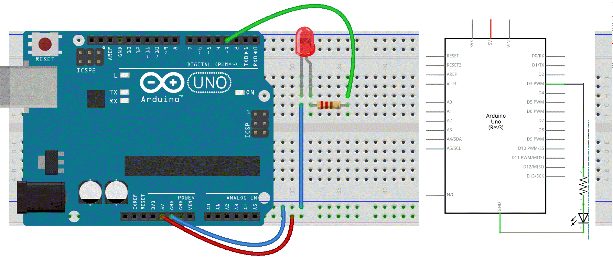

### 10a. Analog Out, a fading LED (for UNO)
PWM, short for **Pulse Width Modulation**, is a technique used to encode analog signal level into a digital one.

There are 6 PMW interfaces on an Arduino Uno: Digital pins 3, 5, 6, 9, 10, and 11, all are indicated with a ~ (tilde).

We will explore this PWM magic by changing the brightness of a LED over time.  

#### Circuit


#### Code
```c++
int ledPin = 3;      // LED connected to digital pin 3
int fadeAmount = 5;  // how many steps to fade the LED by


void setup() {
  // nothing happens in setup
}

void loop() {
  // fade in from min to max in increments of ? points:
  for (int fadeValue = 0 ; fadeValue <= 255; fadeValue += fadeAmount) {
    // sets the value (range from 0 to 255):
    analogWrite(ledPin, fadeValue);
    // wait for 30 milliseconds to see the dimming effect
    delay(30);
  }

  // fade out from max to min in increments of ? points:
  for (int fadeValue = 255 ; fadeValue >= 0; fadeValue -= fadeAmount) {
    // sets the value (range from 0 to 255):
    analogWrite(ledPin, fadeValue);
    // wait for 30 milliseconds to see the dimming effect
    delay(30);
  }
}
```
