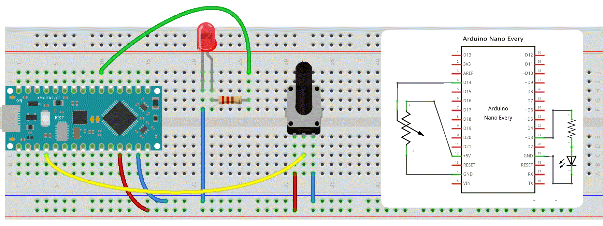

### 10b. Analog Input 2 Output (for Nano Every)
**Now lets connect our Input with the Output.**
In a previous experiment, we have done a *button-controlled LED*, using digital signal to control digital pin. Now we will use a potentiometer to control the brightness of the LED.

The Arduino will read the analog value of the potentiometer and assign this value to PWM port. But since PWM works only in the range from 0 - 255 we need map the input from our sensor down, thus a value between 0 - 1024 to one between 0 - 255.  

#### Circuit


#### Code

```c++
/* Set the brightness of ledPin to a brightness specified by the
  value of the analog input */

const int ledPin = 3;      // LED connected to digital pin 9
const int analogPin = A0;  // potentiometer connected to analog pin 0

int val = 0;               // variable to store the read value
int ledVal;                // variable to store the output value


void setup() {
  // Noting here as: Analog pins are automatically set as inputs &
  // it is not needed to set the pin as an output before calling analogWrite()
}
void loop() {
  // read the value from the sensor
  val = analogRead(analogPin);
  // turn the ledpin on at the brightness set by the sensor
  //Mapping the Values between 0 to 255 because we can give output
  //from 0 -255 using the analogwrite funtion
  ledVal = map(val, 0, 1023, 0, 255);
  analogWrite(ledPin, ledVal);
  delay(10);
}
```
