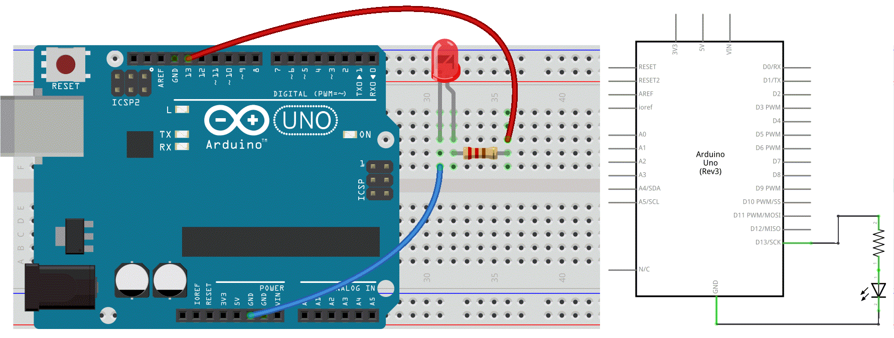

### :triangular_flag_on_post: 5c. An LED on a Breadboard

Then lets try some other actuators 
- A Buzzer or beeper is a little device that makes a buzzing noise and is used for signalling.
- A **relay** is an electrically operated switch. It uses a low voltage control signal to switch, usually higher voltage. It can also be used to control lighting, electrical and other equipment. 
- ...
