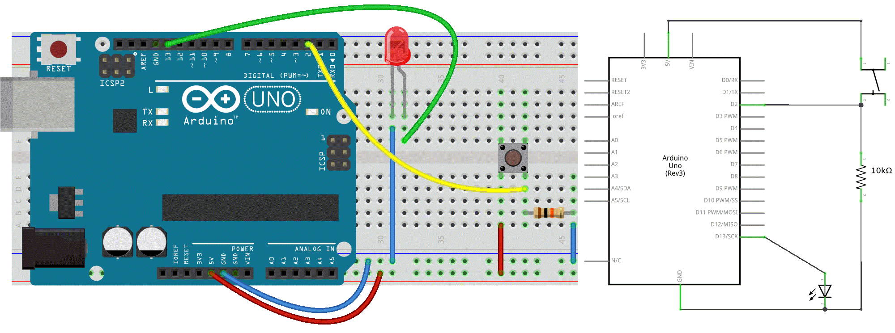

### 8. Push the Button (for UNO)
In our first example, the LED was our actuator, and our Arduino was controlling it. If we image an outside parameter to take control over this LED, our finger, we need **a sensor**. And the simplest form of sensor available is **a pushbutton**.

#### Circuit
- LED attached from pin 13 to ground
- pushbutton attached to pin 2 from +5V
- 10K resistor attached to pin 2 from ground



#### Code
```c++
// constants don't change:
const int buttonPin = 2;
const int ledPin =  13;

// variables will change:
int buttonState = 0;         // variable for reading the pushbutton status

void setup() {
  // initialize the LED pin as an output
  // & the pushbutton pin as an input
  pinMode(ledPin, OUTPUT);
  pinMode(buttonPin, INPUT);
}

void loop() {
  // read the state of the pushbutton value:
  buttonState = digitalRead(buttonPin);

  // check if the pushbutton is pressed.
  // If it is, the buttonState is HIGH:
  if (buttonState == HIGH) {
    // turn LED on:
    digitalWrite(ledPin, HIGH);
  } else {
    // turn LED off:
    digitalWrite(ledPin, LOW);
  }
}
```
If everything is correct, the LED will light up when you press the button.   
Yes?! Good!
