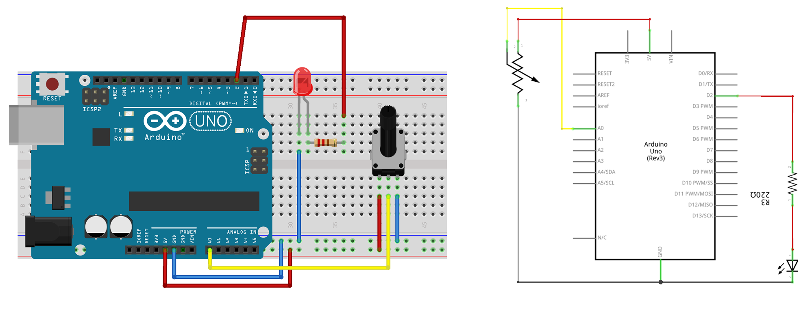

### :triangular_flag_on_post:  6. Analog Sensors

The next sketch & electronics diagram demonstrates analog input by reading an analog sensor as a potentiometer (or trimpot) on analog pin 0 and turning on and off a LED connected to digital pin 2. The amount of time the LED will be on and off depends on the value obtained by `analogRead()`. 

#### Circuit
- potentiometer: center pin of the potentiometer to the analog input 0, one side pin (either one) to ground, the other side pin to +5V 
- LED: a 220Ω resister bridges digital output 2 to the  anode (long leg) of the LED, the cathode (short leg) attached to ground.   
Actually the resistor can also go in between the cathode and ground as in a series circuit the order of components does not matter as the current has to pass through all the parts!



#### Code
```c++
int sensorPin = A0;    // select the input pin for the potentiometer
int ledPin = 13;      // select the pin for the LED
int sensorValue = 0;  // variable to store the value coming from the sensor

void setup() {
  // declare the ledPin as an OUTPUT:
  pinMode(ledPin, OUTPUT);
}

void loop() {
  // read the value from the sensor:
  sensorValue = analogRead(sensorPin);
  // turn the ledPin on
  digitalWrite(ledPin, HIGH);
  // stop the program for <sensorValue> milliseconds:
  delay(sensorValue);
  // turn the ledPin off:
  digitalWrite(ledPin, LOW);
  // stop the program for for <sensorValue> milliseconds:
  delay(sensorValue);
}
```
