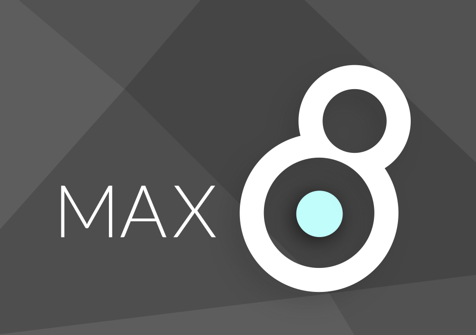

*---[ A crashcourse in Code]---*

# 
## Wat is Max?
**[MAX](https://cycling74.com/products/max)** is [een visuele programmeeromgeving](https://en.wikipedia.org/wiki/Visual_programming_language). Het programmeren gebeurt adhv visuele uitdrukkingen of ruimtelijke ordeningen van tekst en grafische elementen. Het programmeren in MAX heet **“patchen“**, visuele elementen of **“object boxes”** worden verbonden met draadjes of **“patchcords“**. Deze diagrammen laten zien hoe de data door het programma 'stroomt'. Met Max kan je onmiddellijk de resultaten zien en horen bij elke verandering die je maakt. Het is een heel intuïtieve manier van programmeren waarin doen en denken kan samengaan.

MAX groeide over de jaren heen, het is ontstaan midden de jaren 80, uit tot een erg uitgebreid en krachtig platform. Het wordt voornamelijk gebruikt door artiesten, componisten, wetenschappers, docenten, studenten en softwareontwerpers. Het voorziet in tools om te werken met midi, data, geluid en muziek **“msp~”**, bitmap beelden, video en 3D **“jitter”**, interactiviteit en connectiviteit met andere toepassingen en hardware ...

## Inspirerende Personen & Projecten
☞ [MAX user projects](https://cycling74.com/projects) sectie op de C74 website met ideeën en projecten die de gebruikers de afgelopen jaren hebben gedeeld.

☞ Een beperkte persoonlijke selectie:  
* AGF / Antye Greie-Ripatti / [Poemproducer](http://www.poemproducer.com/) uses language, sound, politics & explores speech within the audible depths of anti-rhythmic post-internet assemblages. [interview on C74](https://cycling74.com/forums/an-interview-with-antye-greie-ripatti-agf/), Song [my patch](https://www.youtube.com/watch?v=7o5pPcqcS_k) from the album Westernization Completed (2004).
* [Damian Taylor](https://www.damiantaylor.com/) | record producer, engineer, mixer, writer and programmer best known for his work with artists including The Prodigy, Björk, Arcade Fire, ...
* [Luke Dubois](https://lukedubois.com/) | American composer, performer, conceptual new media artist, programmer, record producer and pedagogue based in New York City.
* [AV3RY](http://www.av3ry.net/) | an AI musician, poet and visual artist created by [Alexander Schubert](http://www.alexanderschubert.net). Read more [here](https://cycling74.com/projects/av3ry)
* Timo Hoogland(http://www.timohoogland.com/) | Dutch livecoder, music technologist & educator.
* [Federico Foderaro](https://www.federicofoderaro.com/patches.html) | an audio-visual artist, media technologist, programmer and Max/MSP teacher.
* ...

☞ Verzameling [DEMO](downloads/max/Demos.zip) patchers

## Max leren
De [Learn Max](https://cycling74.com/learn) sectie op de C74 website bundelt de Max Ducumentatie, een reeks tutorials, artikels en boeken over het weriken met Max.    

☞ [Max 8 Documentation](https://docs.cycling74.com/MAX8)    
☞ [Max Cheat Sheet](downloads/max/MAX_cheatsheet_v2.pdf)    

### A Brief MAX Introduction
Download **[deze patches](downloads/max/A_brief_introduction.zip)** (zip file ±14MB). De tutorial bestaat uit 6 basis patchers maar de meeste patchers hebben links naar andere subpatchers die een apart segment belichten of verduidelijken. (UpToDate)

### A More elaborated (but messy) MAX overview
Download [deze patches](downloads/max/A_More_Elaborated_Overview.zip) (verouderd) (zip file ±5MB)

Deze initiatie is een stuk uitgebreider en volgt een duidelijke opdeling tussen werken met video, geluid, Open GL, etc maar is ontwikkeld voor een vroegere MAX versie (6) en gaat niet in op werken met de GPU.

* Some more messy patches: [codelabMAX_.zip](https://github.com/theBlackBoxSociety/CodeCrashCourses/files/10106908/codelabMAX_.zip)

### Video tutorials en lessen van anderen
* [KADENZE](https://www.kadenze.com/courses/programming-MAX-structuring-interactive-software-for-digital-arts-i/info)
* Cycling74 artikel "[An Introduction to Video Lessons for Max Users](https://cycling74.com/articles/an-introduction-to-free-video-lessons-for-max-msp-users)"
* [Dear John Reed Tutorials](https://www.youtube.com/channel/UCcj4IblMypOlKPYU7aRsQRg)
* [Max/MSP/Jitter Introductory Course](https://www.youtube.com/playlist?list=PLRc5WfOZXC4nRlW4GOXO-0LZDsoG82ZVv) by Federico Foderaro
* All [Amazing Max Tutorials](https://www.youtube.com/playlist?list=PLRc5WfOZXC4ktigvYCDhek0475hizrnM5) by Federico Foderaro
* [Delicious Max Tutorials](https://www.youtube.com/playlist?list=PLD45EDA6F67827497) van your good buddy Sam (aka dude837)

